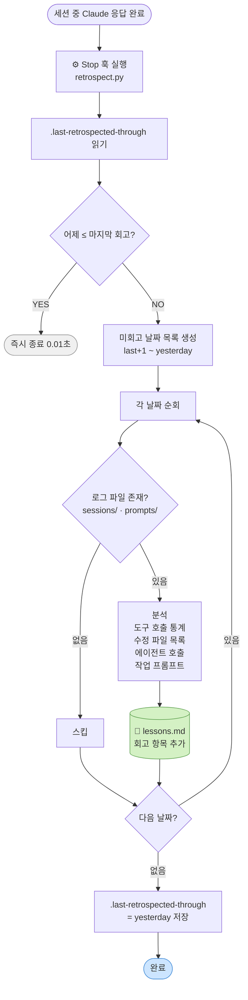

# 회고 루프 (Retrospect Loop)

> 실행할수록 과거 작업이 쌓이고, OS가 맥락을 기억하는 시스템

---

## 핵심 흐름



---

## 구성 요소

| 파일 | 역할 |
|------|------|
| `.claude/hooks/retrospect.py` | Stop 훅 — 날짜 체크 + 로그 분석 + 누적 |
| `.claude/logs/.last-retrospected-through` | 마지막 회고 완료 날짜 (상태 추적) |
| `.claude/lessons.md` | 회고 결과 누적 파일 (자산) |
| `.claude/logs/sessions/YYYY-MM-DD.jsonl` | 분석 입력: 도구 호출 로그 |
| `.claude/logs/prompts/YYYY-MM-DD.jsonl` | 분석 입력: 사용자 프롬프트 로그 |

---

## 설계 결정

**왜 "오늘 첫 Stop"인가?**
오늘 대화 시작 전, 어제 작업을 돌아본다. 모닝 스탠드업과 같은 리듬.

**왜 날짜를 파일로 추적하는가?**
며칠간 Claude를 쓰지 않아도 복귀 시 놓친 날들을 자동으로 캐치업한다.
타이머나 cron 없이 파일 하나로 "어디까지 했나"를 관리한다.

**왜 로그 파일이 없는 날은 스킵하는가?**
작업하지 않은 날 빈 항목이 쌓이면 lessons.md가 노이즈로 가득 찬다.
의미 있는 날만 기록해 가독성을 유지한다.

---

## 누적 자산 예시 (lessons.md)

```
## 2026-07-09 회고

**도구 호출** 53건 (agent: 1, bash: 41, edit: 6, write: 5)
**수정 파일** HabitTrackerApplicationTest.java, ...
**에이전트** Coverage Loop 이터레이션 1 — 커버리지 97% 달성
**작업 내용**
- 랄프 루프 스킬 만들기
- 이터레이션 독립 컨텍스트로 실행하기
```

---

## 측정 지표 & 루브릭

### 건강도 수식

```
건강도 = (에이전트 활용률 + 작업 집중도) / 2

에이전트 활용률 = agent 호출 수 / 총 도구 호출 수
작업 집중도     = (edit + write) / 총 도구 호출 수
```

| Grade | 건강도 | 의미 |
|-------|--------|------|
| **A** | > 0.25 | 에이전트를 잘 쓰고 실제 구현에 집중 |
| **B** | 0.15 ~ 0.25 | 보통 — 개선 여지 있음 |
| **C** | < 0.15 | 탐색(bash)에 시간 낭비 중 |

### 추세 해석

- **에이전트율 상승** → OS를 점점 더 잘 활용함
- **집중도 상승** → 탐색 줄고 실제 작업 비중 증가
- **건강도 A 달성** → 두 지표가 동시에 좋아야만 가능

### 저장 위치

- 일별 원시 데이터 → `.claude/logs/retrospect-metrics.jsonl`
- 추세 요약 → `lessons.md` 하단 `<!-- METRICS_START/END -->` 블록 (자동 갱신)

---

## 문서화 중 발견·개선한 사항

### 1. `inject-policy-context.py` SyntaxError (버그 수정)
- **문제**: 19번 줄 `sys.exit(0)ㄷ` — 한글 자모 오타로 Python SyntaxError 발생
- **영향**: 훅 자체가 실행되지 않아 POLICY.md 주입이 전혀 동작하지 않음
- **수정**: `sys.exit(0)` 으로 변경

### 2. `inject-policy-context.py` 미등록 (설정 추가)
- **문제**: 파일은 존재하나 `settings.json`에 `PreToolUse` 이벤트 미등록
- **영향**: Java 파일 작성 시 정책 컨텍스트 자동 주입이 동작하지 않음
- **수정**: `settings.json`에 `PreToolUse` + `Write|Edit` 매처로 등록
