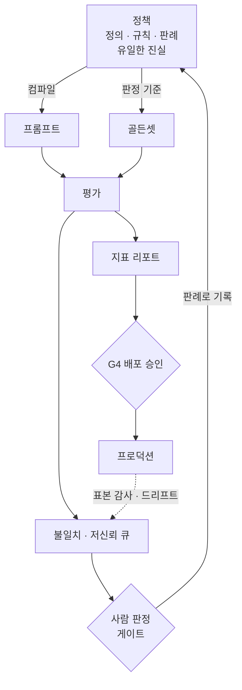
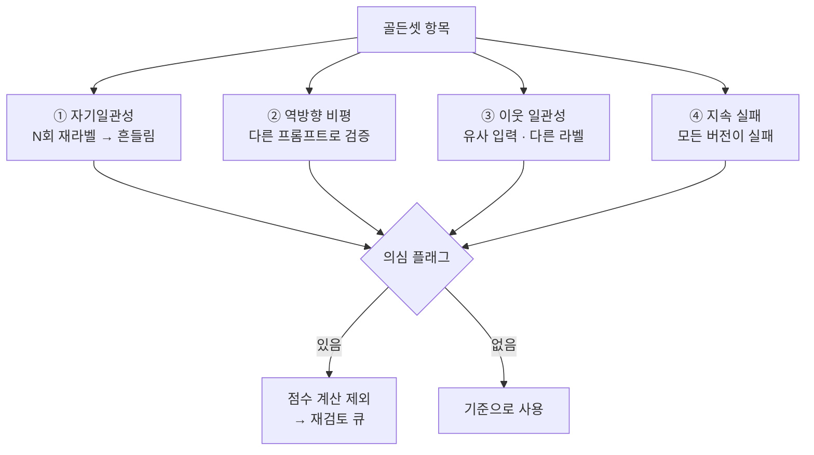
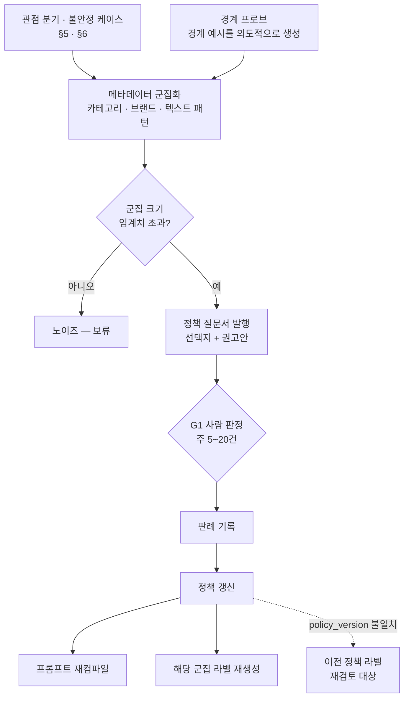
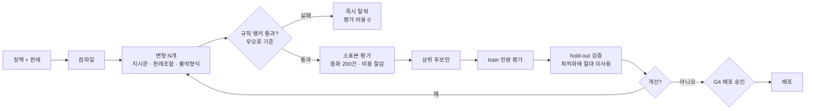
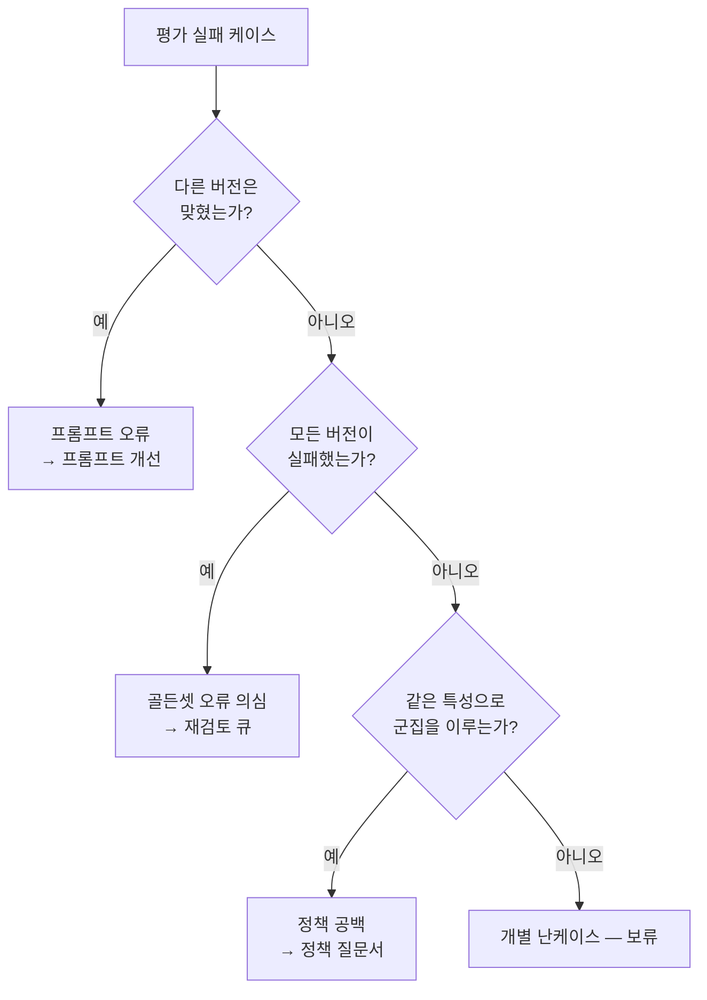
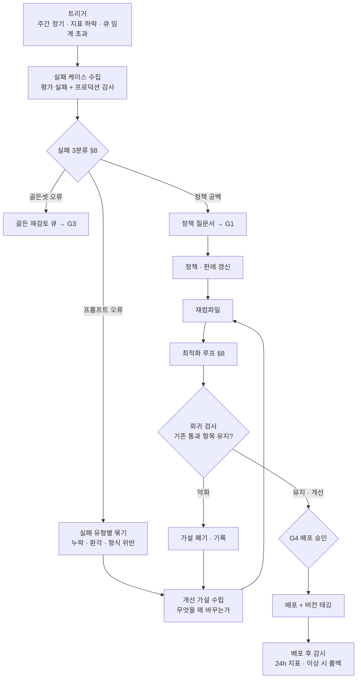
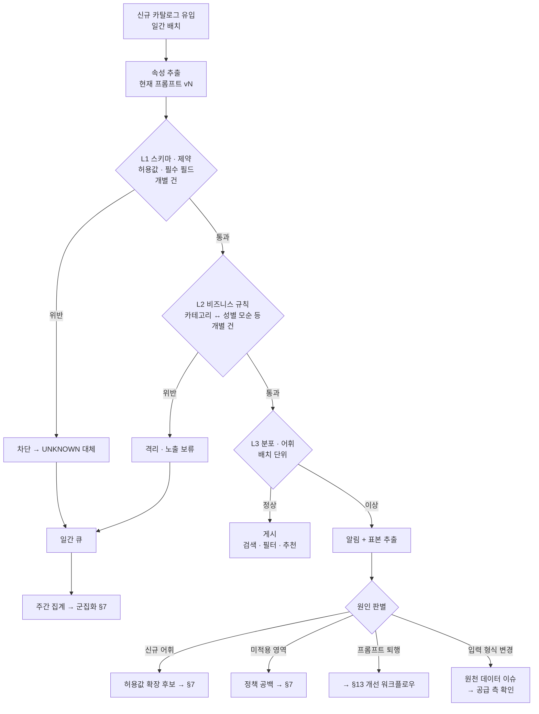

# 설계 — 카탈로그 속성 추출 OS

> 이 문서는 **왜 이렇게 만들었는가**를 담는다. 작업할 때 매번 필요하지 않으므로
> [CLAUDE.md](../../CLAUDE.md)에서 분리했다. 새 속성을 설계하거나, 지금 구조가 왜 이런지
> 되짚을 때 읽는다. 오늘 실제로 도는 코드의 계약은 `engine/contracts/`에 있다.
>
> 목차: §1 문제 · §2 원칙 · §3 아키텍처 · §4 정책 · §5 골든셋 생성 · §6 오류 탐지 ·
> §7 경계 탐지 · §8 프롬프트 하네스 · §9 게이트 · §10 지표 · §11 아티팩트 · §12 운영 루프 ·
> §13 개선 워크플로우 · §14 신규 데이터 검증 · §15 구축 순서 · §16 열린 결정

## 0. 미션 완료 조건 대응

| 조건 | 구현 | 확인 |
|---|---|---|
| 전체 사이클 | `bag-category-gender-os` → `attributes/bag-category-gender/run.sh` | `runs/bag-category-gender/run-summary.json`의 `completed` |
| 스킬·서브에이전트 5개 이상 | 엔진·인터뷰·가방·dev-workflow 스킬과 패키지별 에이전트 | `ls .claude/skills .claude/agents/*` |
| 공유 서브에이전트 | `catalog-golden-adjudicator`를 공통 감사·보고서·판정 스킬이 재사용 | `grep -rl catalog-golden-adjudicator .claude/os/*/skills` |
| 훅 | `UserPromptSubmit`에서 요청 횟수를 기록하는 `count-prompt.sh` | `.claude/settings.json` |
| 사람·AI 협력 | AI는 근거와 질문을 추천하고, 데이터 운영팀만 `decisions.json`에 확정 판정 기록 | `runs/<id>/review/decisions.json` |

개수를 표에 적지 않고 확인 명령을 적는다. 숫자는 스킬을 하나 추가하는 순간 틀리고,
틀린 숫자는 아무도 다시 세지 않는다.

## 1. 이 문서가 푸는 문제

프롬프트 튜닝이 어려운 진짜 이유는 프롬프트가 아니다.

1. **정답을 모른다.** 골든셋이 없으면 프롬프트가 좋아졌는지 알 수 없다.
2. **골든셋도 틀린다.** AI로 만든 골든셋을 검증 없이 기준으로 쓰면 틀린 기준에 프롬프트를 맞추게 된다.
3. **정책 자체가 미정이다.** "네이비 섞인 블랙", "아동복의 성별" 같은 경계는 정책에 답이 없다.
   이건 프롬프트로 못 고친다. 사람이 한 번 정해줘야 한다.

따라서 이 OS의 핵심은 프롬프트 최적화기가 아니라 **정책을 수렴시키는 장치**다.

## 2. 설계 원칙

**원칙 1 — 사람은 케이스가 아니라 정책을 판정한다.**
10,000건에 라벨을 다는 대신, 그 10,000건을 가르는 경계 질문 20개에 답한다.
사람의 시간은 가장 비싼 자원이므로, 개입 지점은 **레버리지 순으로** 배치한다.

**원칙 2 — 불일치는 버그가 아니라 신호다.**
서로 다른 근거를 본 관점들이 갈리는 지점이 곧 골든셋 오류 후보이자 정책 공백 후보다.
규칙 앵커의 불일치는 여기서 제외한다. 그건 LLM 오류가 확정된 것이라 판정할 여지가 없다.
요구사항 3·4·5(골든셋 생성 / 오류 탐지 / 경계 탐지)를 따로 만들지 않고 **같은 신호에서 파생**시킨다.

**원칙 3 — 프롬프트는 작성물이 아니라 컴파일 산출물이다.**
프롬프트를 직접 고치지 않는다. 정책과 판례를 고치면 프롬프트가 다시 만들어진다.
프롬프트를 직접 고치면 정책 문서와 어긋나고, 어느 쪽이 진실인지 아무도 모르게 된다.

**원칙 4 — 골든셋은 기준이지만 무오류가 아니다.**
정확도는 항상 "현재 골든셋 대비"로 읽는다. 골든셋 신뢰도 자체를 지표로 추적한다.

## 3. 아키텍처



핵심은 **화살표가 정책으로 되돌아온다**는 것. 사람의 판정이 일회성 라벨로 소모되지 않고
판례로 축적되어 프롬프트와 골든셋 양쪽에 재사용된다.

점선은 월간 루프다. 프로덕션 표본을 다시 큐로 넣어 드리프트를 잡는다.

## 4. 정책 레이어

속성별로 문서를 하나씩 둔다. 프롬프트가 여기서 컴파일되므로 **애매한 표현을 쓰지 않는다.**

```
policy/
  color.md          색상 정의 · 허용값 · 판정 규칙
  gender.md         성별 정의 · 허용값 · 판정 규칙
  precedents/
    color-0007.md   "차콜과 블랙 구분" 판정 + 근거 + 적용 예시
    gender-0012.md  "아동복 성별 표기 없음" 판정
```

각 정책 문서의 필수 항목:

| 항목 | 내용 | 왜 필요한가 |
|---|---|---|
| 허용값 | 닫힌 목록 (예: 색상 24종) | 열린 목록이면 평가가 불가능하다 |
| 우선순위 | 옵션명 > 상품명 > 설명 | 근거가 충돌할 때의 결정 규칙 |
| 판정 불가 조건 | 언제 `UNKNOWN`을 내는가 | 억지 추출이 가장 흔한 오류원 |
| 판례 링크 | 경계 판정 기록 | 같은 질문을 두 번 묻지 않기 위해 |

**`UNKNOWN`을 1급 값으로 둔다.** 정보가 없는데 값을 만들어내는 것이
값을 안 내는 것보다 항상 나쁘다. 커버리지는 정확도를 확인한 뒤에 올린다.

## 5. 골든셋 생성 — 증거 독립 다관점 합의

독립성을 **모델이 아니라 증거에서** 만든다.
같은 입력을 온도만 바꿔 여러 번 돌리면 같은 근거로 같은 실수를 반복할 뿐이라 대조 신호가 되지 못한다.
그래서 관점마다 **보는 필드를 자른다.**

| 관점 | 보는 필드 | 커버리지 | 성격 |
|---|---|---|---|
| V1 | 옵션명 | 부분 | 표기가 명시적일 때 강함 |
| V2 | 상품명 + 카테고리 | 넓음 | 문맥 판단 |
| V3 | 브랜드 + 설명 | 넓음 | 잡음 많음 |

세 관점 모두 **근거 문자열을 반드시 함께 출력**한다.
근거가 없으면 나중에 검증할 수 없고, 합의가 갈렸을 때 원인을 분류할 수도 없다.

```mermaid
flowchart TB
    subgraph EXT["외부 · core-catalog-platfom"]
        D["카탈로그 데이터 · 프롬프트 · 상품 GT"]
    end

    subgraph ATTR["attributes/‹id› · 속성 팩 · 사람이 쓴다"]
        PROF["profile.json<br/>허용값 · 관점별 필드 · 어댑터 경로"]
        IMP["import 어댑터"]
        AUD["audit · arbiter 어댑터<br/>속성 고유 규칙"]
        POL["policy.md + precedents/<br/>유일한 진실"]
        GOAL["goal.md<br/>귀책 원칙"]
    end

    subgraph ENG["engine · 공통 코어 · 속성을 모른다"]
        V1["V1 · 옵션명만"]
        V2["V2 · 상품명 + 카테고리"]
        V3["V3 · 브랜드 + 설명"]
        AGG{"합의 판정<br/>서로 다른 근거"}
        CR["비평 패스 §6"]
        OK["자동 승인 HIGH"]
        MD["승인 MEDIUM"]
        SK["정보 부족 · 제외"]
        PG["정책 경계 후보 → §7"]
        ARB["arbitrate<br/>귀책 추천"]
        IDX["build_policy_index<br/>질문 ↔ 판례 대조"]
        REC["record_review_decision<br/>원장 기록"]
        RPT["render_catalog_report"]
    end

    subgraph RUNS["runs/‹id› · 산출물 · 지워도 된다"]
        SNAP["policy/ 가져온 스냅샷"]
        GS["golden/"]
        Q["queue/*.jsonl"]
        PQ["reports/policy-questions.json"]
        LED["review/decisions.json<br/>사람 원장"]
    end

    subgraph INT["interview · 사람 판정 게이트"]
        HQ["G2 충돌 판정<br/>표본만"]
        G1["G1 정책 질문에 답"]
    end

    subgraph REP["reports · 사람이 읽는다"]
        HTML["runs/‹id›/reports/<br/>catalog-audit · suspect-gt · policy-gaps"]
        FLOW["os/reports/step1-flow.html<br/>손으로 쓴 해설"]
    end

    D --> IMP
    IMP --> SNAP
    IMP --> GS
    PROF -.-> V1 & V2 & V3
    GS -.-> V1 & V2 & V3
    V1 --> AGG
    V2 --> AGG
    V3 --> AGG
    AGG -->|"3 / 3 일치"| OK
    AGG -->|"2 : 1"| CR
    AGG -->|"근거가 각각 타당"| PG
    AGG -->|"전원 UNKNOWN"| SK
    CR -->|해소| MD
    CR -->|미해소| Q
    OK -.-> GS
    MD -.-> GS
    PG -.-> PQ

    SNAP --> AUD
    GS --> AUD
    AUD --> Q
    AUD --> PQ
    POL --> ARB
    GOAL --> ARB
    Q --> ARB
    ARB --> HQ
    PQ --> G1
    HQ -->|"사용자가 확정한 것만"| REC
    REC --> LED
    G1 -->|"판례로 기록"| POL
    POL --> IDX
    PQ --> IDX
    Q --> RPT
    LED --> RPT
    RPT --> HTML
    FLOW -.-> HTML

    classDef design stroke-dasharray: 5 5
    class V1,V2,V3,AGG,CR,OK,MD,SK,PG design
```



점선 상자와 점선 화살표는 아직 설계만 있는 부분이다. 지금은 골든셋을 세 관점으로 만들지 않고
`import` 어댑터가 외부 GT를 그대로 가져온다. 실선은 오늘 실제로 도는 경로다.

| 상태 | 해석 | 처리 |
|---|---|---|
| 3/3 일치 | 서로 다른 근거가 같은 결론 | 자동 승인 `HIGH` |
| 2 : 1 | 한 관점만 이탈 | 비평 패스(§6) → 해소되면 `MEDIUM`, 아니면 사람 큐 |
| 근거가 각각 타당하게 갈림 | **정책 공백** | §7 경계 후보 |
| 전원 `UNKNOWN` | 정보 부족 | 골든셋 제외 |

**"근거가 각각 타당하게 갈림"이 진짜 경계 신호다.**
옵션명은 `차콜`인데 카테고리는 블랙 계열이라면 어느 쪽도 틀렸다고 말할 수 없다.
정책이 차콜의 소속을 정하지 않은 것이다.

부수 효과가 하나 있다. `V1=UNKNOWN, V2=블랙`이면 근거가 상품명 쪽에 있다는 뜻이므로,
**정책의 필드 우선순위 규칙을 데이터로 검증**할 수 있다.

합의만으로 골든셋을 만들면 쉬운 것만 모인다.
사람이 판정한 2:1·경계 케이스를 **반드시 섞어** 난이도 분포를 맞춘다.

### 규칙 앵커는 생성 파이프라인 밖에 둔다

규칙 라벨러는 커버리지가 **1% 수준**이고, 대신 그 구간에서는 **틀리지 않는다.**
이 성질 때문에 골든셋 생성에는 쓸모가 없고, 다른 곳에서 강하다.

생성에 못 쓰는 이유는 두 가지다.

- 규칙이 틀리지 않으므로 `규칙 ≠ LLM`은 **LLM 오류로 확정**이다. 판정할 것이 없어 사람 큐로 갈 이유가 없다.
- **규칙이 확신하는 구간은 정의상 정책이 애매하지 않은 구간**이다. 여기서는 경계가 구조적으로 나올 수 없다.

| 용도 | 동작 | 값어치 |
|---|---|---|
| 회귀 카나리아 | 배치·프롬프트 버전마다 앵커셋 대조 | 라벨 비용 0, **오탐 없음** |
| 오류율 하한 | 가장 쉬운 구간의 실패율 | 여기서 2% 틀리면 전체는 최소 그 이상 |
| 후보 조기 탈락 | 최적화 1차 관문(§8) | 앵커를 깨는 후보는 전량 평가 전에 버림 |

### 비용 분리

3관점은 호출이 3배다. 전량에 쓰지 않는다.

| 대상 | 방식 |
|---|---|
| 골든셋 구축 표본 (수천 건) | 3관점 전부 |
| 프로덕션 전량 | 단일 프롬프트 + 규칙 카나리아 + 이웃 일관성(§6-③) |

이웃 일관성은 LLM 호출이 없어 전량에 걸 수 있다. 프로덕션의 주력 감시는 이쪽이다.

골든셋 항목 스키마:

```jsonc
{
  "id": "sp_12345",
  "input": { "상품명": "...", "옵션명": "...", "카테고리": "...", "브랜드": "..." },
  "label": { "색상": "블랙", "성별": "여성" },
  "evidence": { "색상": "옵션명 'BLACK'", "성별": "카테고리 '여성>원피스'" },
  "views": { "V1": "블랙", "V2": "블랙", "V3": "UNKNOWN" },
  "confidence": "HIGH",          // HIGH(3/3) | MEDIUM(비평 해소·사람판정) | LOW(단일 관점)
  "source": "3view",             // 3view | human | anchor
  "policy_version": "color@v4",  // 어느 정책으로 판정했는가
  "precedents": ["color-0007"]   // 적용된 판례
}
```

`policy_version`이 중요하다. 정책이 바뀌면 **그 이전 정책으로 만든 라벨은 재검토 대상**이 된다.
이게 없으면 정책 변경 시 어떤 라벨을 다시 봐야 하는지 알 수 없다.

## 6. 골든셋 오류 탐지

"AI가 만든 골든셋이 틀린 경우"를 잡는 장치. 네 가지를 겹쳐 쓴다. 각각 잡는 오류가 다르다.



잡는 오류가 각각 다르다. ①은 우연히 맞은 라벨, ②는 자신 있게 틀린 라벨,
③은 LLM 호출 없이 잡히는 기계적 불일치, ④는 **어려운 게 아니라 라벨이 틀린** 항목이다.

**(1) 자기일관성 (self-consistency)**
같은 항목을 N회(권장 3~5) 라벨링한다. temperature를 올리거나 프롬프트 표현을 바꾼다.
답이 흔들리면 그 항목은 **불안정**이다. 잡는 오류: 우연히 맞은 라벨, 근거 빈약한 판정.

**(2) 역방향 비평 (critic pass)**
라벨을 만든 프롬프트와 **다른** 프롬프트로 "이 라벨이 정책상 맞는가, 틀렸다면 왜"를 묻는다.
생성과 검증을 같은 프롬프트로 하면 같은 실수를 반복하므로 반드시 분리한다.
잡는 오류: 자신 있게 틀린 라벨.

**(3) 이웃 일관성 (neighbor consistency)**
정규화 텍스트나 임베딩으로 군집을 만들고, **거의 같은 입력인데 라벨이 다른 쌍**을 찾는다.
LLM 호출이 필요 없는 기계적 검사이고, 실무에서 가장 많이 잡힌다.
잡는 오류: 배치 간 라벨 흔들림, 동일 상품의 색상 표기 불일치.

**(4) 지속 실패 역추적 (persistent failure)**
프롬프트 버전이 바뀌어도 **매번 틀리는 골든 항목**은 어렵기보다 **라벨이 틀렸을 가능성이 높다.**
K개 연속 버전에서 실패한 항목은 자동으로 골든셋 재검토 큐에 넣는다.

> 이 4번이 없으면 최적화기가 틀린 라벨을 맞추려고 프롬프트를 망가뜨린다.
> 평가에서 실패가 났을 때 **"모델이 틀렸다"고 단정하지 않는 것**이 이 OS의 안전장치다.

탐지 결과는 항목에 플래그로 남긴다: `suspect: ["unstable", "critic-reject"]`.
플래그가 붙은 항목은 **평가 점수 계산에서 제외**하고 사람 큐로 보낸다.
의심스러운 기준으로 점수를 매기면 그 점수가 오염된다.

## 7. 정책 경계 탐지

"정책이 데이터 경계에서 애매한 부분"을 **개별 케이스가 아니라 덩어리로** 찾아낸다.
개별 애매 케이스는 노이즈지만, 같은 종류가 100건 모이면 그건 **정책 공백**이다.



사람은 케이스가 아니라 **질문 하나**에 답한다. 답이 판례가 되어 군집 전체를 한 번에 해결한다.

**(1) 불일치 군집화**
관점 분기·불안정 케이스를 메타데이터(카테고리 / 브랜드 / 가격대 / 텍스트 패턴)로 군집화한다.
군집 크기가 임계치를 넘으면 정책 이슈로 승격한다.

**규칙 앵커 불일치는 입력에서 제외한다.** 앵커가 확신하는 구간은 정책이 애매하지 않은 구간이므로
여기서 경계가 나올 수 없다. 섞어 넣으면 사람이 정책 대신 LLM 버그를 판정하게 된다.

```
예) 관점 분기 143건이 "카테고리=아동>상의" 에 몰림
    → 정책 공백: 아동복의 성별을 어떻게 판정하는가
```

**(2) 경계 프로브 (boundary probe)**
알려진 축을 따라 경계 예시를 **의도적으로 생성**해 정책이 결정적 답을 주는지 시험한다.

| 축 | 프로브 예시 | 확인 사항 |
|---|---|---|
| 색상 인접 | 네이비 ↔ 블랙, 차콜 ↔ 그레이 | 구분 기준이 정책에 있는가 |
| 다색 | "블랙/화이트 배색" | 대표색 1개인가 다중값인가 |
| 성별 중립 | "유니섹스", "커플" | 유니섹스가 허용값에 있는가 |
| 대상 모호 | 아동 / 임부 / 반려동물 | 성별 축이 적용되는가 |
| 근거 충돌 | 옵션명=핑크, 상품명=블랙 | 우선순위 규칙이 답을 주는가 |

프로브에서 답이 흔들리면 **그 경계는 정책에 정의돼 있지 않은 것**이다.
실제 데이터가 그 경계에 도달하기 전에 미리 발견하는 게 목적이다.

**(3) 정책 질문서 발행**
탐지 결과를 "어렵다"로 남기지 않고 **한 번 답하면 닫히는 질문**으로 만든다.

```markdown
## 정책 질문 GQ-0031  (성별)
현상: 충돌 143건, 전량 카테고리 "아동>상의"
쟁점: 아동복에 성별 표기가 없을 때 UNKNOWN인가, 카테고리 기본값인가
선택지:
  A. 항상 UNKNOWN                    영향 +143건 UNKNOWN
  B. 카테고리 성별 상속               영향 +143건 라벨, 오분류 위험
  C. 아동은 성별 축 미적용 (신규 값)   정책·스키마 변경 필요
권고: A (근거 없는 값 생성보다 UNKNOWN이 안전)
```

사람이 고르면 **판례로 기록 → 정책 갱신 → 프롬프트 재컴파일 → 해당 군집 라벨 재생성**까지
자동으로 흐른다. 이게 원칙 1의 구현이다.

## 8. 프롬프트 컴파일 & 최적화 하네스

**컴파일** — 프롬프트를 손으로 쓰지 않고 정책에서 생성한다.

```
정책(정의·허용값·우선순위) + 판례(few-shot) + 출력 스키마  ──▶  프롬프트 vN
```

산출물에는 어떤 정책·판례 버전에서 나왔는지 매니페스트를 붙인다. 역추적이 가능해야 한다.

**최적화 루프**

```
1. 변형 생성   지시문 표현 / 판례 조합 / 추론 유도 / 출력 형식을 바꾼 후보 N개
2. 앵커 관문   규칙 앵커셋 대조 — 깨는 후보는 즉시 탈락 (평가 비용 0)
3. 평가        골든셋(train)으로 채점
4. 선택        상위 후보 유지
5. 검증        hold-out으로 재확인  ← 과적합 방지
6. 반복        개선이 멈추면 종료
```




**hold-out 분리가 필수다.** 골든셋 전체로 최적화하면 골든셋의 오류까지 학습해
실데이터에서 무너진다. train / hold-out을 처음부터 갈라 두고 hold-out은 최적화에 절대 쓰지 않는다.

평가 실패는 자동으로 두 갈래로 분류한다. 이 분류가 이 하네스의 핵심 판단이다.



**실패를 곧바로 "모델이 틀렸다"로 읽지 않는 것**이 이 OS의 안전장치다.
이 분기가 없으면 최적화기가 틀린 라벨을 맞추려고 프롬프트를 망가뜨린다.

| 실패 유형 | 판정 근거 | 조치 |
|---|---|---|
| 프롬프트 오류 | 다른 버전은 맞힘 | 프롬프트 개선 |
| 골든셋 오류 | 모든 버전이 실패 (6-4) | 골든 재검토 큐 |
| 정책 공백 | 군집 형성 (7-1) | 정책 질문서 발행 |

**비용 통제**: 변형 N개 × 골든 M건 = 호출 N×M. 먼저 소표본(층화 200건)으로 거르고
상위 후보만 전량 평가한다. 최적화 1회의 예상 비용을 리포트에 남긴다.

## 9. 사람 개입 게이트

개입 지점을 명시적으로 고정한다. 레버리지 높은 순.

| 게이트 | 시점 | 사람이 하는 일 | 빈도 | 레버리지 |
|---|---|---|---|---|
| **G1 정책 판정** | 정책 질문서 발행 시 | 경계 질문에 답 (선택지 중 택1) | 주 5~20건 | 최고 — 1건이 수백 건을 해결 |
| **G2 충돌 판정** | 충돌 큐 적재 시 | 규칙 vs LLM 중 판정, 표본만 | 주 30~50건 | 높음 — 골든셋 난이도 보정 |
| **G3 골든셋 승격** | 골든셋 버전 확정 전 | 이전 버전 대비 **diff만** 검토 | 버전당 1회 | 중 — 회귀 차단 |
| **G4 배포 승인** | 프롬프트 배포 전 | 평가 리포트·회귀 diff 확인 | 배포당 1회 | 중 — 사고 차단 |

설계 규칙:

- **G1은 선택지를 주고 권고안을 붙인다.** 백지 질문은 답이 늦다.
- **G3은 전량이 아니라 diff만 본다.** 전량 검토는 지속 불가능하고, 실제로 안 하게 된다.
- **모든 게이트는 건너뛸 수 있되 기록에 남는다.** 막을 수 없는 게이트는 우회당한다.
- **큐가 임계치를 넘으면 배포를 막는다.** 미판정 충돌이 쌓인 채 배포되면 골든셋이 신뢰를 잃는다.

이 표 앞에 기계 게이트가 하나 더 있다. 사이클 직후 `review` 패키지가 그 run을 심사해
`FAIL`이면 G1·G2를 시작하지 않는다(§11). 사람의 시간을 아끼는 가장 싼 방법은
**판정할 수 없는 run에서 판정을 시작하지 않는 것**이다. 같은 심사가 미판정 큐에서
심판이 충돌 없다고 본 건과 미결 판례에 막힌 건을 빼고, G1·G2가 지금 실제로 다룰 수 있는
건수를 낸다 — 원칙 1이 지켜지는지 실행마다 확인하는 자리다.

## 10. 지표

정확도 하나만 보지 않는다. 무엇이 나빠졌는지 분해되어야 한다.

| 지표 | 정의 | 주의 |
|---|---|---|
| 정확도 | 골든셋 일치율 | **골든셋 신뢰도가 상한**이다 |
| 커버리지 | `UNKNOWN`이 아닌 비율 | 정확도 확인 전에 올리면 안 된다 |
| 일관성 | 동일 입력 재현율 | 낮으면 정확도 자체를 못 믿는다 |
| 모호율 | 저신뢰·충돌 비율 | 올라가면 정책 공백 신호 |
| 골든셋 신뢰도 | 의심 플래그 없는 항목 비율 | 이 OS의 건강 지표 |
| 사람 단위비용 | 판정 1건이 해결한 케이스 수 | 원칙 1이 지켜지는지 확인 |

**전체 평균은 카테고리별 실패를 가린다.** 카테고리·브랜드별로 분해해서 본다.
전체 정확도 92%가 특정 카테고리 40%를 덮고 있는 상황이 흔하다.

## 11. 아티팩트 구조

```
policy/          정책 문서 · 판례          ← 유일한 진실
golden/vN/       라벨 · 리포트 · 의심 플래그
prompts/         컴파일된 프롬프트 · 매니페스트
eval/runs/       실행별 지표 · 실패 분류
queue/           ambiguity/ · conflict/ · golden-review/
harness/         라벨러 · 컴파일러 · 최적화기 · 탐지기
```

전부 git으로 버전 관리한다. 정책 변경 → 프롬프트 변경 → 지표 변화가
**하나의 커밋 흐름으로 추적**되는 것이 이 구조의 목적이다.

### 현재 구현 (2026-09-02)

손으로 쓰는 **입력**과 사이클이 만드는 **산출물**을 물리적으로 분리했다.

```
.claude/os/
  PACKAGES.md              패키지 목록과 의존 방향
  engine/                  ← 패키지 1. 속성을 모르는 공통 코어
    package.md             소유 목록과 규칙
    goal.md                프로세스 전체의 성공 기준
    contracts/             변경 경계 · 정책 레이어 · 선언된 누수
    scripts/               오케스트레이터 · 심판 · 정책 인덱스 · 진행률 · 원장 · 리포트
    skills/ · agents/      catalog-* 스킬과 판정관의 실체. .claude/skills·agents는 링크
    templates/             새 속성용 정책·판례 뼈대
    tests/                 계약 회귀 + 패키지 경계 테스트
  attributes/bag-category-gender/   ← 패키지 2. 가방 성별만 아는 속성 팩
    package.md · profile.json · goal.md · run.sh
    policy/                policy.md + precedents/BG-*.md   ← 유일한 진실
    adapters/              import · audit · arbiter
    skills/                bag-* 스킬의 실체
    tests/
  runs/<속성>/             ← 산출물. 지우고 다시 만들 수 있다
    run-review/            심사 결과. 엔진이 아니라 review 패키지가 쓴다
  review/                  ← 패키지 3. 엔진이 낸 run을 심사한다. 읽기만 하고 run-review/에만 쓴다
    contracts/handoff.md   엔진과 무엇으로 만나는가
  interview/               ← 패키지 4. 정의가 비어 있을 때 인터뷰로 채운다. catalog-interview 스킬과 인터뷰어의 실체
  reports/                 ← 사람이 쓰는 해설 보고서. 사이클이 만드는 보고서는 runs/<속성>/reports/
```

의존은 한 방향이다. **속성은 엔진을 알고, 엔진은 속성을 모른다.** 엔진이 속성을 알기
시작하면 속성을 추가할 때마다 엔진을 고쳐야 하고, 그 순간 패키지는 이름만 남는다.
합격 기준은 하나다 — 속성 폴더를 통째로 지워도 엔진이 그대로 돈다.
[test_package_boundary.py](engine/tests/test_package_boundary.py)가 매번 확인한다.

`runs/`는 지우고 다시 만들 수 있어야 한다. 그래서 손으로 쓴 정책은 절대 `runs/`에 두지 않는다.
`runs/<속성>/policy/`에 있는 것은 외부에서 **가져온 읽기 전용 스냅샷**, 즉 "지금 프로덕션이
실제로 쓰는 문장"이고, `attributes/<속성>/policy/`에 있는 것이 "우리가 옳다고 정한 문장"이다.
둘의 차이가 곧 개선 대상이다.

### 엔진과 심사는 산출물로만 만난다

사이클이 끝나면 `review` 패키지가 그 run을 심사한다 — **이 결과로 사람이 판정을 시작해도 되는가.**
엔진이 정책과 GT를 의심하듯, 심사는 그 의심이 서 있는 바닥을 의심한다.

둘을 잇는 방법이 세 가지 있었다.

| 방법 | 왜 안 했나 |
|---|---|
| 엔진 스크립트 안에서 검사한다 | 만든 코드가 자기 산출물을 검사하면 같은 오해가 양쪽에 그대로 들어간다. 골든셋 생성과 검증을 다른 프롬프트로 나누는 것과 같은 이유(§5)다 |
| 엔진이 심사를 함수로 부른다 | 심사가 엔진의 시그니처에 묶인다. 필요한 값이 생길 때마다 엔진에 반환값을 하나씩 붙이게 되고, 그 순간 둘은 한 덩어리다 |
| **산출물 한 장으로 잇는다** | 골랐다 |

심사가 읽는 것은 `runs/<속성>/run-summary.json`과 그 요약이 `artifacts`로 선언한 경로뿐이다.
프로필도 어댑터도 정책도 읽지 않는다. 그래서 어제 만든 run, 남이 준 run도 같은 코드가 심사하고,
속성이 늘어도 심사는 바뀌지 않는다. **선언하지 않은 산출물은 심사하지 않고 `SKIPPED`로 남긴다** —
경로를 관습으로 추측하는 순간 그것은 계약이 아니기 때문이다. 건너뛴 검사는 통과가 아니다.

방향은 한쪽이다. 심사는 지적만 하고 아무것도 고치지 않는다. 읽는 쪽이 원본을 고치면
다음 사람은 어느 숫자가 원본이고 어느 숫자가 심사가 손댄 값인지 알 수 없다.
이 OS가 GT와 정책에 대해 하는 일과 같다 — **근거와 함께 지목하는 것까지가 산출물이다.**

엔진은 심사를 모르므로 둘을 잇는 것은 속성의 `run.sh`다. 심사가 멈춰도 사이클은 그대로 돈다.
계약은 [handoff.md](review/contracts/handoff.md), 검사 목록은 [review/package.md](review/package.md)에 있다.

판례는 경계 질문 하나당 파일 하나다. `status: OPEN`은 아직 사람이 답하지 않았다는 뜻이고,
열린 판례의 개수가 그 속성의 정책이 얼마나 미완성인지를 보여준다.
자세한 계약은 [policy-layer.md](engine/contracts/policy-layer.md)에 있다.

## 12. 운영 루프

| 주기 | 하는 일 | 산출 |
|---|---|---|
| 일간 | 신규 데이터 검증(§14), 라벨링, 충돌·저신뢰 큐 적재 | 큐 · 게시/격리 |
| 주간 | 프롬프트 개선 워크플로우(§13) 전체 | 프롬프트 vN+1 |
| 월간 | 프로덕션 표본 감사, 드리프트 확인, 골든셋 재검증 | 감사 리포트 |

**드리프트 감시**: 신규 브랜드·카테고리 유입으로 입력 분포가 바뀌면
기존 골든셋은 더 이상 대표성이 없다. 월간 감사에서 분포 변화를 확인한다.

## 13. 프롬프트 개선 워크플로우

§8이 최적화 *알고리즘*이라면, 이건 그걸 감싸는 *운영 절차*다. 주간 루프의 본체.



절차상 반드시 지킬 것:

| 단계 | 규칙 | 이유 |
|---|---|---|
| 가설 수립 | **가설 없이 프롬프트를 바꾸지 않는다** | "이것저것 바꿔보니 올랐다"는 재현도 롤백도 불가능하다 |
| 회귀 검사 | 새 실패를 고치고 **기존 통과분을 다시 본다** | 새 케이스를 맞히려다 기존을 깨뜨리는 게 가장 흔한 퇴행이다 |
| 가설 폐기 | 실패한 가설도 **기록에 남긴다** | 남기지 않으면 몇 주 뒤 같은 시도를 반복한다 |
| 배포 후 | 24시간 지표를 감시하고 **롤백 조건을 미리 정한다** | 평가셋에서 좋고 실데이터에서 나쁜 경우가 있다 |

**한 번에 하나의 가설만 반영한다.** 여러 변경을 묶어 배포하면 지표가 움직여도 어느 것 때문인지 모른다.

## 14. 신규 데이터 비즈니스 검증 워크플로우

계속 유입되는 신규 카탈로그에서 **잘못된 속성이 프로덕션에 나가는 것**을 막는 일간 게이트.
검색·필터·추천이 이 속성을 쓰므로, 틀린 색상·성별은 고객이 상품을 못 찾거나 잘못 찾는 문제로 직결된다.



**L1/L2는 개별 건을 막고, L3는 배치 단위로 본다.** 이 분리가 핵심이다.
개별로는 전부 정상인데 모아 보면 이상한 경우가 실제 사고의 대부분이다.

L3에서 보는 신호:

| 신호 | 예시 | 의심되는 원인 |
|---|---|---|
| UNKNOWN율 급등 | 특정 브랜드에서 UNKNOWN 80% | 원천 데이터 형식 변경 |
| 값 분포 이탈 | 색상 '블랙' 비중이 평소의 2배 | 프롬프트 퇴행 또는 실제 트렌드 |
| 신규 어휘 출현 | "버건디 멜란지" 첫 등장 | 허용값 확장 필요 |
| 신규 카테고리·브랜드 | 정책이 다루지 않는 영역 유입 | 정책 공백 |
| 입력 분포 이동 | 카테고리 구성비 변화 | 골든셋 대표성 상실 |

설계 규칙:

- **차단의 기본값은 `UNKNOWN`이다.** 틀린 값을 내보내는 것보다 값이 없는 게 항상 낫다(§4와 동일 원칙).
- **격리는 삭제가 아니다.** 노출만 보류하고 큐에 남겨 주간에 군집으로 판정한다.
- **L3 이상은 곧바로 프롬프트를 고치지 않는다.** 원인이 원천 데이터일 수도, 실제 트렌드일 수도 있다.
  원인 판별을 거쳐 §13 또는 §7로 보낸다.
- **규칙 앵커 카나리아를 같은 배치에 함께 돌린다.** 라벨 비용이 0이고 오탐이 없어,
  여기서 울리면 무조건 진짜 오류다. 프로덕션에서 골든셋 없이 동작하는 유일한 확정 신호다.
- **임계치는 절대값이 아니라 이동평균 대비로 잡는다.** 시즌성이 있는 도메인이라 고정 임계는 오탐이 많다.

## 15. 구축 순서

한 번에 다 만들지 않는다. 각 단계는 **그 자체로 쓸모가 있어야** 한다.

| 단계 | 만드는 것 | 완료 기준 |
|---|---|---|
| 0 | 정책 문서 초안(색상·성별), 허용값 확정 | 사람 2명이 같은 상품에 같은 라벨 |
| 1 | 규칙 앵커셋 + 회귀 카나리아 | 라벨 없이 오류 경보 동작 |
| 2 | 3관점 라벨러(V1·V2·V3), 합의 판정 | 3/3 · 2:1 · 분기 분포 확인 |
| 3 | 골든셋 v1 (합의 + 사람판정 분기) | 500~1000건, train/hold-out 분리 |
| 4 | 평가 하네스 | 프롬프트 점수 재현 가능 |
| 5 | 오류 탐지 4종 | 골든셋 신뢰도 측정 가능 |
| 6 | 프롬프트 컴파일러 + 최적화 루프 | 손 튜닝 대비 개선 확인 |
| 7 | 경계 탐지 + 정책 질문서 | 질문 1건이 N건 해결 확인 |
| 8 | 게이트·큐·루프 자동화 | 주간 루프 무인 실행 |

1단계를 맨 앞에 둔 것은 의도적이다. **앵커 카나리아는 골든셋이 하나도 없어도 동작하는 유일한 확정 신호**라,
가장 먼저 만들면 이후 모든 단계에서 안전망 역할을 한다.

**0단계를 건너뛰지 않는다.** 사람 둘이 합의 못 하는 정책이면 LLM도 못 맞힌다.
정책 없이 골든셋부터 만들면 나중에 전량 재작업한다.

## 16. 열린 결정 사항

작성 시점에 확정되지 않아 가정을 두고 쓴 항목. 확정되면 이 문서를 갱신한다.

| # | 결정 사항 | 가정 | 영향 |
|---|---|---|---|
| 1 | 색상 다중값 허용 여부 | 대표색 1개 | 스키마·평가 방식 전체 |
| 2 | 성별 허용값에 유니섹스 포함 | 포함 | 정책·골든셋 |
| 3 | 아동/반려동물의 성별 축 | UNKNOWN | 경계 케이스 상당량 |
| 4 | 입력 필드 범위 | 상품명·옵션명·카테고리·브랜드 | 이미지 사용 시 설계 변경 |
| 5 | 기존 라벨 데이터 유무 | 없음 (신규 구축) | 있으면 0~2단계 단축 |
| 6 | 규모·비용 상한 | 미정 | 최적화 반복 횟수 |

## 참고한 자료 (2026-09-02 기준 GitHub 스타)

- Anthropic, Claude Code best practices. CLAUDE.md는 짧게 유지하고 각 줄을 "이 줄을 지우면 클로드가
  실수하는가"로 검사한다. 가끔만 필요한 지식은 스킬로 뺀다. https://code.claude.com/docs/en/best-practices
- shanraisshan/claude-code-best-practice (65k). 파일당 200줄 이하, 명령형 규칙, skills·agents를 기능별로
  분리. https://github.com/shanraisshan/claude-code-best-practice
- hesreallyhim/awesome-claude-code (53k). CLAUDE.md와 스킬 사례 모음. https://github.com/hesreallyhim/awesome-claude-code
- revfactory/claude-code-mastering (770). 한국어 Claude Code 가이드북 4장. 도메인 용어와 중요 규칙을
  우선순위로 구조화. https://github.com/revfactory/claude-code-mastering
