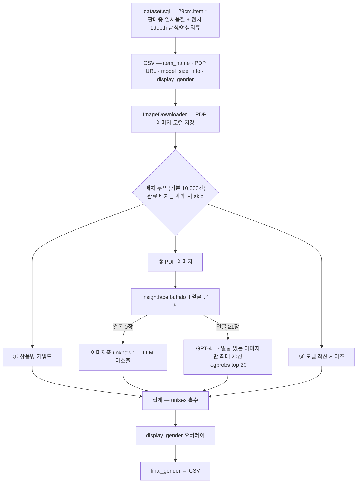
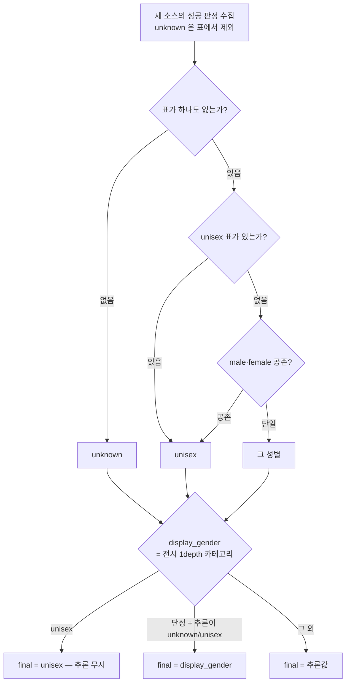

# [참고] CORE AI 29CM 성별 추론 로직

CCP 성별 추론을 고도화할 때 **CORE AI 쪽에서 가져올 수 있는 판정 재료가 있는지** 대조하기 위한 문서다. 정책 정본은 [성별 추론 LLD](gender-inference-lld.md)이고, 이 문서는 외부 구현을 읽은 결과만 담는다.

## 출처

| 항목 | 값 |
| --- | --- |
| 레포 | `musinsa/29cm-search-upgrade` (private) — 데이터 사이언스실 "검색 기본기 강화" 이니셔티브 |
| 경로 | `src/gender_classification/` · `src/agents/gender_agent.py` |
| 작성 | 하상천, 2025-09-04 ~ 09-12 |
| 성격 | **오프라인 배치 프로젝트**. CSV 입력 → CSV 출력이고 서빙 경로·API 는 이 레포에 없다 |
| 형제 모듈 | `display_category_classification`(전시 카테고리) · `color_classification`(색상). 세 축이 같은 레포에 나란히 있으나 서로 결과를 주고받지 않는다 |

LLD 「남은 결정 #6」의 **CORE AI 기추론 50만 건**이 이 파이프라인의 산출물인지는 아직 대조하지 않았다. 상품 성별 백필 CSV 의 제외 대상을 가르는 기준이므로 별도 확인이 필요하다.

# 파이프라인

`ThreadPoolExecutor` 20 워커로 상품 단위 병렬 처리하고, 배치 결과 파일(`gender_results_batch_N.csv`)의 존재 여부로 재개 지점을 잡는다.

## 세 개의 판정 소스

| # | 소스 | 방식 | confidence |
| --- | --- | --- | --- |
| ① | 상품명 | 키워드 정규식. `\b` 단어 경계 보정 | unisex 0.9 · 남녀 동시 0.8 · 단성 0.9 |
| ② | PDP 이미지 | GPT-4.1 멀티모달, 최대 20장 + 상세 텍스트 동봉 | logprobs 기반 (아래) |
| ③ | 모델 착장 사이즈 | `t_item_model_size.model_gender` (1=여성 · 2=남성) | 양성 0.95 · 단성 0.90 |

키워드 사전(`prompts.py`)은 CCP 와 어휘가 다르다 — `boyfit`·`보이핏`·`boyfriend` 가 **FEMALE** 에 들어 있고, `레이디`·`girl` 도 있다. 유니섹스 키워드가 걸리면 나머지를 보지 않고 즉시 확정한다.

②의 입력 텍스트는 `item_important_information` · `order_important_information` · `item_descriptions` 세 컬럼이다. HTML 태그를 제거한 뒤 *제거 후 길이가 원문의 10% 미만이거나 10자 미만이면 마크업 잔재로 보고 통째로 버린다.*

### 얼굴 게이팅

이미지축은 LLM 호출 전에 insightface `buffalo_l` 로 얼굴을 세고, **얼굴이 있는 이미지가 한 장도 없으면 호출 자체를 하지 않고 `unknown` 을 반환한다.** 프롬프트도 "모델 없이 상품만 있으면 unknown", "명시적 근거 없으면 unknown" 으로 보수적으로 잡혀 있다. 누끼컷만 있는 상품은 이미지축을 포기하는 설계다.

### confidence — logprobs 기반

`GenderAgent._extract_gender_certainty` 는 응답 텍스트에서 `"predicted_gender": "..."` 값에 해당하는 **토큰 구간을 역추적**해, 그 토큰들의 `top_logprobs`(20개)로 certainty 를 계산하고 평균한다. LLM 이 자기 신고한 `confidence` 필드가 아니라 이 값을 최종 신뢰도(`final_confidence`)로 쓴다.

# 판정 결정

집계는 다수결이 아니라 **unisex 흡수**다 — 세 소스 중 하나라도 unisex 면 unisex, male·female 이 갈리면 unisex.

그 위에 전시 카테고리에서 유도한 `display_gender` 오버레이가 한 겹 더 있다. `display_gender` 는 `dataset.sql` 이 1depth 전시 카테고리(남성의류 `268100100` · 여성의류 `272100100`)의 동시 보유 여부로 만든 값이다. 결과적으로 **전시 카테고리가 추론보다 우선하고**, LLM 은 "카테고리가 단성인데 추론이 반대 성별을 확신할 때"만 판정을 뒤집는다.

# CCP 현행과의 대조

| 축 | CORE AI | CCP |
| --- | --- | --- |
| 준거 우선순위 | 전시 카테고리 > 세 소스 흡수 집계 | 의류: 상품명 → 썸네일 전체 UNISEX → V1000 상세 → 썸네일 단성 투표. 비의류: 신발 사이즈 → 상품명 → 썸네일 MIXED → 상세 HTML → 상세 이미지 → 썸네일 |
| 카테고리 사용 | **최종 오버레이로 사용** | 근거로 쓰지 않는다 — 카테고리를 성별로 되먹이면 순환 |
| 근거 없음의 표현 | `unknown` → `display_gender` 로 대체 | `UNDETERMINED` 와 `UNISEX` 를 분리. 근거 부족을 공용으로 채우지 않는다 |
| 얼굴 | 얼굴 0장이면 이미지축 포기 | 얼굴은 필수 조건이 아니다. 체형·헤어·실루엣 복합 신호 허용 |
| 이미지 라벨 | 상품 단위 1회 판정. 이미지별 라벨을 남기지 않는다 | 이미지별 라벨을 원장에 보존하고 **URL 키로** 세대·서빙을 병합 (증분은 부분 판정이 정상) |
| 구조화 신호 | 모델 착장 사이즈 `model_gender` | 신발 등록 옵션의 한국 mm 사이즈 |
| 신뢰도 | logprobs 수치 | `HIGH/MEDIUM/LOW/NONE` enum |
| 모델 | GPT-4.1 | Gemini (batch) · core-ai 게이트웨이 (realtime) |
| 실행 | 로컬 CSV 배치, 재개는 파일 존재로 판정 | `gender_run`·`gender_target`·`gender_stage_execution` 원장 |

# 가져올 수 있는 것

| # | 후보 | 판단 | 근거 |
| --- | --- | --- | --- |
| 1 | **모델 착장 사이즈의 `model_gender`** | 검토 가치 높음 | CCP 의 구조화 신호는 신발 사이즈뿐이다. 판매자가 입력한 "모델 성별"은 상품명 다음가는 저비용·고정밀 준거이고, 이미지 판정과 독립이라 폴드 앞단에 끼울 수 있다. **선결: MSS·29CM 원장에 동등한 컬럼이 있는지, 판매자 입력 성별과 구분되는지** |
| 2 | **logprobs 기반 certainty** | 조건부 | 재검수 큐 우선순위·자동 반영 게이팅에 쓸 수 있는 연속값이다. 현행 `HIGH/MEDIUM/LOW` 로는 같은 HIGH 안에서 줄을 세울 수 없다. **선결: Gemini batch api 의 logprobs 지원 여부** |
| 3 | **상세 텍스트 필드의 독립 축화** | **비의류에 적용** | 운영 29CM 원천에서 `item_descriptions`는 HTML 원문이며, 태그 제거 후 명시 성별 표현이 확인됐다. CCP는 이를 CUVE `EgoocmProductDescription(10027).description`으로 읽고 텍스트 노드만 검사한다. 다만 의류 V1000은 2026-08-26 전체 리포트 계약을 재현하기 위해 최종 fold에서 HTML 키워드를 사용하지 않는다. |
| 4 | 얼굴 탐지 프리필터 | 변형해야 쓸 수 있음 | 사람 없는 이미지를 로컬에서 걸러 토큰을 아끼는 발상은 유효하나, CCP 는 `NO_PERSON` 도 원장에 라벨로 남겨야 한다. "제출 제외"가 아니라 "로컬에서 `NO_PERSON` 확정" 으로 바꿔야 한다 |

## 가져오면 안 되는 것

* **`display_gender` 오버레이** — 전시 카테고리를 최종 준거로 쓰는 구조. CCP 는 AI 판정이 파트너 입력을 덮는 계약이고, 전시 카테고리는 그 판정의 하류다. 그대로 들이면 순환이 생긴다.
* **`unknown` → 카테고리 대체** — CCP 는 근거 없음을 `UNDETERMINED` 로 내보내고 29CM 은 `UNKNOWN`, MSS 는 미지정으로 받는다. 빈칸을 카테고리로 메우면 이 계약이 무너진다.
* **상품명 키워드 사전** — 어휘가 사내 정책 문면("29CM 잡화 성별 기준")과 다르다. 특히 `boyfriend`·`boyfit` 을 FEMALE 로 두는 판단은 CCP 폴드의 ② 준거를 조용히 바꾼다.

# 남은 확인

| # | 항목 |
| --- | --- |
| 1 | 이 파이프라인의 산출물이 LLD 「남은 결정 #6」의 **CORE AI 기추론 50만 건**인지 — 맞다면 상품 성별 백필 CSV 의 제외 기준이 이 배치의 `item_no` 목록이 된다 |
| 2 | 이 결과가 어떤 경로로 29CM 원장에 반영되었는지 (이 레포에 적재 코드가 없다) |
| 3 | 후보 1·2 의 선결 조건 (컬럼 존재 · Gemini logprobs) |

# 참고

* `musinsa/29cm-search-upgrade` — [2pager](https://wiki.team.musinsa.com/wiki/spaces/29PRODUCT/pages/131335595) 링크가 레포 README 에 있다
