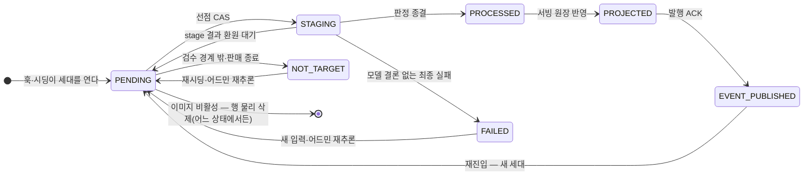

# [LLD] 성별 추론

## 문서 구성

| 문서 | 다루는 것 |
| --- | --- |
| (이 문서) | 정책 · 스코프 · lane 공통 규칙 · **비용** · 저장 스키마 · 백필 CSV 계약 · 롤백 · 인수 조건 |
| [증분 처리](incremental-processing.md) | 실시간 증분 lane — GENDER target · tick · 변경 감지 |
| [썸네일 이미지 성별 백필](thumbnail-image-gender-backfill.md) | 이미지 축 백필 lane |
| [상품 성별 백필](product-gender-backfill.md) | 상품 축 백필 lane — 이미지 폴백 · 종결 |
| [버전·프롬프트 레지스트리](version-registry.md) | V101 이미지 축 · V500/V501 상품 축 · 프롬프트와 평가 버전 정본 |
| [무신사 저장](mss-storage.md) | MSS · MSS Global 적재 — 테이블 · 변경 케이스 · 컨수머 |
| [29CM 저장](29cm-storage.md) | 29CM 적재 — 테이블 · 변경 케이스 · 컨수머 |
| [API spec](api-spec.md) | 지면 소비 API 계약 — 섹션별(글로벌 · 이후 추가) 엔드포인트 · 필드 · 변경 감지 |
| [CORE AI 추론 로직](core-ai-infer-logic.md) | (참고) 29CM 성별 추론 외부 구현 — 판정 소스 · 대조 · 이식 후보 |
| [인수조건별 실행 런북](../../tool/gender/runbook/README.md) | 개발환경 fixture · CCP 실행 · MSS/29CM 원장 확인 |

# 정책 요약

1. `의류, 신발, 스포츠/레저, 가방, 잡화` 카테고리이면서 `IN_REVIEW, ONSALE, SOLDOUT, SOLDOUT_MANUAL, READY_FOR_SALE` 상태의 상품만 대상으로 한다.
2. 파트너는 상품 등록 시 성별을 입력한다.
3. AI 추론 값이 파트너 입력값을 **덮어쓴다.** 별도 저장소를 만들지 않는다.
4. 파트너는 AI 값을 다시 수정할 수 있다.
5. **상품 성별은 대상 상품인데 추론값이 없을 때 한 번만(실질적으로 첫 검수 요청), 썸네일 이미지 성별은 썸네일 이미지 변경 시마다** 추론한다. 상세 이미지 변경은 상품 성별을 다시 추론하지 않는다 — 상세는 검수 전에 확정되고, 그 뒤의 수정은 대부분 판매 문구·배너다. 추론 값은 파트너가 수정한 값도 덮는다.
6. 이미지 성별 백필 target이 열리면 **전량 덮어쓴다**. 단, 환경 플래그로 기추론 썸네일
   표식이 있는 상품을 시딩 단계에서 건너뛸 수 있다.
7. **MSS 상품 성별은 기존 상품을 백필하지 않는다.** 재추론 트리거가 발생한 상품부터 증분 적용한다. 기존 상품 전체 백필은 사업 리스크가 너무 크다.

| CCP 판정 | 29CM | MSS |
| --- | --- | --- |
| 남성 | 남성 | M |
| 여성 | 여성 | W |
| 유니섹스 | 유니섹스 | M + W (2행) |
| 근거 없음(`UNDETERMINED`) | `UNKNOWN` | `goods_gender` `U` + `goods.sex` 비트 `16` (파트너 화면의 "해당 없음") |

# 적재 방식 — 실시간 증분과 배치 백필

CCP는 추론·판정을 담당하고 그 결과를 플랫폼별 적재 이벤트로 발행한다. 파이프라인은 3개다.

| 파이프라인 | 대상 정의 | 추론 방식 | 원장 |
| --- | --- | --- | --- |
| 실시간 증분 | API 서버가 탐지한 이미지 변경 | realtime api — **5분 주기 배치가 호출** |
| 썸네일 이미지 모델 성별 백필 | S3 CSV — MSS · 29CM. 기본은 전량이며 환경 플래그로 기추론 상품을 시딩에서 제외. MSS 결과는 MSS Global에도 함께 기록 | gemini batch api |
| 상품 성별 백필 | S3 CSV — 29CM, CORE AI 기추론 제외 | gemini batch api |

`gender_target`, `gender_stage_execution`, `gender_run` 으로 실행을 관리하고, `seller_product_images`, `seller_product_gender` 에 판정 결과를 기록한다.

## 실시간 증분

검수요청 이후 상태의 상품을 SLO **1시간**(수정 시점부터 플랫폼 반영까지) 안에 반영한다. realtime api 를 5분 주기 배치가 호출한다 — 트리거·입력 선별·tick 구조는 [증분 처리](incremental-processing.md)가 정본이다.

## 배치 백필

기존 상품은 배치로 처리한다. 축마다 **대상 플랫폼과 모수가 다르다.**

미리 데이터를 저장해놓고 플랫폼쪽 작업이 완료되면 이벤트 발행한다.

배치 백필의 경우 비용 절약을 위해서 gemini batch api를 사용한다.

| 축 | 백필 | 비고 |
| --- | --- | --- |
| MSS 상품 성별 (`goods_gender`·`goods.sex`) | **안 한다** | 사업 리스크 (쿠폰·전문관 등 판정 변경). 증분만 |
| MSS 상품 이미지 성별 (`goods_image`) | **배치 (전량)** | MSS 이미지에 판정 결과 기록 |
| MSS Global 상품 이미지 성별 (`goods_global_image`) | **배치 (전량)** | MSS 판정 결과를 같은 이벤트로 함께 기록. 별도 추론·CSV 없음 |
| 29CM 상품 성별 (`t_item_filter` META 2870) | **배치 (일부만)** | **CORE AI 가 기추론한 50만 건 제외** |
| 29CM 상품 이미지 성별 (`t_item_image`) | **배치 (전량)** | 이미지 축에는 CORE AI 기추론 제외가 없다 |

**축마다 스코프가 다르다.** 이미지 성별은 **MSS · MSS Global · 29CM 전부, 전량**이고, 상품 성별 백필은 **29CM 만, CORE AI 기추론 50만 건을 뺀 나머지**다. MSS Global은 MSS 판정 결과를 공유하므로 별도 추론 비용과 대상 CSV가 추가되지 않는다.

CCP에서는 MSS의 경우 아예 상품 성별을 추론하지 않고 null로 보낸다.

플랫폼은 값이 null로 값이 넘어오면 업데이트하지않는다.

29CM의 경우 CORE AI가 추론한 값들을 제외하고 null로 보낸다. 나머지는 추론해서 보낸다.

## 파이프라인 상세

| lane | 문서 |
| --- | --- |
| 실시간 증분 · 변경 감지 | [증분 처리](incremental-processing.md) |
| 썸네일 이미지 성별 백필 | [썸네일 이미지 성별 백필](thumbnail-image-gender-backfill.md) |
| 상품 성별 백필 | [상품 성별 백필](product-gender-backfill.md) |

- 세 lane이 공유하는 것은 <b>stage 이력 reducer</b>다. target type·현재 세대 stage 이력·실제 입력으로
  다음 호출·재시도·종결을 매번 다시 계산하는 규칙의 정본은
  `documents/core-catalog-platform/platform/gender/spec/uc-gender-10-spec-04-stage-progression.md`다.

### 썸네일 LLM 호출 상한

썸네일 축의 `GROUPED`와 필요할 때의 `MULTIPLE_COMPOSITION`은 외부 LLM 호출 하나에 최대
12장만 넣는다. 12장을 넘는 상품은 별도 chunk 번호나 target cursor를 저장하지 않고, 현재
세대 stage 이력에서 성공한 stage의 URL을 제외한 남은 입력의 앞 12장으로 다음 stage를
직렬 생성한다. 예를 들어 25장은 `12장 → 12장 → 1장`으로 처리한다.

한 묶음이 실패하면 같은 URL 묶음의 기술 재시도이므로 `attempt`만 증가시킨다. 서로 다른
묶음은 같은 `attempt=1`이어도 정규화된 URL 순서로 계산한 input bundle fingerprint가 달라
별도 stage·`unit_key`다. 이 식별용 fingerprint는 아래 감사용 `logical_input_sha256`와 역할이 다르다.
Application planner는 reducer에 넣기 전에 live URL과 기존 stage의 `image_urls`를 현재
`GenderPlatformUrlResolver` 설정으로 함께 정규화한다. Domain은 특정 CDN host를 알지 않으며,
정규화된 authority+path가 같은 URL만 동일 이미지로 비교한다.
모든 묶음이 완료된 뒤에만 상품 상세 stage 또는 최종 FOLD로 진행한다. 이 12장 상한은
`gender_run`/workflow 전체의 `max-images` bundle 상한과 별개다.

## 비용

단가는 Gemini 3.1 Flash-Lite **Batch** 입력 $0.125/M · 출력 $0.75/M, $1 = ₩1,400. GT 하네스 실측 토큰 기준이며 실제 Batch API 청구액은 아니다.

### 전량 백필 총액

| 축 | 스코프 | 상품 | 비용 |
| --- | --- | ---: | ---: |
| 썸네일 (V101) | MSS+29CM 전량 (MSS Global은 MSS 결과 공유) | 3,617,910 | ₩3,654,709 |
| 상품 (V500) | 29CM 만 | 481,181 | ₩485,030 ~ ₩1,393,019 |
| **합계** | | | **₩4,139,739 ~ ₩5,047,728** |

## 백필 공통 — 대상 CSV 계약

두 백필 lane 이 같은 계약을 쓴다.

| 항목 | 규약 |
| --- | --- |
| 위치 | run 의 `meta.seedCsvBucket` + `meta.seedCsvKey` |
| 형식 | 필수 2열 `platform,platform_product_id`. 두 값 모두 공백이 아니어야 하며 3열 이후는 무시한다. 첫 유효 행의 첫 열이 `platform` / `platform_code` / `플랫폼` 계열 헤더면 한 번만 건너뛰고, 빈 줄과 UTF-8 BOM을 허용한다 |
| 정규화 | 각 필드는 앞뒤 공백과 감싼 큰따옴표를 제거하고, `platform`은 대문자로 정규화한다. 따옴표 안 쉼표를 해석하는 범용 RFC CSV 형식은 지원하지 않는다 |
| 검증 | 오브젝트 저장소의 nonblank ETag를 run에 필수 고정해 실행 중 파일 교체를 거부한다. 업로드·HEAD에서 ETag를 확보하지 못하면 run을 만들지 않는다. 필수 열 누락·공백 행은 유효 데이터로 세지 않으며 cursor는 유효 데이터 행 기준으로만 증가한다 |
| 커서 | 물리 줄 번호가 아니라 **유효 데이터 라인 번호**. 파일이 원본으로 남아 중단 후 재시딩이 같은 대상을 다시 가리킨다 |
| 투입 완료 | 파일을 끝까지 읽으면 run 의 `targets_sealed` 를 세운다. 그 전에는 "남은 건수 0"이 완료를 뜻하지 않는다 |
| 재실행 | 커서는 영속되지 않는다. 다시 돌리면 처음부터 읽되 이미 만들어진 target 은 `(seller_product_id, type)` 중복으로 건너뛴다 |

**기본값은 기존 판정이 있어도 그대로 덮는다.** 모델을 바꿔 전량 다시 판정할 때는 CSV가
지목한 target을 모두 연다. 다만 썸네일 이미지 백필은
`IMAGE_GENDER_TARGET_SKIP_PREVIOUSLY_INFERRED_THUMBNAIL_BACKFILL=true`이면 현재 썸네일 중
`gender_target_version` 표식이 하나라도 있는 상품을 시딩에서 건너뛴다. 라벨이 null이어도
표식이 있으면 모델이 이미 본 상품이다. 이 플래그는 `PRODUCT_BACKFILL`과 증분에는 적용하지 않는다.

# 저장 스키마

컬렉션은 여섯이다.

**작업 3 + 서빙 2 + 어드민 검수 메타데이터 1.**

| 컬렉션 | 역할 | 쓰는 파이프라인 |
| --- | --- | --- |
| `gender_run` | 백필 **한 번의 실행** — 무엇을 어디서 투입했나 · 어디까지 왔나 | **백필 전용** |
| `gender_target` | 대상 하나의 진행 상태 | 전부 |
| `gender_stage_execution` | 배치 호출 이력 — 무엇을 보냈고 무엇이 왔나 | 전부 — 백필은 상태머신, 증분은 호출 이력 |
| `seller_product_images` | 이미지별 모델 성별 + **이미지 축의 작업 목록** | 증분 · 이미지 백필 |
| `seller_product_gender` | 확정 상품 성별 + **상품 축의 작업 목록** | 증분 · 상품 백필 |
| `gender_target_admin_review` | 적합·부적합 결과, 검수자·검수 시각 등 어드민 메타데이터 | 어드민 검수만 |

### gender_run — 백필 한 번의 실행

내부 매칭의 Run 과 같은 모양이다. **대상 투입의 단위이자 진행률의 분모**이며, 무엇을 어디서 읽었는지가 이 문서 하나에 남는다 — 사고 후 "그때 무엇을 덮었나"를 되짚을 때 파일을 가리키는 것이 이 행이다.

| 필드 | 타입 | 설명 |
| --- | --- | --- |
| `id` | String | run 식별자. `gender_target.run_id` 가 이 값을 가리킨다 |
| `pipeline` | String | `THUMBNAIL_IMAGE_BACKFILL` / `PRODUCT_BACKFILL` |
| `status` | String | `CREATED` → `RUNNING` → `COMPLETED`; 상품 백필 CSV 계약 위반은 `REJECTED`로 종결. `COMPLETED`로 옮기는 주체는 **발행 잡의 종결 스윕**(UC-GENDER-17)이다 — 봉인 + 열린 target 0 이 완료의 정의이고, 그 판정을 아무도 하지 않으면 끝난 run 이 영원히 `RUNNING`으로 남아 도는 run 과 구분되지 않는다 |
| `targets_sealed` | Boolean | CSV 를 끝까지 읽어 **대상 투입이 끝났는가.** 이 값이 서기 전에는 "남은 건수 0"이 완료를 뜻하지 않는다 |
| `seed_opened` | Long | 이 run 이 실제로 연 target 수 — **진행률의 분모**다. 원장을 세어 구하지 않고 시딩이 누적한다: 뒤에 다른 run·증분 세대가 같은 상품 행을 가져가면 `run_id`가 덮여 분모 자체가 줄고, "이 run 이 무엇을 투입했나"는 사후에 흔들리면 안 되는 사실이기 때문이다 |
| `seed_skipped` | Long | 증분 `GENDER` 행이 열려 있어 건너뛴 CSV 행 수(lane 겹침 규칙). 0 이 아니면 이 run 의 "완료"는 전수 완료가 아니다 — 재실행 판단의 근거 |
| `meta` | Object | 실행 인자. `seedCsvBucket` · `seedCsvKey` 와 그 밖의 파라미터 |
| `lock_version` | Long | 낙관적 락. 시딩과 진행 갱신이 겹칠 때 잃는 갱신을 막는다 |
| `rt` · `ut` | Instant | 생성 · 수정 |

### gender_target — 대상 하나의 진행 상태

`type` **이 lane을 가른다.** 증분은 상품당 `GENDER` 1행, 백필은 축별 1행이다.
**썸네일 데이터·판정 결과·대상 판별 조건은 여기 없다** — 서빙 원장과 CSV가 답한다.
검수 목록을 빠르게 나누기 위한 `review_bucket`은 `Math.floorMod(seller_product_id, 8)`으로
삽입할 때 한 번 계산한 값(0..7)이며, 닫힌 행을 다시 열 때도 그대로 보존한다.
`IN_REVIEW`에 진입한 뒤 검수 대상 이미지 집합은 바뀌지 않는다는 업무 계약을 사용하므로,
진행 중 이미지 변경을 나타내는 별도 필드도 두지 않는다.
상품 축의 `detail_image_urls`는 그 세대가 실제로 본 상세 URL snapshot이다. target-level
`detail_hash`·`input_hash`는 없애고, 나머지 입력 감사는 stage의 source ID·prompt/composer version으로 한다.

모든 lane 이 같은 상태기계를 지난다. lane 마다 다른 것은 stage 가 끼는 방식뿐이다(각 usecase 문서).

- 일반 재진입은 닫힌 상태에서 `PENDING`으로 되돌리고 `version`을 새 epoch로 교체한다.
  자동 상품 성별 추론은 상품당 한 번이며, 진행 중 이미지 변경이나 자동 후속 세대는 없다.
- 상품 이미지 비활성화는 어느 상태에서든 그 상품의 모든 축 행을 **물리 삭제**한다 — 묘비(소프트삭제)를 남기지 않는다. 정리된 행은 좀비 작업·발행 오염을 만들 뿐이고 `(seller_product_id, type)` unique 좌표를 점유해 재대상 시 신규 개방을 막는다. 좌표가 비어 있어야 시딩·훅이 신규 세대로 다시 연다. 사고 조사는 `gender_run`·`gender_stage_execution`·발행 이벤트가 담당한다.
- `STAGING` 은 "열린 stage 가 있다"는 뜻이다 — 호출 자체의 상태는 `gender_stage_execution` 이 소유한다.
- 다이어그램의 `PENDING` 은 실제로 둘이다 — `claimed_at` 유무가 **제출 대기**와 **환원 대기**를 가른다. 환원 대기 행은 `PENDING → PROCESSED`(모델 판정 종결)·`PENDING → FAILED`(최종 실패 종결)·`PENDING → PENDING`(다음 stage 전진) 경로를 직접 지난다. 정밀 전이표의 정본은 `documents/core-catalog-platform/platform/gender/spec/uc-gender-10-spec-03-gender-target-status.md` 다.

| 필드 | 타입 | 설명 |
| --- | --- | --- |
| `type` | String | `GENDER` — 증분, 두 축을 한 행에서 · `THUMBNAIL_IMAGE` / `PRODUCT` — 백필, 축마다 대상 범위가 달라 분리 |
| `seller_product_id` | Long | **unique index** `(seller_product_id, type)` — 재실행이 같은 대상을 다시 만들지 않는 근거 |
| `inference_origin` | String | **증분인가 백필인가.** `INCREMENTAL` / `BACKFILL`. 관측·실행 이력에 사용하며 플랫폼 이벤트에는 싣지 않는다 |
| `run_id` | String | 이 대상을 만든 `gender_run`. 백필만 채운다 — `inference_origin` 이 "어떤 종류"를, 이 값이 **"어느 실행"**을 답한다 |
| `platform_code` · `platform_product_id` | String | 플랫폼 · 플랫폼 상품번호 |
| `review_bucket` | Int | `Math.floorMod(seller_product_id, 8)`으로 계산한 검수 목록 좌표. 값은 0..7이며 **최초 삽입 때만 계산**하고 재진입·재시작에서는 변경하지 않는다 |
| `version` | Long | 내부 세대. 값은 **세대 개시 시각 epoch millis** — target·stage·projection·발행 ACK의 CAS와 서빙 원장 역행 방지에만 사용하고 외부 이벤트에는 싣지 않는다. 증분 `GENDER` 행과 백필 축 행이 같은 서빙 필드에 쓰므로 내부 시계가 하나여야 한다 — 행마다 1부터 세면 백필이 남긴 숫자가 증분 첫 세대들의 반영을 조용히 막는다 |
| `status` | String | 성공 사슬은 `PENDING` → `STAGING` → `PROCESSED` → `PROJECTED` → `EVENT_PUBLISHED`. 모델 결론 없이 최종 종결되면 `FAILED`, 대상 밖이면 `NOT_TARGET`. 발행까지가 상태다 — 별도 발행 플래그를 두지 않는다. 비활성화는 상태가 아니라 **행 물리 삭제**다(묘비 없음). `dt`(소프트삭제 표식)는 쓰는 코드 없이 레거시 방어로만 남는다 |
| `inference_requested_at` | Instant | **SLO 1시간의 측정 앵커.** `rt` 로 재면 되살아난 target 이 문서 나이를 리드타임으로 오인한다 |
| `event_published_at` | Instant | 발행 시각. E2E 리드타임(`inference_requested_at` → 발행)의 종점이다. 발행 여부 자체는 `status` 가 답한다 |
| `claimed_at` | Instant | 고아 회수의 시계. tick 이 선점 직후 죽으면 **이 시계가 유일한 증거**다 |
| `detail_image_urls` | String[] | 상품 축 세대가 판정한 상세 입력 스냅샷. 증분·백필 모두 상세 stage를 만들 때 원장(CUVE 상세)에서 읽은 값을 target version·stage identity CAS로 굳힌다 |
| `not_target_at` · `failed_at` | Instant | 재시딩 유예 · 장애 복구의 시계 |
| `decision_path` | String | 로직이 읽지 않는다. 어드민 통계·필터와 "왜 미판정으로 닫혔나"의 단서 (결정 #5) |
| `rt` · `ut` · `dt` | Instant | 생성 · 수정 · 삭제 |

**여기 없는 것들 — 전부 다른 곳이 답한다.**

| 두지 않는 것 | 대신 어디서 |
| --- | --- |
| `next_stage_type`·`next_stage_seq`·`next_stage_attempt` | 현재 세대의 `gender_stage_execution` 이력과 target type별 실제 입력에서 다음 작업을 런타임에 재계산한다 |
| `detail_hash`·`input_hash` | 상품 자동 추론은 입력 변경으로 재실행하지 않는다. 실제 입력 감사는 stage의 `image_urls`·source ID·prompt/composer version이 담당한다 |
| 썸네일 URL 스냅샷 | 판정 직전에 `seller_product_images`의 현재값을 읽는다. 상세 URL은 증분·백필 모두 플랫폼별 CUVE HTML에서 추출하고, 상품 stage의 `image_urls`·source ID와 target의 `detail_image_urls`에 남긴다 |
| 반영 대상 목록 | 증분은 그 tick 이 들고 있고, 백필은 `gender_stage_execution.image_urls` 가 답한다 |
| 작업 유도 근거 | `images[].gender_target_version`(이미지 작업 목록) · `seller_product_gender` 문서의 존재(상품 1회 추론 여부) |
| 축의 결론과 준거 | 서빙 두 컬렉션 |
| 판정 모델 · 백필 대상 | **대상은 CSV가 말한다.** 모델 교체도, CORE AI 기추론 50만 건 제외도 파일에서 정해진다. 썸네일 이미지 백필은 상품 축을 다루지 않으므로 상품 성별 값은 `null`로 매핑한다 |

### gender_target_admin_review — 어드민 검수 메타데이터

`gender_target`의 진행 상태·세대·추론 로직과 분리된 어드민 기록이다. 적합·부적합 결과, 검수자,
검수 시각은 이 컬렉션에만 저장하고, 추론 job은 이 컬렉션을 읽거나 쓰지 않는다. 따라서 운영자가
검수 표시를 바꿔도 target 선점·stage 진행·서빙 성별·이벤트 발행은 달라지지 않는다.

| 필드 | 타입 | 설명 |
| --- | --- | --- |
| `seller_product_id` | Long | 상품 식별자 |
| `target_type` | String | 검수한 `gender_target.type` |
| `target_version` | Long | 검수 당시 target 세대 |
| `review_status` | String | `PENDING` / `APPROPRIATE` / `INAPPROPRIATE` 어드민 검수 결과 |
| `reviewed_by` · `reviewed_at` | String · Instant | 마지막 검수자·검수 시각 |
| `rt` · `ut` | Instant | 생성 · 수정 |

`gender_target_admin_review`의 갱신은 검수 화면의 표시만 바꾼다. 이 기록을 business inference의
입력·완료 조건·재시도 조건으로 사용하지 않으며, `gender_target`에 검수 필드를 되밀어 넣지 않는다.

이 삭제는 저장소에만 한정되지 않는다. 조회 API/DTO의 `nextStageType`·`nextStageSeq`·
`nextStageAttempt`와 어드민 원장 그리드의 세 열도 제거한다. 화면에 현재 작업을 보여줘야 하면
현재 세대 stage 이력과 실제 입력으로 계산한 nullable `currentWork`를 사용한다. stage 이력 표의
`stage_type`·`attempt`와 `unit_key` 안의 input bundle fingerprint는 외부 호출의 식별 좌표다.

### gender_stage_execution — 배치 호출 이력

호출 하나 = 문서 하나.

| 필드 | 타입 | 설명 |
| --- | --- | --- |
| `unit_key` | String | 썸네일 stage에서는 정규화된 URL 목록의 **순서만** SHA-256한 input bundle fingerprint와 attempt를 포함하는 상관 키. **unique index.** 응답 회수가 이 문자열 정확 일치로 호출을 역참조하고, 결과 반영 CAS가 소유권 검증을 겸한다. 상품 stage는 기존 stage type·attempt 형식을 유지한다 |
| `seller_product_id` | Long | 상품 식별자 |
| `target_type` · `target_version` | String · Long | 이 호출이 속한 `gender_target` 행. 세대가 지나면 `SUPERSEDED` 로 닫힌다 |
| `stage_type` · `attempt` | String · int | 외부 LLM 호출 종류와 그 호출의 기술적 재시도 회차. 증분 의류 상품 workflow는 `DETAIL_SCENE_MAPPING`·`DETAIL_RESOLUTION` 두 stage이며, 재시도는 실패한 stage의 attempt만 증가한다. 썸네일 묶음이 달라지면 input bundle fingerprint가 달라지고 attempt는 다시 1부터 시작한다. |
| `image_urls` | Array | 이 호출에 실제로 넣은 이미지. **순번↔URL 복원과 반영 대상의 근거다** — 부분집합 입력이면 응답의 `position 1` 은 대표 썸네일이 아니라 제출 목록의 첫 장이다 |
| `category_depth1` | String | 생성 시점의 대분류 snapshot. 5개 대상 카테고리의 상세 프로토콜 선택 근거 |
| `target_reference_included` | Boolean | 의류 Judge에 256px `TARGET_REFERENCE`를 사용했는지 여부 |
| `detail_scene_mapping` | Object | `DETAIL_SCENE_MAPPING`의 ID-only routing 결과. Mapper는 성별·상품 일치·SKU를 판정하지 않는다 |
| `detail_resolution_selected_image_ids` | List<String> | selector가 Judge에 보낸 상세 ID. soft cap 8, hard cap 12 |
| `detail_resolution_omitted_image_ids` | List<String> | Mapper가 선택하지 않아 Judge에는 보내지 않은 감사용 상세 ID |
| `rendered_source_image_ids` | List<String> | 합성 직후 실제 모델 화면에 그린 ID. 파서는 응답 source ID를 이 목록과 대조한다 |
| `prompt_version` · `prompt_sha256` | String | stage 생성 시점의 프롬프트 식별자와 문면 hash |
| `input_composer_version` · `logical_input_sha256` | String | 감사·재현용 실행 계약 hash. URL 순서뿐 아니라 카테고리·참조 여부·prompt/composer 문맥까지 포함하며, URL 묶음 식별만 맡는 `unit_key` fingerprint와 별도다 |
| `status` | String | `READY` → `DISPATCHED` → `COMPLETED`. 그 밖에 `FAILED` · `SUPERSEDED` |
| `external_workflow_id` | String | promptflow workflow 식별자. 제출 전 사망한 잔여 stage 를 그 단위로 닫는 근거 |
| `outcome_ok` · `outcome` · `outcome_reason` | Boolean · String | 계약 준수 여부 · 성별 결론 · 사유 |
| `outcome_image_verdicts[]` | Array | 이미지별 판정. 원소는 `position` · `gender` · `presence` · `person_count` · `basis` · `confidence` |
| `raw_model_response` | String | 상세 Judge의 구조화 관찰·scope·source ID를 포함한 모델 JSON 원문. `outcome`과 같은 완료 CAS에서 원자적으로 저장 |
| `failure_code` | String | 실패 분류 |
| `rt` · `ut` | Instant | 생성 · 수정. `rt` **가 미접수 유예 판정의 시계다** |

호출 종류는 축에 속한다 — `GROUPED` · `MULTIPLE_COMPOSITION` 은 이미지 축,
`DETAIL_SCENE_MAPPING` · `DETAIL_RESOLUTION`은 상품 축이다. 증분 `GENDER` 행이
두 축의 호출을 모두 남기므로 stage는 자기를 만든 행의 type을 생성 시점에 받아 명시로 저장한다.
최종 상세 성별은 마지막 성공 `DETAIL_RESOLUTION`의 Judge 결과다.

**중복 과금은 target 레벨의 겹침 규칙이 막는다** — 같은 상품의 target 이 처리 중이면(`PENDING`·`STAGING`) 반대 lane(시딩·훅)은 건너뛴다. `unit_key` 는 차단 장치가 아니라 응답 상관과 소유권 검증용이다.

### seller_product_images — 이미지별 모델 성별 + 작업 목록

문서 1개 = 상품 1개. **성별은 이미지 원소에만** 둔다.

| 필드 | 타입 | 설명 |
| --- | --- | --- |
| `seller_product_id` | Long | 상품 식별자 |
| `platform_code` · `platform_product_id` | String | 플랫폼 · 플랫폼 상품번호 |
| `images[]` | Array | 대표·상세 이미지 목록 |
| `images[].type` | String | `THUMBNAIL` / `DETAIL` |
| `images[].image_url` | String | 이미지 축의 **조인 키**. `position` 은 재동기화로 밀리므로 키가 될 수 없다 |
| `images[].position` | int | 노출 순서 |
| `images[].is_representative` | Boolean | 대표 썸네일 여부. 문서당 true 는 정확히 1개 |
| `images[].gender` | String | **이미지별 모델 성별.** `MALE` · `FEMALE` · `MIXED` · `NO_PERSON` · `PERSON_UNCLEAR` · null(미판정) |
| `images[].presence` | String | 사람 존재 형태. `NONE` · `WORN` · `VISIBLE` · null |
| `images[].gender_target_version` | Long | **썸네일 이미지 축의 판정 세대.** 비어 있으면 아직 평가된 적이 없다 — 이 한 칸이 **증분** 이미지 축의 작업 목록을 정의한다. 세대 비교로 낡은 projection의 역행을 막는다 |
| `rt` · `ut` · `dt` | Instant | 생성 · 수정 · 삭제 |

**판정 표식을 이미지 단위로 두는 이유.** `images[]` 는 writer 가 둘이다 — 상품 이미지 sync 가 URL 을 추가·삭제하고, 성별 판정이 결과를 쓴다. 표식을 문서 레벨에 두면 **"미판정으로 확정됨"**(`gender=null`, 표식 있음)과 **"아직 평가 안 됨"**(둘 다 없음)이 한 값으로 뭉개지고, 하류가 후자를 전자로 읽어 라벨을 지운다.

**증분은 판정한 이미지의 원소만 갱신한다.** 백필은 전 이미지를 갱신하며, 판정이 없는 URL 도 `gender`·`presence` 를 null 로 쓰되 표식은 새긴다.

### seller_product_gender — 확정 상품 성별 + 작업 목록

문서 1개 = 상품 1개.

| 필드 | 타입 | 설명 |
| --- | --- | --- |
| `seller_product_id` | Long | 상품 식별자. **unique index** |
| `gender` | String | **확정 상품 성별.** `MALE` · `FEMALE` · `UNISEX` · `UNDETERMINED` |
| `gender_source` | String | 이 값을 정한 준거. `SHOE_SIZE` · `NAME` · `STANDARD_CATEGORY` · `IMAGES` · `DETAIL_TEXT` · `DETAIL_IMAGE` · `NONE` |
| `gender_target_version` | Long | 이 상품 성별을 기록한 **상품 축 `gender_target` 세대**. 썸네일 이미지 축의 세대와 분리된 시계이며, 낡은 상품 성별 projection의 역행을 막는다 |
| `rt` · `ut` | Instant | 생성 · 수정 |

**서빙 원장이 자기 값의 출처를 든다.** "무슨 준거로"·"언제" — 소비자가 물을 자리는 큐가 아니라 값이 있는 곳이다.

비의류 값은 정책 폴드(①신발 확정 사이즈 → ②상품명 → ③썸네일 MIXED → ④상세 HTML
명시 텍스트 → ⑤상세 이미지 성별 → ⑥썸네일 투표 → ⑦근거 없음)의 결과다. 의류는
⓪스커트 leaf 표준 카테고리 → ①상품명 → ②썸네일 전체 UNISEX → ③V1000 상세 → ④썸네일 단성 투표 → ⑤근거 없음으로
접고 HTML 키워드를 사용하지 않는다. Mapper 관찰은 fold하지 않으며, Judge의 유효한
`subjectId`·`subjectRegion`·`skuIdentity`를 가진 `MATCH` 관찰만 성별 집합에 다시 계산한다.
판매자 입력 성별은 사용하지 않는다. 이미지별 라벨과 달리 상품은 `UNISEX`를 가질 수 있다.

`images[].gender=MIXED`는 CCP 내부 판정·상품 성별 폴드에서만 사용한다. 플랫폼 이벤트를 조립할 때
`FEMALE`로 접어 내보내므로 MSS·29CM은 `MIXED`라는 어휘를 알지 못한다. MSS의 최종 이미지 저장값은
기존 `FEMALE→W` 규칙에 따라 `W`다.

"성별 근거가 없다"는 결론은 `UNDETERMINED` **하나**다. 상세 모델의 미완료 응답과 폴드의 최종 근거 없음이 같은 뜻이라 어휘를 나누지 않는다 — 이름만 다른 값이 둘이면 원장·이벤트·어드민이 제각기 다른 쪽을 쓴다. 이 값을 `UNISEX`(공용이라는 적극적 판정)와 섞지는 않는다. 섞으면 공용 상품 수가 부풀고, 29CM 의 `UNKNOWN`·MSS 의 "해당 없음"(`U`) 계약을 표현할 수 없다.

단, 현재 Kafka 상품 성별 payload는 `UNDETERMINED`를 허용하지 않는다. 내부 원장과 stage의 뜻은
유지하고 publisher 경계에서만 `UNDETERMINED → UNISEX`로 매핑한다. 이 전송 호환 규칙을 내부
도메인 어휘의 동일성으로 해석하지 않는다.

# 플랫폼 저장

판정 결과가 각 플랫폼 원장에 어떻게 적재되는지는 플랫폼별 문서가 정본이다 — [무신사 저장](mss-storage.md) · [29CM 저장](29cm-storage.md).

# 롤백 — Feature Flag로 제어할 수 없다

기존 값을 덮어쓰기 때문에 **서빙을 끄는 스위치가 없다.** 기능을 꺼도 이미 덮인 값은 그대로 남고, 소비처들이 성별 원장을 각자 직접 읽기 때문에 노출을 한 곳에서 막을 수도 없다.

| 수단 | 하는 일 | 한계 |
| --- | --- | --- |
| 적재 FF (발행·컨슈머·프로젝션 중단) | 더 이상 덮지 않게 막는다 | 이미 덮인 값은 그대로 남는다 |
| 스냅샷 복원 배치 | 덮기 전 값으로 되돌린다 | 배치라서 시간이 걸린다 |
| 백필 run 의 대상 CSV | 덮을 대상을 파일 행 수로 묶는다. 사고 후 "그때 무엇을 덮었나"도 `gender_run.meta` 가 가리킨다 | 증분에는 적용되지 않는다 |

사고 시 순서 : **적재 중단 → 영향 범위 확인 → 스냅샷 복원.**

오픈 전 필수 준비물 : MSS `goods_gender`·`goods.sex`·`goods_image.gender`, 29CM META 2870 행의 **사전 스냅샷**, 그리고 AI가 쓴 행의 식별 수단(MSS `admin_id`, 29CM `admin_no`). 이미지는 전량 덮으므로 `goods_image.gender` 덤프가 사람 라벨의 유일한 복원 근거다.

# 인수 조건

usecase 단위 인수 조건은 각 usecase 문서에 있다. 여기는 lane 을 가로지르는 조건만 둔다.

| # | 인수조건 | 검증 |
| --- | --- | --- |
| 1 | 썸네일 없으면 **배치·실시간 둘 다 썸네일부터** | 배치 `axis=PRODUCT scanned=3, skipped=3` / 실시간 `scanned=1, skipped=1` |

# 남은 결정

| # | 항목 | 내용 | 담당 |
| --- | --- | --- | --- |
| 1 | `goods.sex` 파급 합의 | 쿠폰·전문관·전시카테고리 판정 변경 확인.  증분 적용이라 규모는 완만하나 판정 변경 자체는 발생 | 쿠폰: 캠페인 서비스팀 전문관 : 상품 서비스팀 전시카테고리 : 상품 서비스팀 |
| 2 | 티몰·조조타운 다중행 대응 | 유니섹스 = M+W 2행. 파트너 입력으로 이미 2행 57만 건이 존재하는 기존 문제 AI 증분으로 완만히 증가. 티몰 단일행 읽기(정렬 없음)·조조타운 `ETC` 축약의 조치 우선순위 판단 | 상품 서비스팀 |
| 3 | 티몰 모델컷 합성 버그 | 이미지 전량 백필 전 수정 필수 성별 분기 도입 커밋 | 상품 서비스팀 |
| 4 | 통관 번호 <-> 성별간의 데이터 정합성 |  | 상품 서비스팀 |
| 5 | `decision_path` 존치 | CCP 로직이 읽지 않는다. 빼면 어드민 통계·필터와 "왜 미판정으로 닫혔나"가 사라진다 | MJ |
| 6 | CORE AI 기추론 50만 건의 식별 수단 | 상품 성별 백필의 제외 대상이자 롤백 범위를 가르는 기준인데, 현재 `admin_no` 로는 CORE AI 와 CCP AI 가 구분되지 않는다(§3.1). **CSV 를 만들려면 이 식별이 먼저다** | MJ |

# 참고

* [성별 추론 LLD (원본)](https://wiki.team.musinsa.com/wiki/spaces/~minjoon.lee/pages/602341537) — 서빙 경로 전수 조사 · 추론 파이프라인 내부
* [29CM 성별 적용 PRD](https://wiki.team.musinsa.com/wiki/spaces/CBPCPP/pages/495225134)
