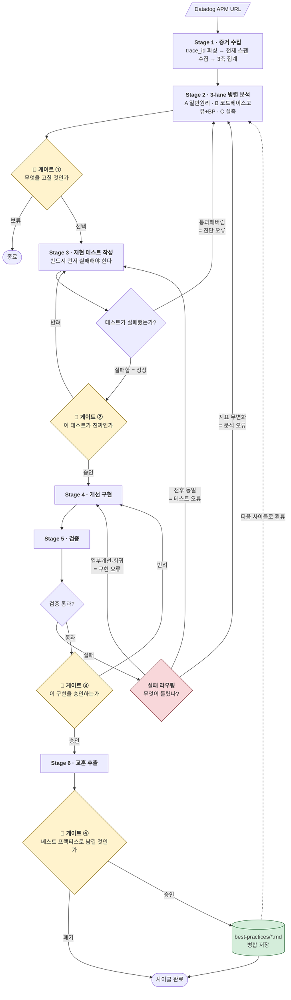
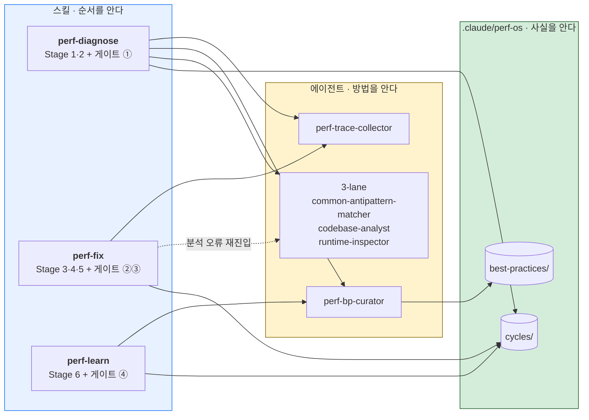

# 성능 개선 OS

> 느린 API를, 증거에서 출발해 회귀 방지 테스트로 봉인하기까지 사람과 AI가 함께 굴리는 협력 체계.

---

## 1. 왜 만드는가

온콜은 계속 느린 API를 발견한다. 그런데 피처 일정이 밀려 있으니, **치명적으로 느린 것이 아니면 그냥 넘어간다.**

한 건씩 보면 합리적인 판단이다. 그러나 이 판단이 반복되면 결과가 누적된다.

- 느린 API는 사라지지 않고 **쌓인다**
- 데이터가 늘수록 같은 코드가 **더 느려진다** — 오늘 넘긴 API가 반년 뒤엔 장애가 된다
- 사용자는 개별 API가 아니라 **누적된 체감 속도**로 제품을 평가한다

넘어가는 이유는 게을러서가 아니다. **성능 개선의 진입 비용이 너무 높기 때문**이다. 원인을 짚으려면 APM을 파야 하고, 짚어도 확신이 없고, 고쳐도 정말 나아졌는지 증명할 방법이 없다. 그래서 "확실히 치명적인 것"만 손대게 된다.

이 OS는 **그 진입 비용을 낮추는 것**을 목적으로 한다. 느린 API 하나를 붙들었을 때, 진단부터 검증까지 가는 길이 이미 깔려 있게 만든다.

---

## 2. 목표와 성공 기준

### 목표

**Datadog APM 링크 하나를 입력하면, 근거 있는 진단 → 사람의 판단 → 재현 테스트 → 개선 → 검증까지 이어지는 하나의 흐름을 제공한다.**

### 성공 기준

개선했다는 **주장**은 인정하지 않는다. 다음 두 가지가 모두 충족되어야 한 사이클이 성공이다.

1. **수치 개선** — 대상 API의 성능 지표가 측정 가능하게 개선되었다
2. **회귀 방지** — 그 개선을 지키는 테스트가 레포에 남았다. 누군가 다시 깨뜨리면 CI가 잡는다

2번이 없는 1번은 성공이 아니다. 시간이 지나면 반드시 원래대로 돌아가기 때문이다.

### 부수 목표

**OS는 쓸수록 똑똑해져야 한다.** 매 사이클의 교훈이 베스트 프랙티스로 축적되고, 다음 사이클의 분석에 자동으로 투입된다. 5번째 개선은 앞선 4번을 이미 알고 시작한다.

---

## 3. 비목표

경계를 명확히 하지 않으면 OS는 무한히 비대해진다. **다음은 이 OS가 하지 않는 일이다.**

| 하지 않는 일 | 이유 |
|---|---|
| **무엇을 고칠지 우선순위를 정하는 일** | 사람이 APM 링크로 지목한다. 탐색은 이 OS의 책임이 아니다 |
| **느린 API를 찾아내는 일** | 별도의 탐지 도구가 담당한다. 이 OS와 완전 독립이며 서로 호출하지 않는다 |
| **사람 대신 결정하는 일** | 4개의 게이트에서 판단 주체는 항상 사람이다 |

---

## 4. 입출력

### 입력

Datadog APM 트레이스 URL **한 개**.

```
https://app.datadoghq.com/apm/trace/6a8ed7d500000000403ffc15fbba5fcc?spanID=6512965886138744892&timeHint=1787746261910
                                    └──────── trace_id ────────────┘        └──── spanID ────┘         └─ timeHint ─┘
```

| 파라미터 | 값의 성격 | OS에서의 쓰임 |
|---|---|---|
| `trace_id` | 32자리 소문자 hex | `get_datadog_trace`의 필수 입력. **전체 스팬 수집의 출발점** |
| `spanID` | 사람이 화면에서 보고 있던 스팬 | **사람이 의심한 지점.** AI의 독립 판단과 대조하는 기준점 |
| `timeHint` | epoch millis | 로그·DB·집계 조회의 **시간창 고정** |

**`trace_id`가 곧 사이클 ID다.** 진단만 하고 며칠 뒤 개선을 시작하거나, 개선 후 교훈만 뽑을 때는 같은 URL(또는 `trace_id`)을 다시 주면 `.claude/perf-os/cycles/<trace_id>/`를 이어받는다.


### 출력

| 산출물 | 성격 | 남는 곳 |
|---|---|---|
| 진단 보고서 | 근거(스팬·실행계획·로그)가 붙은 가설 목록 | `cycles/<trace_id>/20-hypotheses.md` |
| 재현 테스트 | 개선 전 실패하고 개선 후 통과하는, 레포에 남는 테스트 | 레포의 테스트 디렉터리 (기록은 `40-test.md`) |
| 개선 코드 | 게이트를 통과한 변경 | 레포 |
| 검증 리포트 | before/after 측정치 + 잔여 리스크 | `cycles/<trace_id>/50-verify.md` |
| 베스트 프랙티스 md | 다음 사이클의 분석에 투입되는 축적 지식 | `.claude/perf-os/best-practices/` (`perf-bp-curator`만 접근) |

레포에 남는 것(테스트·코드)과 OS가 관리하는 것(사이클 기록·축적 지식)을 나눈다. 앞의 둘은 제품의 일부이고, 뒤의 셋은 **이 OS가 다음 사이클을 위해 스스로에게 남기는 것**이다.

### 사이클 워크스페이스

한 사이클의 산출물은 `trace_id` 이름의 디렉터리 하나에 순서대로 쌓인다.

```
.claude/perf-os/cycles/<trace_id>/
  00-input.md            APM URL 파싱 결과
  10-baseline.md         Stage 1 산출 — 3축 집계·병목 판정·spanID 대조
  20-hypotheses.md       Stage 2 결과 + 교차검증   ← 재진입 시 append
  30-decision.md         게이트 ① 결과 (선택된 가설)
  40-test.md             테스트 경로 + 실패 로그 + 게이트 ② 승인 기록
  50-verify.md           after 측정 + before/after 비교
  60-lesson.md           교훈 초안 + 게이트 ④ 결과
  attempts.json          시도 이력 (§7)
```

번호 접두사는 장식이 아니다. **어디까지 갔는지가 파일 목록으로 드러나는 것이 곧 재개 가능하다는 뜻**이다. 게이트 ②에서 사람이 하루 걸려 테스트를 리뷰하고 다음 날 돌아와도 이어진다. 이 디렉터리가 필요한 이유는 §5에서 드러난다 — 흐름을 세 스킬로 쪼갠 대가가 **넘길 상태**이고, 여기가 그 자리다.

---

## 5. 전체 흐름



### 흐름을 읽는 법

이 흐름에는 세 종류의 화살표가 있다. 셋을 구분해서 보는 것이 이 OS를 이해하는 핵심이다.

1. **전진 화살표** — 정상 경로. 증거 → 진단 → 판단 → 테스트 → 구현 → 검증 → 학습
2. **역방향 화살표** — 되돌아가는 경로. **어디로 되돌아가는지가 곧 무엇이 틀렸는지에 대한 진단이다.** 아무 데나 되돌아가면 무한 루프가 된다 (§7)
3. **점선 환류** — 이번 사이클의 학습이 다음 사이클의 분석으로 들어가는 경로. 이것이 이 체계를 "도구"가 아니라 "OS"로 만든다 (§8)

### 게이트가 4개인 이유

게이트는 **되돌리기 비용이 급격히 오르는 지점 직전**에 배치되어 있다.

| 게이트 | 이 직후에 벌어지는 일 | 게이트가 없으면 |
|---|---|---|
| ① 무엇을 고칠지 | 테스트·구현 작업 착수 | 엉뚱한 문제를 며칠 판다 |
| ② 테스트가 진짜인지 | 이후 모든 "성공" 판정의 기준이 됨 | **가짜 기준 위에 확신이 쌓인다** |
| ③ 구현 승인 | 코드가 프로덕션으로 향함 | 수치만 보고 위험한 방식을 통과시킨다 |
| ④ 교훈 승인 | 지식이 영구 축적되어 미래에 영향 | 틀린 교훈이 다음 사이클을 오염시킨다 |

### 누가 실행하는가 — 세 층

여기까지가 **흐름**(무슨 순서로 판단하는가)이고, 여기부터는 **배치**(누가 담당하는가)다. 구현이 바뀌어도 위의 흐름은 그대로다.

| 층 | 위치 | 아는 것 | 바뀌는 빈도 |
|---|---|---|---|
| **스킬** | `.claude/skills/` | **순서** — 어떤 차례로, 어느 게이트에서 멈출지 | 낮음 |
| **에이전트** | `.claude/agents/` | **방법** — 어떻게 수집·분석·판정할지 | 중간 |
| **공유 디렉터리** | `.claude/perf-os/` | **사실** — 축적된 지식과 사이클 상태 | 매 사이클 |

단계 묶음으로만 쪼개면 **단계를 넘나드는 것**(축적 지식, 분석 능력, 측정 방법)을 담을 자리가 없다. 그것들이 2층으로 내려간다. 에이전트는 스킬 디렉터리 밖의 프로젝트 전역에 있으므로, 내려놓는 것만으로 공유된다.

| 스킬 | 담당 | 입력 | 진행 거부 조건 |
|---|---|---|---|
| `perf-diagnose` | Stage 1·2 + 게이트 ① | APM URL | — |
| `perf-fix` | Stage 3·4·5 + 게이트 ②③ + 실패 라우팅(§7)<br/>(분석 오류 시 3-lane 재호출 + **게이트 ① 재실행**) | `trace_id` 또는 APM URL | `30-decision.md` 없음 |
| `perf-learn` | Stage 6 + 게이트 ④ | `trace_id` (미지정 시 미처리 사이클 목록 제시) | `50-verify.md` 없음 |




### 소유권 규칙

| # | 규칙 | 이유 |
|---|---|---|
| **R1** | 스킬은 다른 스킬을 호출하지 않는다 | 순환 의존 차단. 공유가 필요하면 에이전트로 내린다 |
| **R2** | 에이전트는 다른 에이전트를 호출하지 않는다. **조립은 항상 메인이 한다** | 서브에이전트 중첩 제약. 이 규칙이 R1을 자연스럽게 만든다 |
| **R3** | `.claude/perf-os/best-practices/` 경로를 아는 것은 `perf-bp-curator`뿐 | 경로가 두 곳에 적히는 순간 캡슐화가 무너진다 |

R2의 실무적 귀결이 크다. **"메인이 조립한다"는 것은 메인이 각 에이전트의 입력을 직접 만들어 넘긴다는 뜻**이다. 그래서 계약이 없으면 재사용이 성립하지 않고, 두 곳에서 각자 다르게 부르는 결과가 된다. 각 에이전트의 계약은 §6의 해당 단계에 붙어 있다.

### 디렉터리

```
.claude/
  agents/
    perf-trace-collector.md              트레이스 안
    perf-common-antipattern-matcher.md   보편 지식
    perf-codebase-analyst.md             이 레포 고유
    perf-runtime-inspector.md            트레이스 밖
    perf-bp-curator.md                   축적 지식
  skills/
    perf-diagnose/SKILL.md
    perf-fix/SKILL.md
    perf-learn/SKILL.md
  perf-os/
    best-practices/
      INDEX.md
      <pattern>.md
    cycles/
      <trace_id>/            사이클 워크스페이스 (§4)
```

**`.claude/`는 이 OS를 이루는 모든 것의 루트다.** `agents/`·`skills/`가 **방법과 순서**를 담고, `perf-os/`가 **사실**을 담는다. 셋을 형제로 나란히 둔다.

한 단계 더 감싸지 않는 이유는, **중간 디렉터리가 격리를 주지 않으면서 경로만 길게 만들기 때문**이다. `.claude/docs/perf-os/`는 `.claude/perf-os/`보다 한 층 깊을 뿐 `.claude/` 아래라는 사실은 같고, `docs`라는 이름표는 내용과 어긋난다 — `attempts.json`은 스킬이 재시도 횟수를 세는 상태 파일이고, `best-practices/*.md`조차 사람이 아니라 `perf-bp-curator` 에이전트가 읽는다. 사람이 읽으라고 쓴 문서는 여기 없다. **디렉터리 이름은 계약이므로, 틀린 이름은 언젠가 잘못된 정리를 부른다.**

커밋 경계는 **하위 디렉터리 단위로 긋는다.**

| 디렉터리 | 커밋 | 이유 |
|---|---|---|
| `best-practices/` | O | 팀 지식. §8이 리뷰 대상으로 못 박았다 |
| `cycles/` | X | 사이클마다 늘어나는 로컬 기록. `.gitignore`에 넣는다 |

### 게이트는 파일로 빼지 않는다

게이트는 스킬의 소유물이 아니라 **특정 산출물이 생겼을 때 반드시 거치는 관문**이다. 그렇다면 게이트 정의를 스킬 밖 공용 파일로 빼야 할 것 같다. **빼지 않는다.**

| 게이트 | 호출 지점 | 어긋날 여지 |
|---|---|---|
| ① 무엇을 고칠지 | `perf-diagnose` + `perf-fix`(분석 재진입) → **서로 다른 스킬 2곳** | 있다 — 아래 참조 |
| ② 테스트가 진짜인지 | `perf-fix` 내부 2회 (최초 + 수정 후 재통과) | 같은 스킬 안이라 원리적으로 없다 |
| ③ 구현 승인 | `perf-fix` 1곳 | 없다 |
| ④ 교훈 승인 | `perf-learn` 1곳 | 없다 |

**스킬 경계를 넘는 것은 ① 하나뿐이고, 그마저도 공유할 내용이 이미 다른 곳에 있다.**

- 제시 항목 5개는 3-lane 계약의 출력 스키마 `{evidence[], confidence, expected_gain, risk, effort}`와 1:1이다(§6 Stage 2)
- 재진입 시 덧붙일 이력은 `attempts.json`의 구조가 그대로 결정한다(§7)

게이트 ①의 공용 파일을 만들면 **두 계약 위에 얹힌 얇은 렌더링 층**이 된다. 그 층을 위해 파일과 디렉터리를 만들면 진짜 계약(스키마)과 그 사본(프롬프트 파일)이 공존하게 되어, **어긋날 자리가 오히려 하나 늘어난다.**

**공유는 파일이 아니라 자료구조로 한다.** §7의 `attempts.json`과 같은 원리다 — 산문 규칙을 별도 파일로 옮겨봤자 여전히 산문이고, 스키마로 만들면 누락이 불가능해진다. 게이트 제시 형식은 두 스킬에 각각 인라인으로 적되, **채워야 할 필드는 계약이 정한다.**

대신 R1의 대가가 여기서 드러난다. 스킬이 스킬을 부를 수 없으므로 `perf-fix`는 게이트 ①을 직접 다시 구현하고, **재진입 시 이력 섹션을 빠뜨려도 구조적으로 막히지 않는다.** 이 책임은 §6 게이트 ①에 명시하고 `perf-fix` SKILL.md가 진다.

---

## 6. 단계 상세

각 단계 표의 **담당** 행은 그 일을 수행하는 에이전트를 가리킨다(§5). **담당 행이 없는 단계는 스킬이 직접 수행한다.** 에이전트의 계약(입력·출력·불변식)은 **그 에이전트가 처음 등장하는 단계**에 함께 적는다.

### Stage 1 · 증거 수집 ★ 메인

| 항목 | 내용 |
|---|---|
| **담당** | `perf-trace-collector` (`mode: baseline`) |
| **입력** | APM URL |
| **산출** | 전체 스팬 수집 후 3축 집계 + AI 독립 병목 판정 → `10-baseline.md` |
| **진행 조건** | 트레이스 수집 성공 |

**하는 일**

1. URL에서 `trace_id` / `spanID` / `timeHint` 파싱
2. `get_datadog_trace(trace_id)`로 **모든 스팬을 수집한다**
3. 3축으로 집계
4. AI가 **먼저 독립적으로** 병목을 지목한 뒤, URL의 `spanID`와 대조

**3축 집계 — "모든 스팬을 본다"의 실무적 의미**

수백 개 스팬을 나열하면 사람도 AI도 읽지 못한다. 전량을 수집한 뒤 다음 세 축으로 압축해 제시한다.

| 축 | 무엇이 드러나는가 |
|---|---|
| operation·resource별 **호출 횟수 × 총 소요시간** | 반복 호출(N+1)이 즉시 보인다 |
| **동일 쿼리 반복 패턴** | 같은 쿼리가 파라미터만 바꿔 몇 번 나갔는가 |
| **self-time 상위 스팬** | 자식 대기가 아니라 스스로 오래 걸린 지점 |

**에이전트 계약 — `perf-trace-collector`**

| 항목 | 내용 |
|---|---|
| **입력** | `trace_id`, `timeHint`, `mode: baseline \| after`, `suspect_span_id`(baseline만) |
| **출력** | 3축 집계표 · AI 독립 병목 판정 · `spanID` 대조 결과(baseline만) · 측정 스냅샷 |
| **불변식** | **baseline과 after가 같은 집계 축·같은 필터를 쓴다** |
| **금지** | 스팬 원본을 반환하지 않는다. 집계 결과만 반환한다 |
| **호출처** | 이 단계(`perf-diagnose`) / Stage 5(`perf-fix`) |

**불변식이 곧 이 에이전트를 공유하는 이유다.** 불변식이 없으면 파일 두 개로 쪼갠 것과 다르지 않다. Stage 5에서 after를 다른 방식으로 재면 §2의 성공 기준인 before/after 비교 자체가 무의미해진다.

---

### Stage 2 · 3-lane 병렬 분석

| 항목 | 내용 |
|---|---|
| **담당** | 3-lane 에이전트 (이름은 이 단계 끝의 매핑 표) |
| **입력** | `10-baseline.md` + `perf-bp-curator` 발췌 + (재진입 시) `refuted_hypotheses[]` |
| **산출** | 증거 강도 순으로 정렬된 가설 목록 → `20-hypotheses.md` |
| **진행 조건** | 최소 1개의 가설이 도출될 것 |

**먼저 `perf-bp-curator`에게 `lookup`을 요청해 이번 증상과 관련된 베스트 프랙티스 발췌를 받는다.** 그 다음 세 레인을 **병렬 서브에이전트**로 실행한다. 각 레인은 **서로의 결론을 모르는 채** 독립적으로 가설을 세운다.

발췌는 **Lane B에만 주입한다.** A와 C에도 주면 축적된 지식이 세 레인에 동시에 확증 편향을 걸어, "서로 다른 출발점 3개"라는 존재 이유가 사라진다(§8).

| 레인 | 관점 | 주요 재료 |
|---|---|---|
| **A · 일반 원리** | 성능 문제의 보편 유형 | N+1, 인덱스 미사용, 과다 페치, 페이징 부재, 직렬화 비용, 커넥션 풀 고갈, 캐시 미스 |
| **B · 코드베이스 고유** | 이 코드베이스에서 실제로 반복되는 문제 | 데이터 접근 계층 설정, 테넌트·고객별 데이터 편차, 캐시·메시징 경계, **`perf-bp-curator`가 주입한 BP 발췌** |
| **C · 실측** | 추측이 아닌 실제 데이터 | `get_datadog_database_explain_plans`(실제 실행 계획), `search_datadog_database_samples`, 필요 시 플레임그래프 |

**왜 병렬·독립인가**

성능 진단은 확증 편향이 특히 심한 영역이다. "N+1인 것 같다"는 첫인상이 생기면 이후 모든 데이터를 그 방향으로 읽게 된다. 레인을 독립시키면 **세 개의 서로 다른 출발점**에서 결론이 나오고, 교차 검증이 가능해진다. 토큰을 3배 쓰지만 그만한 값을 한다.

**Lane C가 이 설계의 숨은 핵심인 이유**

보통 성능 분석은 "이 쿼리가 느려 보인다"는 추측에서 시작한다. DBM이 붙어 있으면 **프로덕션 데이터베이스의 실제 실행 계획**을 그대로 볼 수 있다. 인덱스를 탔는지, 몇 행을 스캔했는지가 추측이 아니라 사실로 나온다. 그러면 Stage 3의 테스트가 무엇을 단정해야 하는지도 자동으로 정해진다.

**교차 검증**

세 레인의 결과를 모아 다음을 판정한다.
- 여러 레인이 같은 결론에 도달했는가 → 증거 강도 상승
- 레인 간 결론이 충돌하는가 → 충돌 자체를 게이트 ①에 그대로 보고
- Stage 1의 `spanID` 대조 결과와 일치하는가

**레인 ↔ 에이전트 이름 매핑**

| 본문 표기 | 에이전트 파일 |
|---|---|
| Lane A · 일반 원리 | `perf-common-antipattern-matcher` |
| Lane B · 코드베이스 고유 | `perf-codebase-analyst` |
| Lane C · 실측 | `perf-runtime-inspector` |

**본문은 Lane 표기를 유지하고, 파일명만 자립적으로 간다.** 에이전트는 스킬 밖 전역 네임스페이스에 살고, 메인이 "누구에게 맡길지" 고를 때 보이는 것은 이름과 description뿐이다. `perf-lane-b` 같은 순서만 있는 이름은 이 문서를 펼쳐야 뜻을 알 수 있어 라우팅 정확도를 떨어뜨린다. **에이전트 이름은 문서용 라벨이 아니라 라우팅 키다.** 반대로 본문의 "Lane A/B/C"를 새 이름으로 바꾸면 확증 편향 방어의 맥락("세 레인이 독립")이 흐려지고 변경 범위만 커진다. 두 표기를 이 표로 잇는다.

**에이전트 계약 — 3-lane 공통**

| 항목 | 내용 |
|---|---|
| **공통 입력** | `aggregation`(collector 산출), `service`·`resource`, `timeHint` 시간창, `refuted_hypotheses[]` |
| **추가 입력** | `perf-codebase-analyst`만 `bp_excerpt` (큐레이터 발췌) |
| **공통 출력** | `[{hypothesis, evidence[], confidence, expected_gain, risk, effort}]` — 게이트 ① 제시 형식과 1:1 대응 |
| **불변식** | **서로의 결론을 입력으로 받지 않는다.** 교차 검증은 메인이 한다 |
| **호출처** | 이 단계(`perf-diagnose`) / `perf-fix`의 분석 오류 재진입(§7) |

**`refuted_hypotheses[]`가 필수 필드인 이유** — §7은 "재진입 시 반증된 가설을 명시적 입력으로 넣는다"고 요구한다. 그 규칙을 산문으로만 두면 실행 시점에 조용히 누락된다. 계약에 필드로 존재하면 메인이 빈 배열이라도 채워야 하므로, "이번이 재진입인가"를 강제로 묻게 된다.

각 에이전트의 description에는 다음 제약을 명시한다.

> 3-lane 병렬 분석의 한 축. 나머지 두 레인과 동시 호출하며, 서로의 결론을 입력으로 받지 않는다.

---

### 🚦 게이트 ① · 무엇을 고칠 것인가

| 항목 | 내용 |
|---|---|
| **판단 주체** | 사람 |
| **AI가 하는 일** | 선택지 제시까지. **결정하지 않는다** |
| **형식의 출처** | 공용 파일 없음. 아래 항목은 3-lane 출력 스키마에서, 재진입 이력은 `attempts.json`에서 파생된다(§5) |

**제시 형식** — 각 가설에 대해:

- **근거** — 어느 스팬 / 어느 실행 계획 / 어느 로그
- **증거 강도** — 몇 개 레인이 지지하는가
- **예상 개선폭** — 정량 추정
- **리스크** — 정합성·부작용
- **작업량** — 대략의 규모

위 5개 항목은 새로 정하는 것이 아니라 **3-lane 계약의 출력 스키마와 1:1로 대응한다**(Stage 2의 계약). 에이전트가 `{evidence[], confidence, expected_gain, risk, effort}`로 반환하면 제시 형식은 그대로 결정된다. **형식을 공용 파일로 빼지 않는 이유가 이것이다**(§5) — 계약이 이미 정한 것을 한 번 더 적으면 사본만 생긴다.

**재진입 시에는 화면이 달라진다**

§7의 분석 오류로 이 게이트가 다시 열릴 때, 사람은 최초와 **다른 것**을 봐야 한다.

| 최초 (`perf-diagnose`) | 재진입 (`perf-fix`) |
|---|---|
| 가설 목록 (위 5개 항목) | 가설 목록 + **이미 반증된 가설과 그 이유** + 시도 횟수 |

재진입 화면은 최초의 **상위집합**이고, 그 차이는 `attempts.json`이 그대로 결정한다(§7) — `outcome: "refuted"` 항목이 반증 목록이 되고, 배열 길이가 시도 횟수가 된다. `perf-fix`는 이 게이트를 열 때 **`attempts.json`을 반드시 읽는다.**

**여기가 이 설계의 약한 고리다.** 공용 파일을 두지 않았으므로 `perf-fix`가 이력 섹션을 빠뜨려도 구조적으로 막히지 않는다. 막는 것은 `perf-fix` SKILL.md의 게이트 ① 절이 `attempts.json`을 명시적 입력으로 요구하는 것뿐이다. 누락되면 **사람은 "이미 두 번 틀렸다"는 사실을 모른 채 세 번째 선택을 하고**, §7 루프 가드가 형식만 남는다.

**분기**

- 선택 → Stage 3
- 보류/취소 → 종료 (진단 보고서는 남긴다)

---

### Stage 3 · 재현 테스트 작성

| 항목 | 내용 |
|---|---|
| **입력** | 게이트 ①에서 선택된 가설 |
| **산출** | **실패하는** 테스트 + 실패 로그 |
| **진행 조건** | 테스트가 실제로 실패할 것 |

**하는 일**

- **프로덕션과 같은 종류·같은 엔진의 데이터 저장소로 테스트한다.** 인메모리나 경량 대체 DB로는 성능 문제가 재현되지 않는다 — 인덱스 사용 여부, 실행 계획, 풀스캔 비용이 프로덕션과 다르다
- 문제가 실제로 터지는 규모의 데이터를 시딩한다 (프로덕션 상위 구간에 준하는 규모)
- 하네스는 **이 케이스에 필요한 만큼만** 만든다. 범용 인프라를 선제 구축하지 않는다

**단정은 시간이 아니라 구조로 한다**

```
# ❌ 실행 환경에 따라 흔들리는 flaky 단정
assert elapsed < 200ms

# ❌ 구조 단정이지만 취약 — 정당한 쿼리 하나만 늘어도 깨진다
assert queryCount == 2

# ✅ 스케일 불변 단정 — 리팩터링에 강건하고, N+1이 되살아나면 반드시 깨진다
q10  = countQueries { fetchDashboard(seed = 10) }
q100 = countQueries { fetchDashboard(seed = 100) }
assert q10 == q100              # 데이터가 10배여도 쿼리 수는 그대로

# ✅ 실행 계획 단정 — 쿼리를 어떻게 고쳐 쓰든 인덱스를 타면 통과한다
assert plan.hasNoFullScan()
```

**반드시 먼저 실패해야 한다**

테스트가 개선 전에 통과해버리면 둘 중 하나다.

- **진단이 틀렸다** — 짚은 것이 실제 병목이 아니다
- **환경이 프로덕션을 못 흉내 냈다** — 데이터 규모나 스키마가 부족하다

어느 쪽이든 **Stage 2로 복귀**한다. 이것이 "성능을 개선했다"는 착각을 막는 유일한 장치다.

---

### 🚦 게이트 ② · 이 테스트가 진짜인가

| 항목 | 내용 |
|---|---|
| **판단 주체** | 사람 |
| **판단 재료** | 테스트 **코드 전문** + 개선 전 **실패 로그** |

> **4개 게이트 중 가장 중요하다.**

AI에게 테스트를 시키면 **통과하는 테스트**를 쓰려는 압력이 생긴다. 문제를 실제로 재현하지 않는 가짜 테스트가 만들어지면, 이후 "개선 성공"이라는 **모든 판정이 그 위에 얹힌다.** 틀린 기반 위에 쌓인 확신이 가장 위험하다.

**사람이 확인할 것**

1. 데이터 규모가 프로덕션의 실제 최악 구간에 준하는가
2. 단정이 **구조적**인가, 시간 기반인가 — 구조적이라면 고정값(`== 2`)에 묶여 있지 않고 스케일 불변성이나 실행 계획을 짚는가
3. **개선 전에 진짜로 실패했는가** — 실패 로그로 확인
4. 이 테스트가 깨지면 정말 그 문제가 재발한 것인가

**분기**

- 승인 → Stage 4
- 반려 → Stage 3 (테스트 수정 후 **이 게이트를 다시 통과해야 한다**)

---

### Stage 4 · 개선 구현

| 항목 | 내용 |
|---|---|
| **입력** | 승인된 가설 + 승인된 테스트 |
| **산출** | 변경 코드 |
| **진행 조건** | 빌드·정적 검사 통과 |

---

### Stage 5 · 검증

| 항목 | 내용 |
|---|---|
| **담당** | `perf-trace-collector` (`mode: after`) |
| **입력** | 변경 코드 |
| **산출** | 검증 리포트 (before/after) → `50-verify.md` |
| **진행 조건** | 아래 3가지 모두 충족 |

1. Stage 3의 재현 테스트가 **통과**한다
2. 기존 테스트 전체가 **무회귀**다
3. before/after 측정치가 기록되었다

**after 측정은 Stage 1과 같은 에이전트로 한다.** `perf-trace-collector`를 `mode: after`로 호출해 **같은 집계 축·같은 필터**로 잰다. 측정 방법이 다르면 before/after 비교 자체가 무의미해지고, §2의 성공 기준("수치 개선")이 성립하지 않는다. 이것이 두 스킬이 이 에이전트를 공유하는 이유다. 계약은 Stage 1에 적혀 있다.

**하나라도 실패하면 §7 실패 라우팅으로 넘어간다.**

---

### 🚦 게이트 ③ · 이 구현을 승인하는가

| 항목 | 내용 |
|---|---|
| **판단 주체** | 사람 |
| **판단 재료** | 변경 diff + 측정 결과 + 잔여 리스크 + 되돌리기 방법 |

> **수치가 좋은 것과 방식이 옳은 것은 별개의 판단이다.**

예를 들어 캐시를 덧대 p95는 내려갔지만 정합성 리스크가 생겼다면, 수치만 보고 승인해서는 안 된다. 성능은 종종 다른 무언가와의 교환으로 얻어지며, **무엇을 내주었는지는 사람이 판단해야 한다.**

**분기**

- 승인 → Stage 6
- 반려 → Stage 4 (다른 방식으로 재구현)

---

### Stage 6 · 교훈 추출

| 항목 | 내용 |
|---|---|
| **담당** | 초안은 스킬이 쓰고, 저장은 `perf-bp-curator` (`mode: merge`, 게이트 ④ 통과 후) |
| **입력** | 이번 사이클 전체 기록 (**실패 이력 포함**) — `cycles/<trace_id>/` |
| **산출** | 베스트 프랙티스 초안 → `60-lesson.md` |

실패 이력은 `attempts.json`에 남아 있다(§7). **교훈의 1급 재료는 이 실패 이력이다.** "왜 처음에 틀리게 진단했는가"는 성공 사례보다 값지다. 성공은 재현하기 어렵지만, 실패의 원인은 다음번에 곧바로 피할 수 있다.

**초안에 담을 것**

- 증상 (스팬 트리 모양, 어떤 지표로 드러났는가)
- 원인
- 해결 방식
- **이번에 틀렸던 가설과, 왜 틀렸는지**
- 다음에 같은 증상을 봤을 때의 체크리스트

초안은 `60-lesson.md`에 남긴다. **게이트 ④를 통과한 뒤에만** `perf-bp-curator`의 `merge` 모드로 넘긴다.

---

### 🚦 게이트 ④ · 베스트 프랙티스로 남길 것인가

| 항목 | 내용 |
|---|---|
| **판단 주체** | 사람 |
| **핵심 질문** | **"이건 새 패턴인가, 기존 패턴의 사례인가?"** |

**분기**

- **기존 패턴의 사례** → 해당 md에 사례 절만 추가 (파일 수 증가 없음)
- **새 패턴** → 새 md 생성 + `INDEX.md` 갱신
- **일반화 불가** → 폐기. 이번 사이클에만 해당하는 특수 상황이었다면 남기지 않는다

승인 후 **실제 파일 갱신은 `perf-bp-curator`의 `merge` 모드가 수행한다.** 스킬은 저장 경로를 모른다(§5 R3).

---

## 7. 실패 라우팅

> "테스트가 실패했으니 구현을 고친다"는 AI에게 가장 자연스러운 반응이다. **문제는 분석이 틀렸을 때도 똑같이 반응한다는 것이다.** 병목을 잘못 짚었는데 구현만 계속 바꾸면 다섯 번을 고쳐도 지표는 움직이지 않고 토큰과 시간만 태운다. 사람이 지켜보지 않으면 이 루프는 스스로 끊기지 않는다.

그래서 **어느 계층이 틀렸는지 가르는 객관적 신호**와 **루프 탈출 조건**을 함께 정의한다.

### 판별 신호 — "지표가 얼마나 움직였는가"로 가른다

| 관측된 현상 | 해석 | 복귀 지점 |
|---|---|---|
| 지표가 **개선됐지만 목표 미달** (쿼리 100 → 40, 목표 2) | 방향은 맞고 정도가 부족 → **구현 오류** | **Stage 4** |
| **다른 테스트가 깨짐** (회귀 발생) | 구현의 부작용 → **구현 오류** | **Stage 4** |
| 지표가 **거의 안 움직임** (쿼리 100 → 98) | 고쳤는데 아무 일도 안 일어남 → **분석 오류** | **Stage 2** |
| **엉뚱한 지표만** 개선됨 | 진단이 다른 문제를 보고 있었음 → **분석 오류** | **Stage 2** |
| 개선 전후 측정이 **완전히 동일**한데, 코드는 실제로 달라졌음 | 테스트가 변화를 감지하지 못함 → **테스트 오류** | **Stage 3** |
| 위 어디에도 명확히 해당하지 않음 | 판단 보류 | **사람에게 질문** |

핵심 판별식은 한 줄이다. **"고쳤는데 변화가 없다 = 분석이 틀렸다."**

### 세 갈래 모두 스킬 이동은 없다

복귀 지점이 Stage 2여도 `perf-fix`가 `perf-diagnose`를 호출하지는 않는다(§5 R1). **Stage 2는 스킬이 아니라 3-lane 에이전트**이고, `perf-fix`가 자기 자리에서 직접 다시 부른다.

| 복귀 지점 | 실제로 하는 일 | 스킬 이동 |
|---|---|---|
| Stage 4 | 구현 재작성 | 없음 (`perf-fix` 내부) |
| Stage 3 | 테스트 재작성 + 게이트 ② 재통과 | 없음 (`perf-fix` 내부) |
| Stage 2 | 3-lane 에이전트 재호출 + 게이트 ① 재실행 | **없음** (`perf-fix`가 직접 호출) |

### 복귀 지점별 규칙

#### → Stage 2 (분석 오류)

**Stage 1은 다시 하지 않는다.** 트레이스는 이미 일어난 일의 **불변 기록**이므로 재수집해도 같은 데이터가 나온다. 틀린 것은 증거가 아니라 **해석**이다. 재호출 입력으로는 이미 저장된 `10-baseline.md`를 그대로 쓴다.

재진입 시 **반증된 가설을 명시적 입력으로 넣는다.** 이것은 3-lane 계약의 `refuted_hypotheses[]` 필드이며(§6 Stage 2), 값은 `attempts.json`에서 `outcome: "refuted"`인 항목을 뽑아 만든다.

```
반증 정보: "가설 X(N+1)를 수정했으나 쿼리 수 무변화. 따라서 X는 병목이 아님."
```

같은 결론을 두 번 내리지 않게 하는 장치다. 이것이 없으면 세 레인이 매번 같은 답을 내놓는다.

새 가설은 `20-hypotheses.md`에 **덧붙인다**(덮어쓰지 않는다). 그 뒤 **게이트 ①을 다시 실행한다.** 이때 화면은 최초와 다르다 — `attempts.json`에서 반증 이력과 시도 횟수를 읽어 가설 목록과 함께 제시한다(§6 게이트 ①). 이것이 빠지면 아래 루프 가드가 사람 눈에 보이지 않는다.

#### → Stage 4 (구현 오류)

가설과 테스트는 유효하다. 구현 방식만 바꾼다. 게이트 재통과는 필요 없다.

#### → Stage 3 (테스트 오류)

테스트를 수정한 뒤 **게이트 ②를 반드시 다시 통과해야 한다.**

사람이 승인했던 것은 **수정 전의 테스트**다. 내용이 바뀌었다면 그 승인은 무효다. 재승인 없이 진행하면 게이트 ②는 형식만 남고, 그 순간 이후 모든 "성공" 판정의 근거가 사라진다.

### 루프 가드 — 자동 승격

```
구현 재시도 2회 실패  →  강제로 분석 단계(Stage 2)로 승격
분석 재시도 2회 실패  →  파이프라인 중단, 사람에게 에스컬레이션
```

**재시도 횟수는 `attempts.json`의 배열 길이로 센다**(아래). 대화 맥락으로 세면 세션이 끊기는 순간 카운터가 리셋되어, 루프 가드가 있으나 마나가 된다.

재시도할 때마다 **시도 이력을 게이트에 함께 표시한다.** 사람이 "AI가 이미 무엇을 몇 번 시도해봤는지" 모른 채 판단하는 상황을 막는다. 표시할 데이터 역시 `attempts.json`이다.

### `attempts.json` — 규칙을 자료구조로 만든다

사이클 워크스페이스(§4)에 함께 놓인다.

```json
{
  "analysis_attempts": [
    { "n": 1, "hypothesis": "X에서 N+1", "outcome": "refuted",
      "reason": "수정 후 쿼리 100→98. 병목 아님" }
  ],
  "implementation_attempts": [
    { "n": 1, "approach": "배치 페치", "outcome": "regression",
      "detail": "테스트 Y 실패" }
  ]
}
```

이 파일 하나가 위의 산문 규칙 셋을 실행 가능하게 만든다.

| §7이 요구하는 것 | `attempts.json`이 있으면 |
|---|---|
| 반증된 가설을 명시적 입력으로 넣는다 | `outcome: "refuted"` 필터 → `refuted_hypotheses[]` |
| 구현 2회 / 분석 2회 실패 시 승격 | 배열 길이로 판정 |
| 시도 이력을 게이트에 함께 표시한다 | 게이트 제시 시 그대로 렌더 |

**규칙을 산문으로 쓰면 실행 시점에 조용히 누락되고, 자료구조로 만들면 누락이 불가능해진다.**

---

## 8. 베스트 프랙티스 축적과 환류

**이 피드백 루프가 이 체계를 "도구"가 아니라 "OS"로 만든다.** Stage 6이 남긴 지식이 Stage 2의 Lane B에 들어간다. 다섯 번째 API를 개선할 때는 앞선 네 번의 교훈을 이미 알고 시작한다.

### 함정 — 쌓이기만 하는 지식은 소음이다

케이스마다 파일을 하나씩 추가하면 1년 뒤 50개 파일이 된다. 그 시점에 전부 읽을 수는 없고, **결국 아무것도 읽지 않게 된다.** 그래서 저장 규칙을 **추가가 아니라 병합**으로 둔다.

### 저장 구조 — 어느 스킬의 것도 아니다

```
.claude/perf-os/best-practices/
  INDEX.md              ← 패턴 목록 + 한 줄 요약
  n-plus-one.md         ← 패턴별 파일. 새 사례는 이 파일에 "사례" 절로 추가
  missing-index.md
  over-fetching.md
  ...
```

지식은 **읽는 쪽(Stage 2)과 쓰는 쪽(Stage 6)이 서로 다른 스킬**에 있다. 어느 한쪽 스킬 안에 두면 반대쪽이 남의 디렉터리에 쓰게 된다. 그래서 스킬 밖에 둔다.

### 접근은 `perf-bp-curator` 하나로 통일한다

이 디렉터리의 경로를 아는 컴포넌트는 `perf-bp-curator` 에이전트뿐이다(§5 R3). 스킬은 경로를 모르고, 두 가지만 요청한다.

| 모드 | 호출 시점 | 입력 | 큐레이터가 하는 일 |
|---|---|---|---|
| `lookup` | Stage 2 직전 | `symptom_summary` (3축 집계 요약 + 병목 후보) | INDEX를 읽고 → 관련 패턴 파일만 펼쳐 → **발췌만 반환**. 관련 패턴이 없으면 "없음"을 명시적으로 반환한다 |
| `merge` | **게이트 ④ 통과 후** | `cycle_record` (가설·반증·해결·측정치) | 아래 병합 규칙으로 판정하고 파일을 갱신한다. 산출은 병합 판정 + 실제 파일 변경 목록 |

**읽기와 쓰기를 한 에이전트에 묶는 이유는 병합 규칙 때문이다.** "이번 교훈이 새 패턴인가, 기존 패턴의 사례인가"를 판정하려면 기존 지식 전체를 알아야 하는데, 그것은 `lookup`이 하는 일과 같다. 둘을 나누면 두 곳의 판단 기준이 반드시 어긋난다.

`lookup`이 "관련 패턴 없음"을 명시적으로 반환하게 하는 것도 규칙이다. 빈 응답과 조회 실패가 구분되지 않으면, Lane B는 지식이 없어서인지 도구가 안 돈 것인지 모른 채 진행한다.

### 2단 로딩 — 전량은 메인 컨텍스트에 올라오지 않는다

| 계층 | 보는 것 | 이유 |
|---|---|---|
| `perf-bp-curator` 내부 | `INDEX.md` → 관련 패턴 파일 | **전량이 여기서 소멸한다.** 파일이 50개가 되어도 메인은 영향받지 않는다 |
| 메인(스킬) | 큐레이터가 준 **발췌**만 | 사이클 기록에 남길 최소 분량 |
| Lane B | 메인이 프롬프트로 주입한 발췌 | 서브에이전트는 다른 에이전트를 부를 수 없다(§5 R2) |

### 발췌는 Lane B에만 주입한다

Lane A(일반 원리)와 Lane C(실측)에는 **주지 않는다.** 셋 모두에게 주면 축적된 지식이 세 레인에 동시에 확증 편향을 걸어, "서로 다른 출발점 3개"라는 3-lane의 존재 이유가 사라진다. **무엇을 공유하지 않을지도 공유 설계의 일부다.**

### 병합 규칙

| 상황 | 처리 |
|---|---|
| 기존 패턴의 새 사례 | 해당 파일에 사례 절 추가. **파일 수 증가 없음** |
| 진짜 새 패턴 | 새 파일 생성 + `INDEX.md` 한 줄 추가 |
| 기존 항목이 틀렸음이 드러남 | **기존 항목을 수정하거나 삭제한다.** 축적은 추가만이 아니다 |
| 일반화 불가 | 폐기 |

**에이전트 계약 — `perf-bp-curator`**

| 항목 | 내용 |
|---|---|
| **불변식** | `.claude/perf-os/best-practices/` 경로를 아는 유일한 컴포넌트 (§5 R3) |
| **금지** | 게이트 ④ 승인 전 쓰기 금지 |

**게이트 ④ 승인 전에는 쓰지 않는다.** 큐레이터의 `merge` 모드는 사람이 승인한 뒤에만 호출된다.
