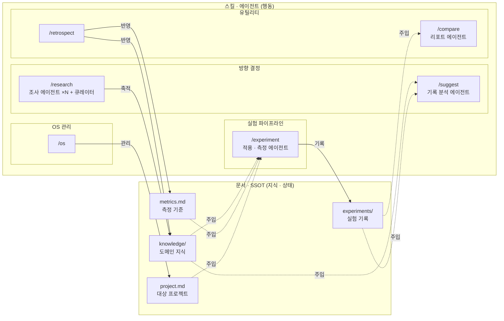
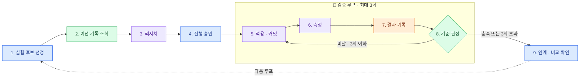

# OS.md — 색상 실험 OS

## 목표

이미지 대표 색상 추출 알고리즘을 개선하는 작업에서, **아이디어 선정부터 결과 판정까지
AI와 사람이 협력하는 체계**를 만든다. 개선 여부를 매번 근거(기록·측정)를 가지고
판단할 수 있게 하는 것이 핵심이다.

## 대상 도메인

- 실제 색상 추출 애플리케이션 코드는 **별도 저장소**에 있다.
- 이 저장소(`my-claude-code-os`)는 그 작업에 적용할 **작업 방식(OS)** 을
  설계·문서화하는 곳이다.

## OS 개요

OS는 두 기둥으로 선다. **스킬·에이전트(행동)** 는 매번 실행되고,
**문서·SSOT(지식·상태)** 는 실행 결과가 쌓여 다음 실행의 컨텍스트로 주입된다.

### 스킬 · 에이전트 카탈로그

스킬은 진입점이자 절차서(지휘 악보)이고, 서브에이전트는 스킬을 수행하는
메인 에이전트가 스폰하는 독립 일꾼이다 (독립 컨텍스트 · 백그라운드 · 병렬).

| 카테고리 | 스킬 (지휘) | 서브에이전트 (일꾼) | 협력 방식 |
|---|---|---|---|
| **방향 결정** 외부 입력·의사결정 | `/research` | 조사 에이전트 ×N (주제별 동적 분해, 2~4개) + 큐레이터 에이전트 | 주제를 독립 하위 주제로 분해해 조사 에이전트를 **병렬** 스폰 → 큐레이터가 취합·선별해 knowledge 문서로 정리 |
| | `/suggest` | 기록 분석 에이전트 | 실험 기록 전체를 독립 컨텍스트에서 읽고 다음 실험 후보만 요약 반환 |
| **실험 파이프라인** 실행의 중심축 | `/experiment` | 리서치 / 적용 / 측정 에이전트 | **순차** 협력: 리서치→(승인)→적용→측정→기록, 검증 루프(시도 3회 상한)로 반복, 판정은 스킬(메인)이 담당 |
| **유틸리티** 반복 작업 지원 | `/compare` | 리포트 에이전트 | 실험 기록을 읽고 전후 비교 리포트 생성 (향후 시각화 확장 지점) |
| | `/retrospect` | 없음 (메인 직접) | 대화 맥락 자체가 재료 — 독립 컨텍스트로 분리하면 오히려 손해 |
| **OS 관리** 메타 | `/os` | 없음 (메인 직접) | OS 파일 수정의 유일 경로 — 사람과의 상호작용이 핵심이라 위임 부적합 |

설계 원칙:

- **병렬 vs 순차**: 조사처럼 대상이 서로 독립적이면 병렬, 적용→측정처럼
  선후 의존이 있으면 순차.
- **모든 스킬에 에이전트가 필요한 건 아니다**: 대화 맥락이나 사람과의 결정이
  핵심인 작업(`/retrospect`, `/os`)은 서브에이전트로 빼면 컨텍스트가 끊긴다.

### 문서 · SSOT

| 문서 | 내용 | 쓰는 스킬 → 읽는 스킬 |
|---|---|---|
| `experiments/` | 실험 기록 — 모든 시도의 성공/실패 누적 | `/experiment` → `/suggest`, `/compare` |
| `metrics.md` | 측정 기준 — "개선"의 정의 | `/retrospect` → `/experiment` |
| `knowledge/` | 도메인 지식 — 색상 추출 기법 정리 | `/research` → `/suggest`, `/experiment` |
| `project.md` | 대상 프로젝트 컨텍스트 — 별도 저장소인 색상 추출 앱의 구조·실행법 | `/os` → `/experiment` |

### 컨텍스트 갱신 루프

`/research` 결과가 knowledge에 쌓이고, `/experiment` 결과가 experiments에 쌓이고,
`/retrospect`가 배운 것을 metrics·knowledge에 반영하면, 다음 `/suggest`와
`/experiment`가 그 문서를 읽고 시작한다. **실행할수록 문서가 두꺼워지고,
문서가 두꺼워질수록 다음 실행이 좋아지는 순환**이 이 OS의 성장 원리다.

## 실험 파이프라인 상세 — `/experiment` 9단계 루프

역할을 4개 레인으로 나눈다. 사람은 방향을 결정하고, 오케스트레이터(스킬을 수행하는
메인)는 흐름을 지휘·판정하며, 서브에이전트는 실제 작업을 실행하고, 실험 기록은
상태 저장소 역할을 한다.

| # | 담당 | 단계 | 설명 |
|---|------|------|------|
| 1 | 🔵 사람 | 실험 후보 선정 | 어떤 아이디어/기법을 시도할지 고른다 (`/suggest` 활용 가능) |
| 2 | 🟢 오케스트레이터 | 이전 기록 조회 | 실험 기록에서 관련 이력·교훈을 확인한다 |
| 3 | 🟣 리서치 에이전트 | 리서치 | 아이디어를 구체화하고 리서치 노트를 작성한다 |
| 4 | 🔵 사람 | 진행 승인 | 리서치 노트를 검토하고 진행 여부를 결정한다 |
| 5 | 🟣 적용 에이전트 | 적용·커밋 | 코드 변경을 최소 단위로 구현하고 커밋한다 |
| 6 | 🟣 측정 에이전트 | 측정 | 결과를 측정한다 |
| 7 | 🟠 실험 기록 | 결과 기록 | 이번 시도의 성공/실패를 기록한다 |
| 8 | 🟢 오케스트레이터 | 기준 판정 | 기준 미달 & 3회 이하면 5번부터 재시도, 아니면 루프를 종료한다 |
| 9 | 🔵 사람 | 인계 · 비교 확인 | 3회 초과 시 인계받아 판단하거나, 기준 충족 시 이전 기록과 비교해 채택을 결정한다 |

5~8번은 **검증 루프(최대 3회, 실패 시 재시도)** 로 묶인다. 9단계가 끝나면
다음 루프의 1단계로 다시 이어진다.

시간 순서(1→9)대로 흐르고, 색으로 담당을 구분한다
(🔵 파랑=사람, 🟢 초록=오케스트레이터, 🟣 보라=서브에이전트, 🟠 주황=실험 기록).

## 향후 확장 (지금은 범위 밖)

- 개선 전후 결과를 자동으로 시각적으로 비교/생성하는 기능
  (`/compare` 리포트 에이전트에 편입 예정)

## 구축 현황

`OS.md`는 **목적지(완성형)** 다. 원래는 통증 기반 Stage 승급으로 키울 계획이었으나,
Stage 0(맨손 사이클, 실험 0001) 완주 후 **배치 단위 빠른 구축**으로 전환했다
(계획서: `private/notes/plans/`, 개인 보관).

| 배치 | 내용 | 상태 |
|---|---|---|
| 0 | 맨손 사이클 — 실험 0001 완주, 기록 포맷·격리 원칙 확정 | ✅ 완료 |
| 1 | `/experiment` + 리서치·적용·측정 에이전트 + `metrics.md`·`project.md` | 🔨 구현됨, 실전 검증(실험 0002) 대기 |
| 2 | `/research`(동적 분해 병렬) + `/suggest` + `knowledge/` | ⬜ |
| 3 | `/compare` + `/retrospect` + `/os` + 권한 설정 | ⬜ |

## 관련 문서

**설계**

- 단계적 성장 가이드 (Stage 0~8, 어디서부터 만들지):
  [`docs/guides/os-growth-stages.md`](docs/guides/os-growth-stages.md)
- 저장소 구조와 브랜치 운영:
  [`docs/guides/repo-layout.md`](docs/guides/repo-layout.md)
- `/experiment` 오케스트레이터 상세 기획:
  [`docs/design/experiment-orchestrator.md`](docs/design/experiment-orchestrator.md)

**기록** (개인 보관 — `personal` 브랜치 전용)

- `private/decisions/` — 의사결정 기록(ADR). 왜 이렇게 결정했나
- `private/journey/` — 사고 여정. 생각이 어떻게 바뀌어 왔나

**시각화 (공유용, 내용 원본은 md)**

- 개요·오케스트레이터: [`docs/share/color-experiment-orchestrator.html`](docs/share/color-experiment-orchestrator.html)
- 단계별 성장 구조: [`docs/share/os-growth-stages.html`](docs/share/os-growth-stages.html)
