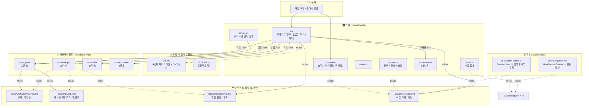
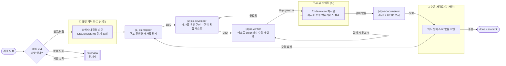
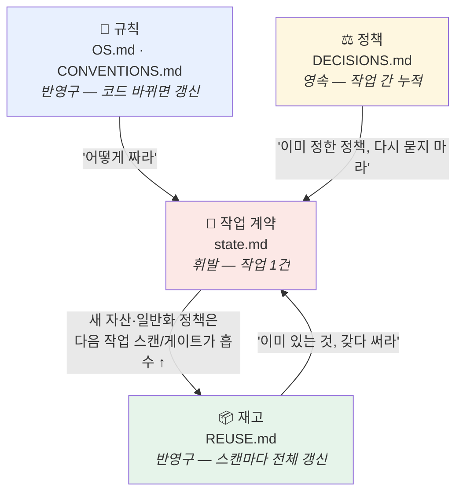
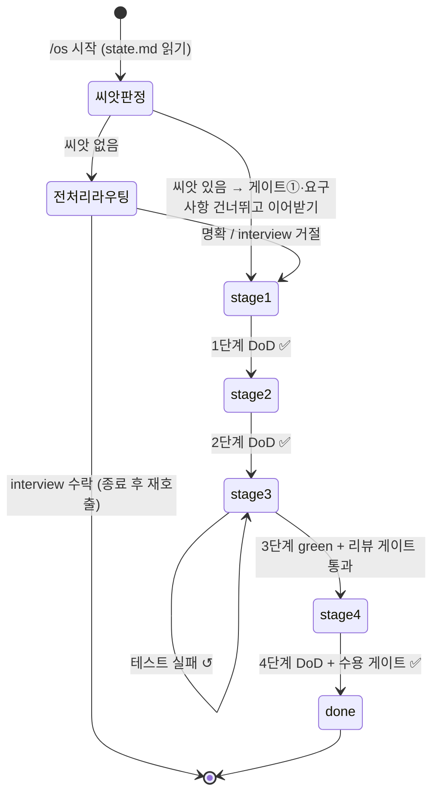

# CONTEXT-MAP — 프로젝트 컨텍스트 도식

이 문서는 **Claude OS**(이 저장소가 만들고 있는 개발 운영 시스템)의 구성요소와 그들이 주고받는 컨텍스트의 **배선도**다.
`CONVENTIONS.md`가 *애플리케이션 코드*(Java 모듈)의 규칙이라면, 이 문서는 *OS 자체*(`.claude/` 배선 + `docs/` 원장)가 어떻게 맞물려 도는지를 그린다.

> 한 문장 요약: **`/os` 오케스트레이터**가 `OS.md`를 규칙서로 삼아 개발 요청을 **4단계 파이프라인**으로 돌리되, 각 단계를 **전용 서브에이전트**에 위임하고, **DoD 게이트 + 사람 게이트**로 전진을 통제하며, **수명이 다른 4계층 컨텍스트 파일**로 상태와 학습을 파일에 남긴다.

---

## 1. 구성요소 지도 (무엇이 있는가)

**요약**
- **스킬** = 사람이 부르는 진입점. `/os`가 중심 오케스트레이터, `/interview`는 그 앞단(전처리), 나머지는 보조.
- **에이전트** = `/os`가 무거운 작업을 위임하는 일꾼. 단계별로 1:1 대응(`os-mapper`만 `/os-scan`과 공유).
- **훅** = 사람이 부르지 않아도 자동 실행되는 배선(세션 시작 시 재개 알림, 매 요청마다 카운트).
- **컨텍스트 파일** = 에이전트끼리 직접 대화하지 않으므로, 모든 협업은 이 파일들을 통해 이뤄진다.

---

## 2. 4단계 파이프라인 + 게이트 (어떻게 흐르는가)

**게이트 두 종류를 구분한다** — OS 설계의 핵심.
| 게이트 | 검증자 | 검증 대상 | 위치 |
|---|---|---|---|
| **DoD 게이트** | AI(자가검증) | "단계 산출물이 완료조건을 채웠나" | 매 단계 끝 |
| **결정 게이트 ①** | 사람 | 되돌리기 비싼 **회색지대 결정** (API 계약·toolchain·도메인 정밀도) | 2단계 위임 **전** |
| **리뷰 게이트** | AI | 코드 품질·설계·재사용 준수·놓친 엣지케이스 | 3단계 green **직후** |
| **수용 게이트 ②** | 사람 | "이게 당신이 원한 그것이 맞나" | done **전** |

> ⚠️ **초록불 게이트**: 3단계 DoD(모든 테스트 green)를 통과 못 하면 절대 4단계로 가지 않는다.
> 🔁 **에스컬레이션 규칙**: 결정 게이트①은 (영향 큼 ∧ 선택지 복수 ∧ 되돌리기 비쌈)이 **모두** 겹칠 때만 사람에게 올린다. 나머지는 AI가 정하고 로그만 남긴다.

---

## 3. 컨텍스트 4계층 (수명과 학습)

에이전트는 서로 대화하지 않는다. 모든 협업은 **수명이 다른 4개 파일**을 통해 일어나고, 아래로 갈수록 수명이 짧아진다.
위 두 계층(REUSE·DECISIONS)이 **작업을 넘어 누적**되기에 OS가 **작업 간 학습**을 한다.

**소유권 · 읽기/쓰기 매트릭스**
| 파일 | 쓰기(소유) | 읽기 | 수명 |
|---|---|---|---|
| `OS.md` | 사람(설계자) | `/os` + 모든 에이전트 | 반영구 |
| `docs/CONVENTIONS.md` | `os-mapper`(1단계) | `os-developer`, `os-documenter` | 반영구 |
| `docs/REUSE.md` | `os-mapper`(1단계, 전체 overwrite) | `os-developer`(2단계) | 반영구 |
| `docs/DECISIONS.md` | **오케스트레이터만**(게이트①) | `/os`(게이트 전), `os-developer` | 영속(누적) |
| `.claude/os/state.md` | **오케스트레이터만** | 모든 에이전트(**읽기 전용**) | 휘발(작업 1건) |

> **포인터 주입 원칙**: 오케스트레이터는 요구사항 내용을 프롬프트에 **복사하지 않고** state.md 경로만 가리킨다. 에이전트가 원본을 직접 읽어 **복사 드리프트**를 방지하고, 오케스트레이터는 "얇은 코디네이터"로 남는다.

---

## 4. 작업 상태 머신 (state.md의 stage)

`state.md`의 `stage` 값이 작업의 위치를 기록한다. 컨텍스트가 리셋돼도 `SessionStart` 훅이 이를 읽어 **자동으로 이어가기**를 안내한다.

- **재개 자동화**: `stage`가 `done`이 아니면 세션 시작 시 훅이 `⚠️ 진행 중인 OS 작업이 있습니다 — stage: N` 한 줄을 컨텍스트에 주입한다. → "상태는 항상 파일에" 원칙의 자동화.
- **현재 상태**: `stage: done` — 스도쿠 Validator/Solver 모듈 작업 완료(1건 통과 이력). 이 도식의 파이프라인이 실제로 한 바퀴 돈 결과가 `DECISIONS.md`·`REUSE.md`에 누적돼 있다.

---

## 5. 핵심 설계 원칙 (왜 이렇게 배선했는가)

| 원칙 | 배선으로의 구현 |
|---|---|
| **문서가 먼저(Docs-first)** | 1단계가 코드 전에 CONVENTIONS/REUSE를 확정 |
| **재사용 우선(Reuse-first)** | REUSE.md 카탈로그를 부품 재고로; OS 자신도 `/code-review`를 재사용(새 에이전트 안 만듦) |
| **테스트로 증명(Test-proven)** | 2단계 단위+통합 필수, 3단계 green 게이트 |
| **초록불에서만 전진(Green-gate)** | DoD 미충족 시 다음 단계 진입 차단 |
| **흔적을 남김(Traceable)** | 4계층 컨텍스트 파일 + 단계별 원자적 커밋 |
| **작업 간 학습** | REUSE(재고)·DECISIONS(정책)가 작업을 넘어 누적 → 다음 작업이 흡수 |
| **얇은 코디네이터** | `/os`는 판단·위임·게이트·기록만; 코드는 손대지 않음 |

---

> 이 문서는 OS **배선**의 스냅샷이다. `.claude/`의 스킬·에이전트·훅 또는 `docs/`의 원장 구조가 바뀌면 이 지도를 현실에 맞게 갱신한다.
