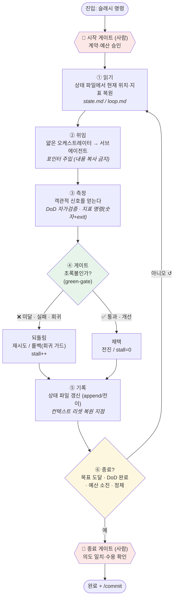
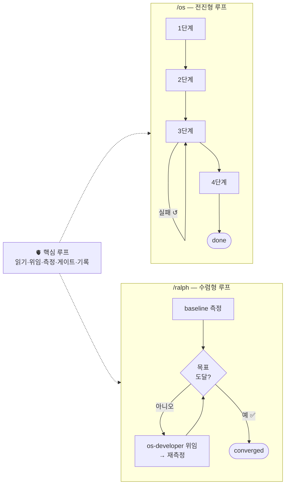

# CORE-LOOP — OS 핵심 루프

이 문서는 Claude OS의 **심장**을 그린다. `CONTEXT-MAP.md`가 *어떤 부품이 어떻게 배선됐나*(구성요소 지도)를 그린다면, 이 문서는 그 부품들이 돌 때 **반복되는 단 하나의 사이클**을 뽑아낸다.

> 한 문장 요약: 이 OS의 모든 작업은 **`읽기 → 위임 → 측정 → 게이트 → 기록`을 종료조건까지 반복**하는 하나의 루프다. `/os`(4단계 파이프라인)와 `/ralph`(지표 수렴)는 **같은 루프의 두 인스턴스**일 뿐이다.

---

## 1. 핵심 루프 (the engine)

**루프를 도는 6단계**
1. **읽기** — 상태를 프롬프트가 아니라 **파일**에서 읽는다. 컨텍스트가 리셋돼도 여기서 이어간다.
2. **위임** — 오케스트레이터는 직접 일하지 않고 서브에이전트에 넘긴다. 요구사항은 복사하지 않고 **경로만 가리킨다**(포인터 주입 → 복사 드리프트 방지).
3. **측정** — "됐다"는 주관을 신뢰하지 않는다. **객관적 신호**(DoD 체크 / 지표 숫자 + exit 코드)로만 판정한다.
4. **게이트(green-gate)** — 초록불일 때만 전진한다. 미달·실패·회귀면 **되돌린다**(재시도 또는 롤백).
5. **기록** — 매 반복의 결과를 상태 파일에 남긴다. 이 흔적이 다음 반복과 리셋 복원의 단일 진실원천.
6. **종료 판정** — 목표 도달·DoD 완료(성공) 또는 예산 소진·정체(중단)면 루프를 빠져나온다.

**루프를 감싸는 두 사람 게이트** — 되돌리기 비싼 결정(시작 전)과 "이게 맞나"(종료 전)는 자동화하지 않고 사람이 지킨다.

---

## 2. 하나의 루프, 두 인스턴스

`/os`와 `/ralph`는 서로 다른 스킬처럼 보이지만, 위 루프의 각 단계를 **다르게 채운 같은 엔진**이다.

| 핵심 루프 단계 | `/os` — 4단계 파이프라인 | `/ralph` — 지표 수렴 |
|---|---|---|
| **①읽기** | `state.md`의 `stage`(1~4) | `loop.md` 히스토리의 마지막 지표·iter |
| **②위임** | 단계별 `os-mapper`/`developer`/`verifier`/`documenter` | `os-developer` (테스트 작성) |
| **③측정** | 단계 **DoD 체크리스트**(자가검증) | **지표 명령** `measure-coverage.sh` → 숫자+exit |
| **④게이트** | DoD 통과해야 다음 단계 (3단계 green 필수) | 목표값 도달? / 지표 개선? / 회귀(exit 1)? |
| **⑤기록** | `state.md` `stage` 전이·DoD 체크 | `loop.md` 지표 히스토리 append |
| **⑥종료** | `stage=done` | `converged`/`budget_exhausted`/`stalled` |
| **반복 축** | 단계를 **앞으로** 전진(1→2→3→4) | 같은 개선을 **지표가 오를 때까지** 반복 |
| **사람 게이트** | 결정 게이트① · 수용 게이트② | 시작 게이트 · 종료 게이트 |

**차이는 딱 두 가지**
- **반복의 축**: `/os`는 *단계*를 앞으로 민다(전진형). `/ralph`는 *같은 개선*을 지표가 목표에 닿을 때까지 반복한다(수렴형).
- **측정의 형태**: `/os`는 단계별 DoD(정성 체크리스트), `/ralph`는 지표 숫자(정량). 하지만 **둘 다 green-gate**로 전진을 통제한다는 본질은 같다.

---

## 3. 왜 이 루프가 핵심인가 (설계 불변식)

이 루프가 지키는 **불변식(invariant)** 은 새 스킬을 만들 때도 그대로 이어진다.

| 불변식 | 루프에서의 구현 | 어기면 |
|---|---|---|
| **측정이 전진을 결정한다** | ③측정 → ④게이트. 주관적 "됐다" 금지 | 가짜 완료·회귀가 새어나간다 |
| **초록불에서만 전진(green-gate)** | ④게이트가 미달 시 ⑤기록으로 우회(전진 차단) | DoD 미충족인데 다음 단계로 감 |
| **상태는 항상 파일에** | ①읽기·⑤기록이 파일을 오간다 | 컨텍스트 리셋 시 작업 유실 |
| **얇은 코디네이터** | ②위임 — 오케스트레이터는 판단·게이트·기록만 | 오케스트레이터가 비대해져 리셋에 취약 |
| **단조 개선(monotonic)** | ④게이트의 회귀 가드가 나쁜 변경을 롤백 | 히스토리가 우상향을 잃음 |
| **안전 상한** | ⑥종료의 예산·정체 조건 | 무한 루프(랄프의 최대 위험) |
| **사람이 두 경계를 지킨다** | 시작 게이트·종료 게이트 | 되돌리기 비싼 결정을 AI가 독단 |

> **새 스킬을 만들 때의 체크리스트**: 이 6단계를 어떻게 채울지 정하면 그것이 곧 새 스킬이다.
> "무엇을 **측정**해 ④게이트를 열 것인가"가 가장 중요하다 — 객관적 신호가 없으면 green-gate가 성립하지 않는다.

---

> 이 문서는 OS **작동 원리**의 스냅샷이다. `/os`·`/ralph`의 루프 로직이나 게이트 구조가 바뀌면 이 그림을 현실에 맞게 갱신한다. 부품 배선은 `CONTEXT-MAP.md`, 단계 규칙·DoD는 `OS.md`를 본다.
