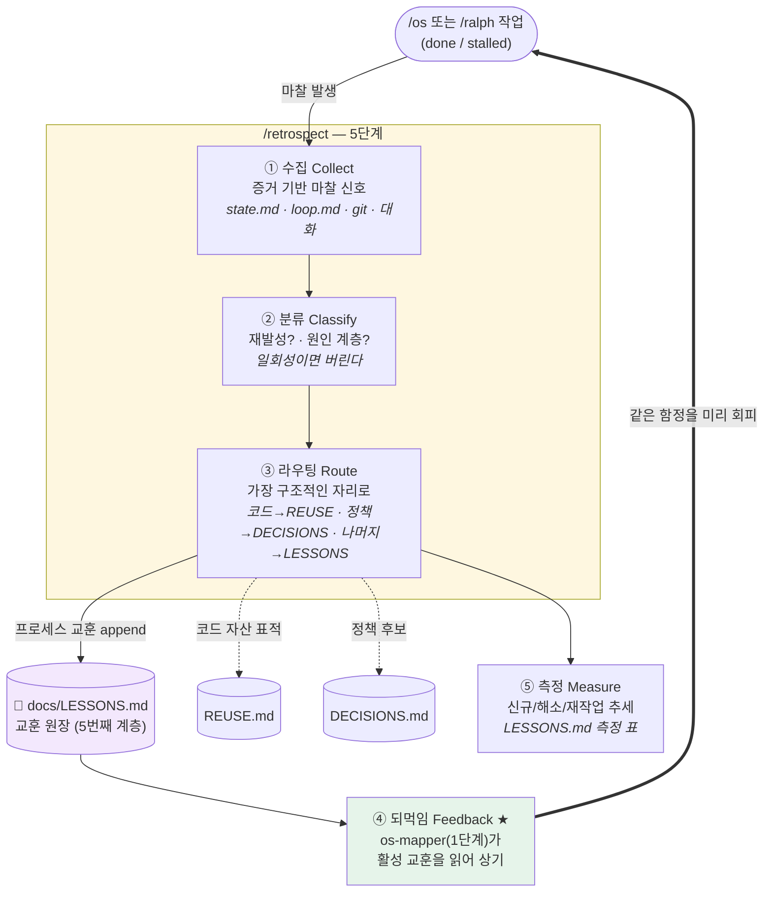
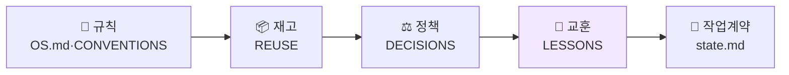

# RETROSPECT-LOOP — 회고 → 교훈 누적 루프 (자산 축적형)

이 문서는 `/retrospect` 시스템 루프 하나를 **1페이지**로 정리한다. `CORE-LOOP.md`가 *작업 안*에서 도는 엔진(`/os`·`/ralph`)을 그린다면, 이 루프는 그 **작업들을 가로질러** 도는 학습 루프다.

> 한 문장 요약: **겪은 마찰을 `docs/LESSONS.md`에 남기고(자산 축적), 다음 작업의 `os-mapper`(1단계)가 그걸 읽어 같은 함정을 피한다(자율 개선).** 기록만으로는 죽은 로그다 — *다음 실행이 읽어야* 루프가 닫힌다.

---

## 1. 루프 도식 (5단계 + 되먹임 고리)

**5단계**
1. **수집** — 추측이 아니라 **증거**(상태파일·git·대화)에서 마찰을 모은다.
2. **분류** — *재발하는 것만* 남긴다(일회성은 버린다) + 원인 계층(규칙부재/재고누락/정책공백/프로세스) 판정.
3. **라우팅** — 코드는 `REUSE`, 정책은 `DECISIONS`, **나머지 프로세스 교훈만** `LESSONS`에. (원장 중복 방지)
4. **되먹임 ★** — `os-mapper`가 다음 작업 1단계에서 활성 교훈을 읽어 상기. **이 화살표가 루프를 닫는다.**
5. **측정** — 신규/해소/재작업 수를 세션마다 기록해 *학습하고 있는지*를 숫자로 본다.

---

## 2. 자율 개선 장치 — 루프가 "닫히는" 지점

축적형 루프의 성패는 **되먹임 배선** 하나에 달렸다. 기록(③)과 소비(④)를 잇는 계약이 없으면 `LESSONS.md`는 아무도 안 읽는 로그가 된다.

| 장치 | 배선 | 없으면 |
|---|---|---|
| **쓰기 계약** | `LESSONS.md` 쓰기 소유자 = `/retrospect`만 | 아무나 덧대 원장이 오염 |
| **읽기 계약(자율 개선)** | `os-mapper`(1단계)가 스캔 시 활성 교훈을 읽어 **보고에 상기** | 교훈이 안 읽혀 다음 작업이 같은 실수 반복 |
| **라우팅 규율** | 코드→REUSE·정책→DECISIONS·나머지→LESSONS | 원장이 중복돼 어디를 봐야 할지 모름 |
| **졸업(해소)** | 교훈이 스킬·에이전트·문서로 흡수되면 `상태: 해소`로 표시 | `LESSONS`가 무한정 커져 신호가 묻힘 |
| **트리거** | `/os` 완료 시 마찰 있으면 `/retrospect` 권유(자동 안내) | 아무도 회고를 안 돌려 축적이 멈춤 |

> **핵심 불변식**: *기록 ≠ 루프.* `③라우팅 → ④되먹임`이 이어져야 "실행할수록 개선"이 성립한다.

---

## 3. 5번째 컨텍스트 계층 (어디에 얹히나)

기존 4계층에 **교훈(LESSONS)** 이 추가됐다. 위 세 계층이 작업을 넘어 누적돼 OS가 **작업 간 학습**을 한다 — 각각 *코드·정책·경험*을 남긴다.

| 계층 | 남기는 것 | 한 문장 |
|---|---|---|
| 재고 `REUSE` | 코드 자산 | "이미 있는 것, 갖다 써라" |
| 정책 `DECISIONS` | 승인된 결정 | "이미 정한 정책, 다시 묻지 마라" |
| **교훈 `LESSONS`** | **겪은 마찰** | **"지난번 넘어진 데, 이렇게 피해라"** |

---

## 4. 실증 — `MoneyMath` 세션 (2026-07-16)

이 루프는 실제로 한 바퀴 돌아 닫혔다.

- **되먹임 첫 작동**: `os-mapper`가 지난 세션의 **L-001(toolchain)** 을 읽어 환경 프리플라이트를 자동 실행 → IDE/빌드 JDK 불일치를 코드 짜기 전에 포착.
- **새 교훈 4건 축적**: 리뷰 블로킹(음수 scale 분배 쏠림)→**L-003**, 요구사항↔구현 편차→**L-002**, 게이트 정책 미개입→**L-004**, 툴 호출 실패→**L-005**.
- **라우팅**: `testutil/BigDecimals.java`(중복 헬퍼 추출)는 **REUSE 표적**으로, "돈=BigDecimal·HALF_EVEN"은 게이트①에서 **DECISIONS §B로 승격**.
- **다음 효과**: 다음 금액/분배 작업은 **리뷰 게이트까지 가기 전에** L-003을 상기해 그 함정을 피한다.

---

## 5. 설계 원칙 (요약)

| 원칙 | 뜻 |
|---|---|
| **기록만으로는 루프가 아니다** | 되먹임(④)이 있어야 자율 개선. |
| **재발하는 것만 남긴다** | 일회성 사고는 버린다. |
| **가장 구조적인 자리로** | 코드→REUSE·정책→DECISIONS·나머지만 LESSONS. |
| **교훈의 종착점은 해소** | 좋은 교훈은 배선이 되어 LESSONS에서 졸업한다. |
| **증거 기반만** | 상태파일·git·대화에 근거한 마찰만. |

---

> **이 문서를 쓰며 그 자리에서 고친 2가지** (자기개선 실천):
> 1. `/retrospect §5 측정`의 **기록 위치가 미지정**이었다 → `LESSONS.md`의 측정 표로 위치·형식을 고정.
> 2. **트리거 공백**(완료 시 `/commit`만 안내) → `/os` 완료에 `/retrospect` 권유를 추가해 축적 루프가 실제로 발화하게 함.

> 이 문서는 루프 **설계**의 스냅샷이다. 스킬(`/retrospect`)·에이전트(`os-mapper` 읽기 계약)·원장(`LESSONS.md`) 구조가 바뀌면 이 그림을 현실에 맞게 갱신한다. 부품 배선은 `CONTEXT-MAP.md`, 엔진 루프는 `CORE-LOOP.md`를 본다.
