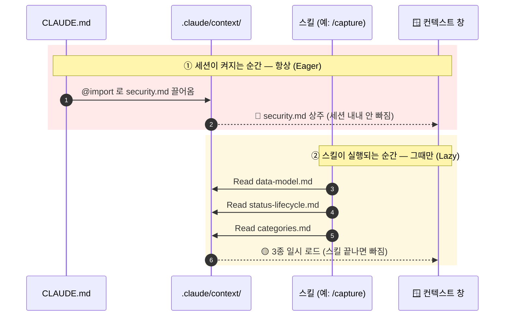
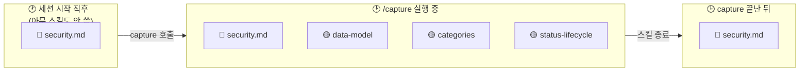
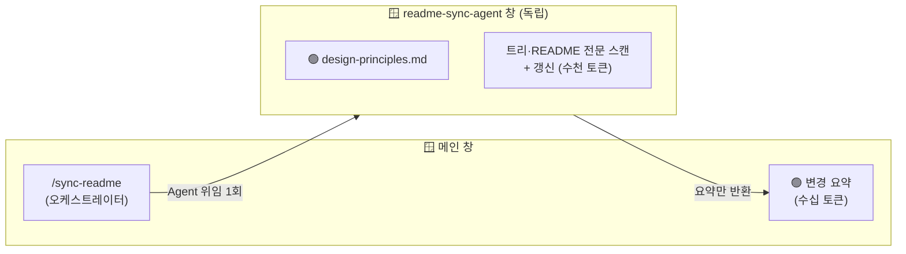

# 컨텍스트 주입 도식 (Context Injection Map)

> 이 프로젝트의 **정본(Single Source of Truth)** 이 실행 중 **언제 컨텍스트 창에 주입되는지**를
> 그림으로 보여주는 문서. 정본 목록·폴더 성격 등 나머지 설명은 [`README.md`](../.claude/context/README.md)에 있고,
> 이 파일은 그중 **"주입"** 한 가지에 집중한다. 정본이나 참조 관계가 바뀌면 이 도식도 함께 갱신한다.

---

## 1. 컨텍스트 주입 — "언제 무엇이 컨텍스트 창에 들어오나"

정본은 `.claude/context/`에 **한 번만 정의**되고, 실행 중 **컨텍스트 창(=모델이 실제로 보는
창)** 에 주입된다. 핵심은 **"어떻게 연결되나"가 아니라 "언제 들어오나"** 다. 주입은 서로 다른
두 시점에 일어난다 — 세션이 켜지는 순간(Eager), 그리고 스킬이 실행되는 순간(Lazy). 여기에
**"어느 창이냐"** 는 축이 하나 더 있다 — 스킬이 서브에이전트에 위임하면 정본은 메인이 아닌
**별도 창**에 들어간다(§1-4).

### 1-1. 시간축으로 본 주입 (누가 · 언제 · 무엇을)

읽는 법: **위 빨강 블록은 세션 시작 때 자동으로, 아래 노랑 블록은 스킬을 부를 때만** 일어난다.
즉 주입 = "정본을 컨텍스트 창에 넣는 사건"이고, 그 사건이 두 시점으로 갈린다.

### 1-2. 그래서 컨텍스트 창 안에는 실제로 뭐가 있나 (순간별 스냅샷)

같은 세션이라도 **어느 순간이냐에 따라 창 안의 정본이 달라진다.** 이게 Eager와 Lazy의 실제 차이.

🔴는 세 순간 내내 그대로, 🟡는 스킬이 도는 동안만 나타났다 사라진다. **"Lazy = 일시적"** 이
이 그림의 핵심 — 평상시엔 창에 없으니 토큰을 안 먹고, 필요할 때만 잠깐 올라온다.

### 1-3. 두 방식 한눈 대비

| | 🔴 **Eager** | 🟡 **Lazy (메인 창)** | 🟢 **위임 (서브에이전트 창)** |
|--|--------------|-------------|----------------|
| **대상** | `security.md` 1종 | `categories`·`data-model`·`status-lifecycle` | `design-principles`(writer·readme-sync-agent), `categories`(classifier) 등 |
| **언제 들어오나** | 세션 시작 시 자동 | 스킬 실행 시 | 스킬이 서브에이전트에 위임할 때 |
| **넣는 주체** | `CLAUDE.md`의 `@import` | 스킬 안의 `Read` 호출 | 서브에이전트 안의 `Read` 호출 |
| **어느 창에** | 메인 | 메인 | **그 서브에이전트 창 (메인 아님)** |
| **얼마나 머무나** | 세션 내내 상주 | 스킬 도는 동안만 | 서브에이전트 도는 동안만 |
| **보장성** | **100% 보장** | 모델이 Read해야 함(비보장) | 서브에이전트가 Read해야 함(비보장) |
| **메인 토큰 비용** | 매 세션 (그래서 짧아야) | 평상시 0, 쓸 때만 | **0** (비용은 서브에이전트 창에만) |

> **승격 기준**: "빈도 높음"이 아니라 **"안 읽으면 사고 + 파일이 짧음"**일 때만 Eager로 올린다.
> `security.md`가 유일하게 Eager인 이유 — 자격증명을 잘못 다루면 곧 사고이기 때문.

### 1-4. 세 번째 위치: 서브에이전트의 별도 창 (위임 주입)

지금까지 "컨텍스트 창"을 하나(메인)로 봤지만, 스킬이 **서브에이전트에 위임**하면 그 서브에이전트는
**자기만의 독립된 창**을 갖는다. 정본이 거기서 Read되면 **메인 창엔 안 들어온다** — 이게 위임의
핵심이자 컨텍스트 최적화의 지렛대다.

읽는 법: `sync-readme`는 정본을 직접 Read하지 않고 `readme-sync-agent` **한 곳에** 위임한다. 그
에이전트가 자기 창에서 스캔·README Read·갱신까지 다 하고, 메인엔 변경 요약만 돌아온다. 그래서
`design-principles.md`는 §2 표에서 보이듯 **오직 서브에이전트(writer·readme-sync-agent) 창에만** 사는
유일한 정본이다 — 메인 창엔 한 번도 안 올라온다.

> **최적화의 이득과 그 한계 (정직하게)**: 큰 스캔·문서 전문을 서브에이전트 창이 흡수해 메인은
> 가볍게 유지된다(메인 흡수 ~5,108→수십 토큰). 단 위임은 **서브에이전트 창을 통째로 여는 비용**이
> 있어, 메인 절감이 그 비용을 넘어설 때만 이득이다 — ① 메인이 **큰 파일을 Read할 때만** 위임하고
> (`sync-test`는 grep-only라 위임 안 함), ② 스캔과 작성을 **한 에이전트로 합쳐** 창을 한 번만 연다
> (두 번 열면 총 토큰이 되레 늘어, 앞서 scanner→writer로 나눴던 걸 하나로 합쳤다).

---

## 2. 누가 무엇을 주입받나 — 스킬·에이전트별 참조 정본

§1이 "언제 주입되나"라면, 이 표는 **"어느 소비자가 어떤 정본을 Read하나"** 를 보여준다.
§1-2 스냅샷에서 `/capture`가 왜 하필 저 3종을 로드했는지의 근거가 이 표다.
✅ = 그 소비자가 해당 정본을 Read한다.

| 소비자 | categories | data-model | status-lifecycle | design-principles | security |
|--------|:--:|:--:|:--:|:--:|:--:|
| capture | ✅ | ✅ | ✅ | | |
| list | | ✅ | ✅ | | |
| plan | ✅ | ✅ | ✅ | | |
| remind | | ✅ | ✅ | | ✅ |
| done | | | | | (🔴 상시) |
| classifier-agent | ✅ | | | | |
| telegram-agent | | | | | ✅ |
| state-sync-writer | | | | ✅ | |
| readme-sync-agent | | | | ✅ | |

> `security.md`는 🔴 Eager라 표의 ✅가 없어도 모든 소비자 컨텍스트에 이미 존재한다. `remind`·
> `telegram-agent`가 명시적으로도 거는 건, 자격증명을 직접 만지는 경로라 강조하기 위함.
>
> `readme-sync-agent`는 `sync-readme` 스킬이 위임해 스캔·비교·갱신을 한 번에 수행하는 공유
> 에이전트다. `sync-readme` 자체는 정본을 직접 Read하지 않고 이 에이전트에 위임하므로, 직접 참조
> 주체인 `readme-sync-agent`만 표에 오른다(정본 참조는 `design-principles.md` 1종). 상세는 §1-4.
>
> 이 표는 실물에서 재확인할 수 있다:
> `grep -roE "\.claude/context/[a-z-]+\.md" .claude/skills/`
