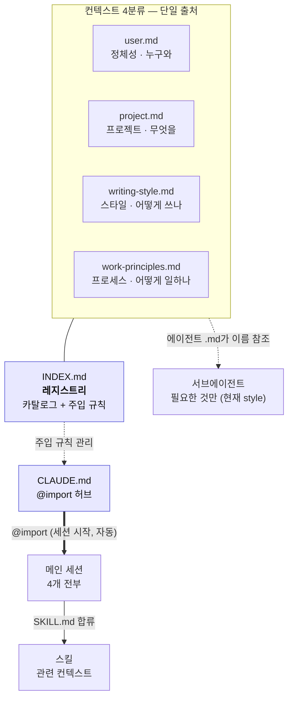

# 컨텍스트 체계 도식

이 OS의 컨텍스트가 어디에 살고, 무엇을 거쳐, 어느 표면에 닿는지 한 장으로 본다.
세부 규칙과 카탈로그는 레지스트리(`INDEX.md`)에, 자동 주입 배선은 `CLAUDE.md`에 있다.

## 한눈에



렌더러가 없으면 아래 ASCII로 같은 구조를 본다.

```
        컨텍스트 4분류 (단일 출처)
   user   project   writing-style   work-principles
     \       |           |            /
      \      |           |           /
        [ INDEX.md 레지스트리 ] ---- 주입 규칙 관리 ----> [ CLAUDE.md ]
                                                              |
                                     @import (세션 시작, 자동) |
                                                              v
                                                        [ 메인 세션 ] --합류--> [ 스킬 ]
   컨텍스트 4분류 ....에이전트 .md가 이름 참조....> [ 서브에이전트 ]
```

## 주입 매트릭스

표면별 주입 방식(메인 세션·스킬·서브에이전트)은 레지스트리 `INDEX.md`의 주입
매트릭스가 단일 출처다. 여기 복제하지 않는다 — 위 다이어그램의 화살표가 그 요약이다.

## 읽는 법

- 위쪽 4개는 각 사실의 단일 출처. 어디서도 내용을 복사하지 않고 이름으로만 참조한다.
- 레지스트리(`INDEX.md`)는 "무엇이 어디에 어떻게 주입되나"의 진입점. 규칙을 바꿀 땐
  여기부터 고친다.
- 서브에이전트만 별도 컨텍스트라 `@import`가 닿지 않는다. 그래서 수동 배선(에이전트
  본문의 이름 참조)이 남아 있다 — 이 비대칭이 이 도식의 핵심 포인트다.

> 텍스트 상세는 `INDEX.md`, 배선 코드는 `CLAUDE.md`. 이 파일은 그 둘의 그림 버전이다.
