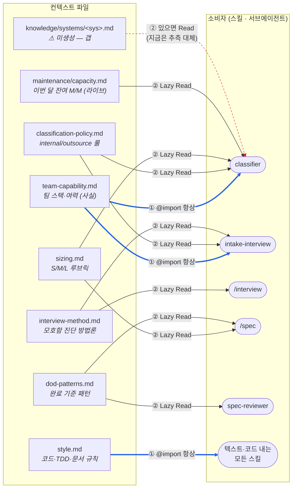
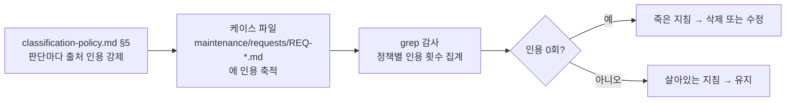

# Day2 필수 3 — 내 OS 컨텍스트 체계 도식 (1P)

> `.claude/context/` 운영 지침이 **어느 파일 → 어떤 트리거 → 어떤 소비자**로 흘러가는지 한 장으로.
> 이 지도는 [`day2-ab-injection-test.md`](./day2-ab-injection-test.md) 의 A/B 3라운드로 실제 동작이 검증됨.
> 작성일: 2026-09-07

---

## 흐름도



**엣지 범례** — `══>` ① 항상 로드(굵은 파랑) · `──>` ② Lazy Read · `┈┈>` 미구현/갭(빨강 점선)

---

## 파일 → 트리거 → 소비자 표

| 파일 | 성격 | 주입 방식 | 트리거(언제 들어오나) | 소비자 |
| --- | --- | --- | --- | --- |
| `team-capability.md` | 사실 | ① `CLAUDE.md` `@import` | 세션 시작, 무조건 | `classifier`, `intake-interview` |
| `style.md` | 형식 룰 | ① `CLAUDE.md` `@import` | 세션 시작, 무조건 | 텍스트·코드 내는 모든 스킬 |
| `classification-policy.md` | 판단 룰 | ② 소비자가 Read | `classifier` 가 분류 판단 직전 | `classifier`(필수), `intake` |
| `sizing.md` | 판단 룰 | ② 소비자가 Read | `classifier` 판단 시 (Read 목록 5번) | `classifier`, `/spec` |
| `dod-patterns.md` | 작성·검토 룰 | ② 소비자가 Read | `/spec` 완료 기준 작성 시 / `spec-reviewer` 체크 #1 | `/spec`, `spec-reviewer` |
| `interview-method.md` | 방법론 | ② 소비자가 Read | 인터뷰·면담 진행 시 | `/interview`, `intake-interview` |
| `maintenance/capacity.md` | 라이브 데이터 | ② 소비자가 Read | `classifier` 가 정책 §2 캐파 룰 평가 시 | `classifier` |
| `knowledge/systems/<sys>.md` | 시스템별 사실 | ② 있으면 Read | `classifier` §1② 수행주체 확인 시 | `classifier` |

> 세 번째 방식 **③ 훅(PreToolUse `additionalContext`)** 은 아직 없음.
> 소비자가 많은 `escalation.md`(사람 판단 넘김 조건)를 도입할 때 정석.

---

## 왜 방식을 갈랐나

| | ① 항상 로드 | ② Lazy Read |
| --- | --- | --- |
| 장점 | 확실히 들어감 | 컨텍스트 창 안 먹음 |
| 단점 | 안 쓰는 턴에도 자리 차지 (@team-capability ≈ 940토큰/세션) | 소비자가 안 읽으면 무시됨 |
| 배정 기준 | 짧고 두루 필요 (`team-capability`, `style`) | 길고 특정 단계에서만 (`classification-policy`, `sizing`, `dod-patterns`, `interview-method`) |

② 방식의 "안 읽으면 무시" 를 막으려고 `classifier.md` 에 **"판단 전 반드시 Read 할 것"** 표를 절차로 못박음.

---

## 활용 검증 루프 (죽은 지침 잡기)



```bash
grep -rho 'classification-policy\.md §[0-9]' maintenance/requests/ | sort | uniq -c
```

---

## 이 지도의 검증 상태 (필수 2 결과)

| 확인 항목 | 결과 |
| --- | --- |
| ② Lazy Read 가 실제로 발동하나 | ✅ A/A2/A3 실행이 `classification-policy`·`team-capability`·`sizing`·`capacity` 를 도구 호출로 Read |
| 새로 배선한 `sizing.md` 가 소비되나 | ✅ A·A2·A3 세 라운드 `적용한 기준` 에 모두 인용 |
| ① 항상 로드 `team-capability.md` 가 판단을 바꾸나 | ✅ 라운드 3에서 이 파일 때문에 판단이 outsource↔internal 로 갈림 |
| `knowledge/systems/` 갭 | ⚠ 파일 부재로 `classifier` §1② 가 "board = 내부 관리" 를 추측으로 대체 중 |
