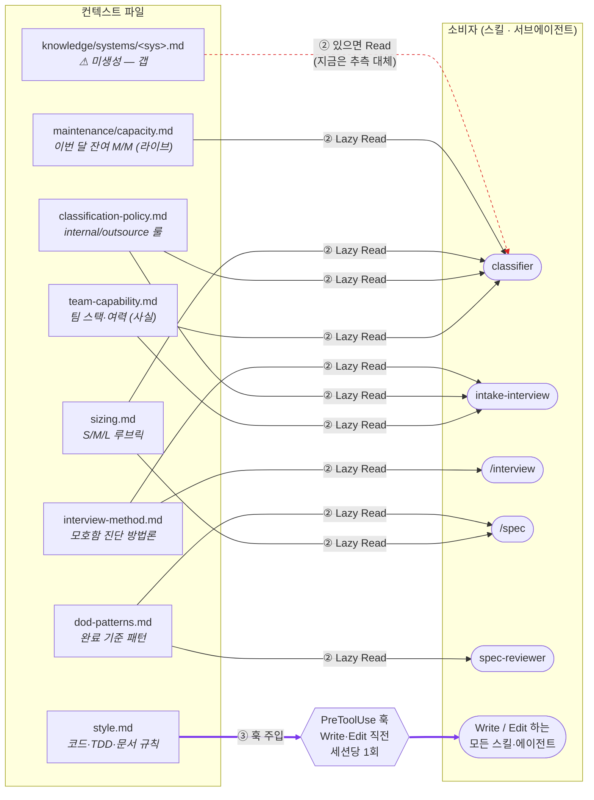
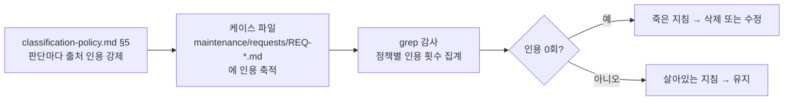

# Day2 필수 3 — 내 OS 컨텍스트 체계 도식 (1P)

> `.claude/context/` 운영 지침이 **어느 파일 → 어떤 트리거 → 어떤 소비자**로 흘러가는지 한 장으로.
> 이 지도는 [`day2-ab-injection-test.md`](./day2-ab-injection-test.md) 의 A/B 로 실제 동작이 검증됨.
> 작성일: 2026-09-07 · 갱신: 2026-09-08 (도전 2 — `@import` 제거, `style.md` 훅 전환)

---

## 흐름도



**엣지 범례** — `══>` ③ 훅 주입(보라) · `──>` ② Lazy Read · `┈┈>` 미구현/갭(빨강 점선)
**① `@import` 항상 로드는 이 OS 에서 안 씀** (도전 2에서 제거).

---

## 파일 → 트리거 → 소비자 표

| 파일 | 성격 | 주입 방식 | 트리거(언제 들어오나) | 소비자 |
| --- | --- | --- | --- | --- |
| `style.md` | 형식 룰 | **③ PreToolUse 훅** | `Write`/`Edit` 직전, 세션당 1회 | 파일 쓰는 모든 스킬·에이전트 |
| `team-capability.md` | 사실 | ② 소비자가 Read | `classifier`·`intake-interview` 가 판단 직전 | `classifier`, `intake-interview` |
| `classification-policy.md` | 판단 룰 | ② 소비자가 Read | `classifier` 가 분류 판단 직전 | `classifier`(필수), `intake` |
| `sizing.md` | 판단 룰 | ② 소비자가 Read | `classifier` 판단 시 (Read 목록 5번) | `classifier`, `/spec` |
| `dod-patterns.md` | 작성·검토 룰 | ② 소비자가 Read | `/spec` 완료 기준 작성 시 / `spec-reviewer` 체크 #1 | `/spec`, `spec-reviewer` |
| `interview-method.md` | 방법론 | ② 소비자가 Read | 인터뷰·면담 진행 시 | `/interview`, `intake-interview` |
| `maintenance/capacity.md` | 라이브 데이터 | ② 소비자가 Read | `classifier` 가 정책 §2 캐파 룰 평가 시 | `classifier` |
| `knowledge/systems/<sys>.md` | 시스템별 사실 | ② 있으면 Read | `classifier` §1② 수행주체 확인 시 | `classifier` (⚠ 파일 미생성) |

> **① `@import` 항상 로드는 없앴다** (도전 2). 이유는 아래 "왜 방식을 갈랐나".

---

## 왜 방식을 갈랐나 — 3가지 통로

| | ① `@import` 항상 로드 | ② Lazy Read | ③ PreToolUse 훅 |
| --- | --- | --- | --- |
| 확실히 들어가나 | ✅ | ❌ 소비자가 안 읽으면 무시 | ✅ 훅이 매번 발동 |
| 세션 토큰 비용 | ❌ 안 쓰는 턴에도 계속 | ✅ 필요할 때만 | ✅ 트리거될 때만 |
| 서브에이전트에 전달되나 | ✅ (CLAUDE.md 는 서브도 로드) | ✅ (직접 Read) | ❌ 훅 컨텍스트는 메인 세션에만 |
| 이 OS 배정 | (없음 — 도전 2에서 제거) | 판단·조사 단계 컨텍스트 6개 | `style.md` (파일 쓸 때만 필요) |

- ② 의 "안 읽으면 무시" 는 `classifier.md`·`intake-interview.md` 에 **"판단 전 반드시 Read"** 절차로 못박아 막음.
- ③ 은 서브에이전트에 안 들어가므로, 서브(`classifier`·`intake-interview`)가 소비하는 `team-capability.md` 는 훅이 아니라 ② 로 보장.
- 배선 유지 여부는 `.claude/scripts/check-context-wiring.sh` 가 검사 (도전 1).

---

## 활용 검증 루프 (죽은 지침 잡기)



```bash
grep -rho 'classification-policy\.md §[0-9]' maintenance/requests/ | sort | uniq -c
```

---

## 이 지도의 검증 상태 (필수 2 결과)

| 확인 항목 | 결과 |
| --- | --- |
| ② Lazy Read 가 실제로 발동하나 | ✅ 필수 2 classifier A/B — `classification-policy`·`team-capability`·`sizing`·`capacity` 를 도구 호출로 Read |
| 새로 배선한 `sizing.md` 가 소비되나 | ✅ classifier A/B 3라운드 `적용한 기준` 에 모두 인용 |
| `team-capability.md` 가 판단을 바꾸나 | ✅ classifier A/B 라운드 3에서 이 파일 때문에 판단이 outsource↔internal 로 갈림 |
| ③ 훅이 실제로 발동하나 | ✅ 도전 2 — 이 파일 편집 시 `inject-style-context.sh` 가 `style.md` 를 `additionalContext` 로 주입 (스모크 테스트 + 실사용 확인) |
| 배선 정합성 | ✅ `check-context-wiring.sh` 17건 PASS / WARN 1 |
| `knowledge/systems/` 갭 | ⚠ 파일 부재로 `classifier` §1② 가 "board = 내부 관리" 를 추측으로 대체 중 |
