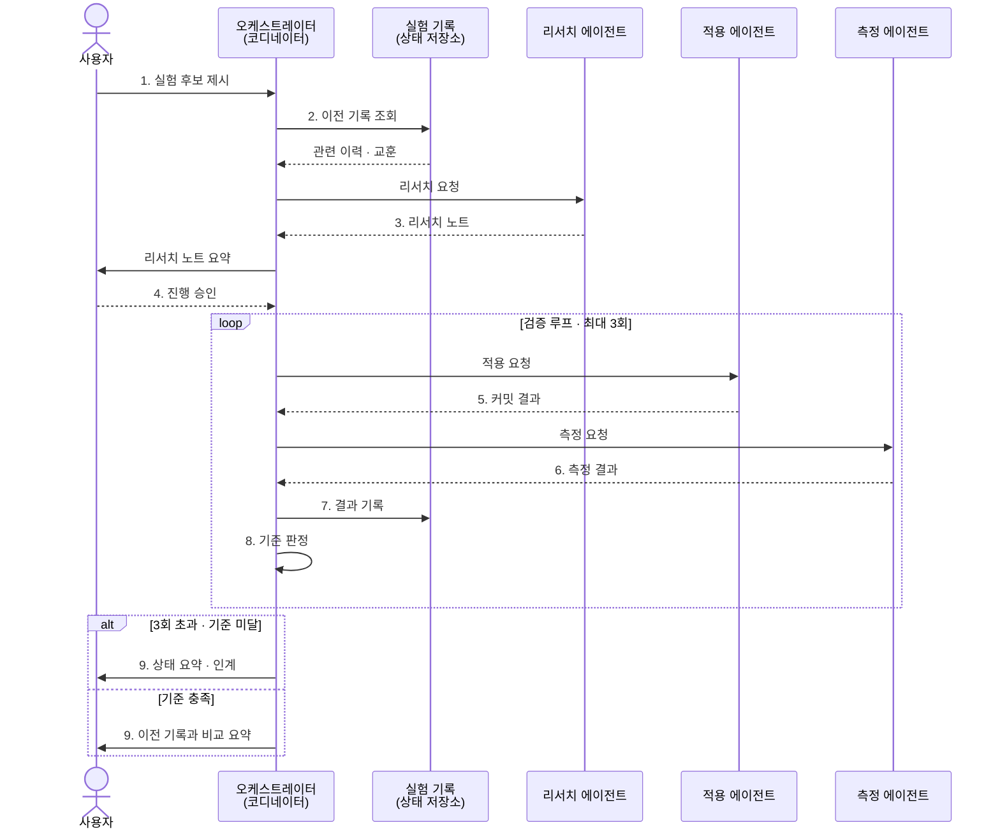

# 색상 실험 오케스트레이터 — 기획 문서

`OS.md`의 9단계 실험 루프를 **오케스트레이터(메인 스킬) + 서브에이전트 3개** 구조로
구현하기 위한 기획 문서다. 이 문서는 설계만 다루며, 실제 `.claude/skills`,
`.claude/agents` 파일은 별도 구현 단계에서 만든다.

## 전체 구조

- **오케스트레이터** — 흐름을 지휘하는 메인 스킬. 사람 체크포인트를 직접
  처리하고(질문·승인 요청·요약 보고), AI 단계에서는 서브에이전트를 호출한다.
  검증 루프의 재시도 여부도 오케스트레이터가 판정한다.
- **서브에이전트 3개** — 리서치 / 적용 / 측정. 각자 독립된 컨텍스트에서
  하나의 책임만 수행하고, 결과를 오케스트레이터에게 반환한다.
- **실험 기록** — 오케스트레이터가 매 시도(성공/실패 모두)를 남기고 조회하는
  상태 저장소. 아직은 파일(로그) 형태를 상정하며 구체적 포맷은 구현 단계에서 정한다.

## 서브에이전트별 책임 경계

### 1. 리서치 에이전트

- **트리거**: 오케스트레이터가 2단계(이전 기록 조회) 이후, 3단계에서 호출
- **입력**: 사람이 고른 실험 후보 아이디어, 관련 과거 기록(있다면)
- **처리**: 관련 색상 추출 기법·파라미터를 조사하고 적용 방안 초안을 만든다
- **출력**: 리서치 노트 (기법 설명, 예상 효과, 적용 방법 초안)
- **하지 않는 것**: 실제 코드 변경, 진행 여부 결정(4단계는 사람 몫)

### 2. 적용 에이전트

- **트리거**: 사람이 4단계에서 승인한 뒤, 검증 루프 안(5단계)에서 호출
- **입력**: 리서치 노트, 승인된 적용 방안, (재시도 시) 이전 시도의 측정 결과
- **처리**: 대상 저장소(색상 추출 프로젝트)에 최소 단위로 코드 변경 후 커밋
- **출력**: 커밋 결과, 변경 요약
- **하지 않는 것**: 측정·판정, 리서치

### 3. 측정 에이전트

- **트리거**: 6단계
- **입력**: 적용된 변경 사항, 측정 기준
- **처리**: 결과를 측정한다 (파라미터 자체 조정은 하지 않음 — 조정 여부는
  오케스트레이터가 8단계에서 판정 후 적용 에이전트에게 재요청)
- **출력**: 측정 결과
- **하지 않는 것**: 기록 저장(7단계는 오케스트레이터가 실험 기록에 기록),
  재시도 여부 판단(8단계는 오케스트레이터 몫)

## 오케스트레이터가 직접 처리하는 단계 (에이전트 아님)

- **1단계**: 사람에게 "이번에 시도할 실험 아이디어는?" 질문
- **2단계**: 실험 기록에서 관련 이력 조회
- **4단계**: 리서치 노트 요약 제시 + "진행할까요?" 승인 요청
- **7단계**: 적용·측정 결과를 실험 기록에 기록
- **8단계**: 기준 충족 여부 판정 → 미달 & 3회 이하면 5단계로 재시도, 아니면 종료
- **9단계**: 3회 초과 시 상태 요약 후 인계 / 기준 충족 시 이전 기록과 비교한
  요약을 생성해 채택 여부를 질문

## 호출 흐름 (시퀀스)

## 향후 구현 시 파일 위치 (지금은 만들지 않음)

- `.claude/skills/color-experiment-orchestrator/SKILL.md` — 오케스트레이터
- `.claude/agents/color-research-agent.md` — 리서치 에이전트
- `.claude/agents/color-apply-agent.md` — 적용 에이전트
- `.claude/agents/color-measure-agent.md` — 측정 에이전트

## 미확정 항목 (구현 단계에서 정할 것)

- 실험 기록의 구체적 저장 포맷(파일 구조, 필드)
- 측정 기준(무엇을 "개선"으로 볼지)의 구체적 지표
- 적용 에이전트가 대상 저장소(별도 프로젝트)에 접근하는 방식
