# 색상 실험 OS — 단계적 성장 가이드

> **[이력 문서]** 2026-08-30부로 이 가이드의 통증 기반 Stage 승급 방식은 중단됐다.
> Stage 0(맨손 사이클) 완주 후, 배치 단위 "빠른 구축"으로 전환 — 현재 진행은
> `OS.md`의 구축 현황 절을 본다. 이 문서는 층위 설계 원리(하네스 7층, 완료 조건
> 우선)의 참고 자료로 남긴다.

`OS.md`의 개요는 **완성형**이다. 이 문서는 그 완성형을 한 번에 만들지 않고,
**한 사이클을 끝까지 돌릴 수 있는 최소 구조에서 시작해 살을 붙여나가는 순서**를 정의한다.

시각 자료: [`docs/share/os-growth-stages.html`](../share/os-growth-stages.html)

## 설계 원칙 4가지

1. **각 단계는 끝까지 도는 상태를 유지한다.** 반쪽 기능 여러 개보다, 작지만 완주하는
   구조 하나가 낫다 (walking skeleton). Stage 0조차 "실험 1회 완주 + 기록 1개"라는
   완결된 사이클이다.
2. **다음 단계는 통증이 생겼을 때만 간다.** 각 단계에 "다음 신호"를 명시했다.
   그 통증을 느끼기 전에 미리 만들면, 필요 없는 구조를 유지보수하게 된다.
3. **한 단계에 한 층만 추가한다.** 하네스 층(① 컨텍스트 ② 도구 ③ 제어 ④ 검증
   ⑤ 사람 게이트 ⑥ 상태 ⑦ 평가)을 동시에 여러 개 바꾸면, 무엇이 효과였는지 알 수 없다.
4. **완료 조건을 먼저 쓴다.** 못 재면 못 고친다. 각 단계의 완료 조건은 "느낌"이 아니라
   관찰 가능한 사실로 적었다.

## 전체 로드맵

```mermaid
flowchart LR
    S0["Stage 0<br/>맨손 사이클"] --> S1["Stage 1<br/>절차서화"]
    S1 --> S2["Stage 2<br/>컨텍스트 주입"]
    S2 --> S3["Stage 3<br/>첫 서브에이전트"]
    S3 --> S4["Stage 4<br/>검증 루프"]
    S4 --> S5["Stage 5<br/>지식 축적 · 병렬"]
    S5 --> S6["Stage 6<br/>방향 제안"]
    S6 --> S7["Stage 7<br/>비교 · 회고"]
    S7 --> S8["Stage 8<br/>메타 · 자동화"]

    S0:::stateL
    S1:::ctrlL
    S2:::ctxL
    S3:::ctrlL
    S4:::verifyL
    S5:::ctxL
    S6:::ctrlL
    S7:::evalL
    S8:::gateL

    classDef stateL fill:#ffedd5,stroke:#ea580c
    classDef ctrlL fill:#dcfce7,stroke:#16a34a
    classDef ctxL fill:#dbeafe,stroke:#2563eb
    classDef verifyL fill:#ede9fe,stroke:#7c3aed
    classDef evalL fill:#fef9c3,stroke:#ca8a04
    classDef gateL fill:#fce7f3,stroke:#db2777
```

층이 채워지는 순서:

| Stage | 0 | 1 | 2 | 3 | 4 | 5 | 6 | 7 | 8 |
|---|---|---|---|---|---|---|---|---|---|
| ⑥ 상태 | ● | ● | ● | ● | ● | ●+ | ● | ● | ● |
| ③ 제어 | | ● | ● | ●+ | ● | ●+ | ●+ | ● | ● |
| ① 컨텍스트 | | | ● | ● | ● | ●+ | ● | ● | ● |
| ④ 검증 | | | | | ● | ● | ● | ● | ● |
| ⑦ 평가 | | | | | | | | ● | ● |
| ⑤ 사람 게이트 | | | | | | | | | ● |

두 가지 보충:

- **② 도구 층은 우리가 만들지 않는다.** Read·Edit·Bash·서브에이전트 스폰은
  하네스(Claude Code)가 이미 제공한다. 우리 몫은 그 도구를 어떻게 쓸지 정하는 것이다.
- **⑤ 사람 게이트는 Stage 1부터 개념적으로 존재한다**(1·4·9 개입). 다만 권한 설정으로
  실제 자동화 수준을 통제하는 것은 Stage 8에서 완성된다.

---

## Stage 0 — 맨손 사이클

- **목표**: 스킬 없이 대화만으로 실험 1회를 끝까지 돌려보고 기록을 남긴다
- **만드는 것**: `experiments/0001-<실험명>.md` (손으로 작성) + 기록 포맷 자체
- **채워지는 층**: ⑥ 상태
- **완료 조건**: 실험 1회를 완주했고 기록 파일 1개가 남았다
- **다음 신호**: 두 번째 실험을 시작할 때 "저번에 뭐 했더라" 하고 위로 스크롤한다

가장 흔한 실수가 이 단계를 건너뛰는 것이다. 스킬을 먼저 쓰면 **아직 겪어보지 않은
절차를 상상으로 적게 된다.** 한 번 손으로 돌려보면 스킬에 무엇을 적어야 할지가 드러난다.

## Stage 1 — 절차서화 (스킬 1개, 에이전트 0개)

- **목표**: 매번 내가 지휘하던 순서를 스킬로 박제한다
- **만드는 것**: `.claude/skills/experiment/SKILL.md` — 9단계 절차, 사람 개입은
  1·4·9번만. 서브에이전트 없이 메인이 전부 수행
- **채워지는 층**: ③ 제어 (최소)
- **완료 조건**: `/experiment` 한 번 호출로 사이클을 완주하고 기록이 자동 생성된다
- **다음 신호**: 매번 "측정 기준이 뭐였지", "이 프로젝트 어떻게 빌드하지"를 다시 설명하고 있다

서브에이전트를 여기서 도입하지 않는 이유: **절차가 맞는지 먼저 확인해야 한다.**
절차와 위임을 동시에 도입하면 문제가 생겼을 때 원인이 절차인지 위임인지 모른다 (원칙 3).

## Stage 2 — 컨텍스트 주입

- **목표**: 매번 설명하던 전제를 문서로 옮긴다
- **만드는 것**: `metrics.md`(측정 기준), `project.md`(대상 프로젝트 구조·빌드·실행법)
  + 스킬이 시작 시 읽도록 명시
- **채워지는 층**: ① 컨텍스트
- **완료 조건**: 측정 기준과 빌드 방법을 말하지 않아도 스킬이 알아서 참조한다
- **다음 신호**: 리서치 자료가 대화창을 가득 채워 뒤 작업의 판단이 흐려진다

## Stage 3 — 첫 서브에이전트 (리서치 분리)

- **목표**: 컨텍스트를 가장 많이 잡아먹는 일을 독립 일꾼에게 넘긴다
- **만드는 것**: `.claude/agents/research.md` + 스킬 3단계가 이를 스폰하고 노트만 회수
- **채워지는 층**: ③ 제어 확장 (컨텍스트 격리)
- **완료 조건**: 리서치 원자료가 메인 대화에 쌓이지 않고 요약 노트만 돌아온다
- **다음 신호**: 측정이 미달일 때 매번 사람이 "파라미터 바꿔서 다시"를 손으로 지시한다

첫 서브에이전트로 리서치를 고르는 이유: **독립 컨텍스트의 이득이 가장 큰 자리**다.
조사는 원자료가 방대하지만 결과물(노트)은 작아서, 격리 효과가 즉시 체감된다.

## Stage 4 — 검증 루프 (적용·측정 분리 + 3회 상한)

- **목표**: 실패했을 때 사람 없이 다시 시도하게 만든다
- **만드는 것**: `.claude/agents/apply.md`, `.claude/agents/measure.md`
  + 스킬에 판정·재시도·3회 상한 로직
- **채워지는 층**: ④ 검증
- **완료 조건**: 미달 시 자동 재시도가 돌고, 3회에서 멈춰 사람에게 인계된다
- **다음 신호**: 시도할 아이디어가 고갈되거나, 같은 기법을 또 조사하고 있다

여기서 `OS.md`의 9단계 그림이 완성된다. 적용과 측정을 굳이 분리하는 이유는
**실행자와 검증자를 나누는 것**이 검증 층의 핵심이기 때문이다 — 자기 결과를
자기가 채점하면 통과시키는 쪽으로 기운다.

## Stage 5 — 지식 축적 + 병렬 (`/research`)

- **목표**: 조사를 병렬로 돌리고 결과를 knowledge로 쌓는다
- **만드는 것**: `.claude/skills/research/SKILL.md` + 조사 에이전트 ×N 병렬
  + 큐레이터 에이전트 + `knowledge/`
- **채워지는 층**: ① 컨텍스트 · ⑥ 상태 강화 (+ 병렬 실행 도입)
- **완료 조건**: 조사 결과가 knowledge/에 축적되고 다음 실험이 그것을 읽는다
- **다음 신호**: knowledge/와 experiments/가 쌓였는데 다음에 뭘 할지는 여전히 감으로 고른다

## Stage 6 — 방향 제안 (`/suggest`)

- **목표**: OS가 다음 실험 후보를 스스로 제안하게 해서 사이클을 닫는다
- **만드는 것**: `.claude/skills/suggest/SKILL.md` + 기록 분석 에이전트
- **채워지는 층**: 루프 닫힘 (OS가 자기 입력을 생성)
- **완료 조건**: 1단계 후보를 OS가 제안하고 사람은 고르기만 한다
- **다음 신호**: 실험이 여러 번 쌓였는데 전체 개선폭을 한눈에 못 본다

이 단계가 OS의 분기점이다. Stage 5까지는 "내가 시키면 잘하는 도구"였지만,
여기서부터 **쌓인 기록이 다음 행동을 제안하는 순환**이 된다.

## Stage 7 — 비교·회고 (`/compare`, `/retrospect`)

- **목표**: 결과를 비교해 보여주고, 배운 것을 문서로 되돌린다
- **만드는 것**: `.claude/skills/compare/SKILL.md` + 리포트 에이전트,
  `.claude/skills/retrospect/SKILL.md`
- **채워지는 층**: ⑦ 평가 (씨앗)
- **완료 조건**: 전후 비교 리포트가 나오고, 회고가 `metrics.md`·`knowledge/`를 갱신한다
- **다음 신호**: OS 자체를 고치고 싶은 항목 목록이 생겼다

⑦ 평가 층에는 두 종류가 있다. **대상 수준 평가**(알고리즘이 좋아졌나)는 `metrics.md`가
담당하고, **하네스 수준 평가**(OS 자체가 좋아졌나)는 `/retrospect`가 남기는
"이번에 OS 때문에 답답했던 지점"의 누적이 담당한다. 후자가 Stage 8의 입력이 된다.

## Stage 8 — 메타 (`/os` · 권한 · 훅)

- **목표**: OS가 자기 자신을 고칠 수 있게 하고, 자동 구간을 진짜 자동으로 만든다
- **만드는 것**: `.claude/skills/os/SKILL.md`(OS 수정 유일 경로),
  `settings.json` 권한 허용 목록, 필요한 훅
- **채워지는 층**: ⑤ 사람 게이트 정교화 + 자기 수정
- **완료 조건**: OS 수정이 `/os` 한 경로로 이뤄지고, 5~8단계가 권한 확인 없이 끝까지 돈다
- **도달점**: `OS.md` 개요의 완성형

"1·4·9번에서만 개입한다"는 설계는 Stage 1에서 절차로 적히지만, **권한 확인 창이
매번 뜨면 현실에서는 개입 지점이 훨씬 많아진다.** 절차서(스킬)와 권한(settings)이
합쳐질 때 비로소 설계한 개입 지점이 실제 개입 지점이 된다.

---

## 지금 위치

Stage 0 이전 — 설계만 끝난 상태. 다음 할 일은 **색상 추출 프로젝트에서 실험 1회를
손으로 돌려보고 `experiments/0001-*.md`를 남기는 것**이다.
