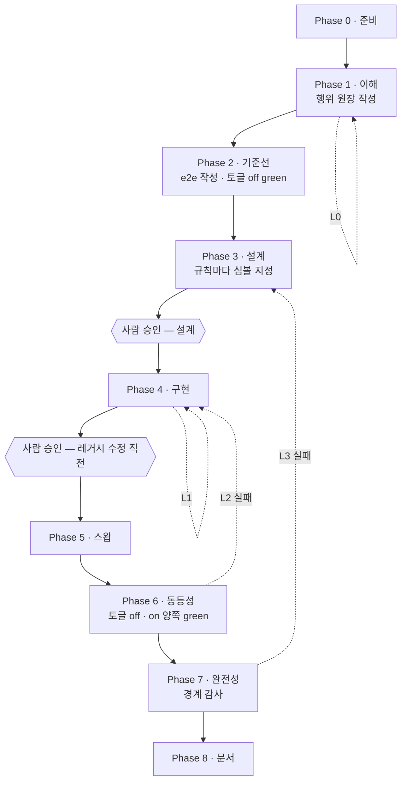

# 레거시 마이그레이션 OS 설계

- 상태: 초안 — 구조는 확정, 실행 검증 전
- 대상: 프론트엔드와 백엔드가 분리되지 않은 레거시 PHP 서비스의 백엔드를 Spring/Kotlin 으로
  슬라이스 단위 이관
- 구성 요소: 마이그레이션 스킬 6개, 서브에이전트 8개, 훅 2개
  (저장소에는 이 OS 와 무관한 범용 스킬도 있다)

이 문서는 살아있는 설계 문서다. 설계가 바뀌면 여기를 먼저 고치고 구현을 따라오게 한다.
결정마다 상태(합의 / 잠정 / 검토 중)와 근거를 남기는 이유는, 나중에 바꾸려는 사람이
"왜 이렇게 됐는지"를 몰라 같은 함정을 다시 밟는 걸 막기 위해서다.

## 1. 풀려는 문제

레거시 PHP 는 화면과 업무 로직이 한 파일에 섞여 있다. 이걸 한 번에 옮기는 대신,
백엔드에 해당하는 부분만 Spring 으로 떼어내고 PHP 가 그것을 호출하게 바꾼다. 화면은 그대로
두므로 기존 동작이 곧 정답지가 된다.

그런데 이 전환에는 확인해야 할 것이 **두 가지**인데 흔히 하나만 확인한다.

| 질문 | 답할 수 있는 것 |
|---|---|
| 이관 전후 동작이 같은가 | e2e 테스트 |
| 도메인 로직이 실제로 다 옮겨갔는가 | **e2e 로는 답할 수 없다** |

두 번째가 답이 안 되는 이유는 구조적이다. PHP 가 규칙을 여전히 계산하고 새 백엔드에는
데이터만 요청해도, 화면에 찍히는 결과는 완전히 이관된 경우와 동일하다. e2e 는 화면만
관찰하므로 둘을 구분하지 못한다. 슬라이스가 green 인 채로 절반만 이관된 상태가 나온다.

## 2. 핵심 설계 결정

| # | 결정 | 상태 | 근거 |
|---|---|---|---|
| D-01 | 검증 장치를 둘로 나눈다 — e2e(동등성) + 코드 재독 감사(완전성) | 합의 | 1장. 두 질문은 원리적으로 다른 관찰 수단을 요구한다 |
| D-02 | 두 장치를 **행위 원장** 한 표로 잇는다 | 합의 | 단계별 산출물이 따로 놀면 오케스트레이션이 불가능하다. 3장 |
| D-03 | 루프를 4개로 나누고 각각 다른 조건에서 닫는다 | 합의 | 4장. 루프 하나가 여러 실패 유형을 떠안으면 어디로 되돌아갈지 결정할 수 없다 |
| D-04 | 사람 게이트는 2개 — 설계 승인, 레거시 수정 직전 | 합의 | 되돌리기 비용이 급증하는 두 지점. 5장 |
| D-05 | 스킬에는 환경 상수를 두지 않고 gitignore 된 설정 파일에서 읽는다 | 합의 | 6장. 저장소는 공개, 대상 코드는 비공개 |
| D-06 | 레거시 전환은 데이터 접근 계층 내부에서만, 환경변수로 경로 전환 | 합의 | 버려질 연결 코드를 한 계층에 가둔다. 7장 |
| D-07 | 판단이 필요한 역할만 상위 모델, 패턴 추종 역할은 하위 모델 | 잠정 | 8장. 실제 토큰 소모를 보고 조정 |
| D-08 | 산출물(원장·설계서·감사)은 백엔드 저장소 docs 에 쓴다 | 잠정 | 코드와 같이 버전 관리되고 팀이 리뷰에서 본다. 다만 초안 상태가 히스토리에 남는다 |
| D-09 | 환경 기동·e2e 실행은 얇게만 갖고, 이미 있으면 위임한다 | 합의 | 마이그레이션 고유 로직만 이 저장소가 소유한다 |
| D-10 | 슬라이스 산출물은 번호 접두 파일명으로 고정한다 | 합의 | 게이트에서 세션이 끊기는 설계다. 진행 단계가 `ls` 로 관찰돼야 재개할 수 있다. 3장 |
| D-11 | 레드팀은 라운드마다 다른 렌즈로 읽는다 | 합의 | 같은 프롬프트를 두 번 돌린 빈손은 한 번보다 거의 강하지 않다. 4장 |
| D-12 | 원장의 열마다 쓰는 주체가 정확히 하나다 | 합의 | 3장. 소비자가 전제하는 열을 아무도 쓰지 않는 상태가 실제로 있었다 |
| D-13 | e2e 하네스를 이 디렉토리 안의 gitignore 된 레포로 둔다 | 합의 | 6장. 설정의 모든 경로가 프로젝트 안이 되어 `--add-dir` 이 사라진다 |

### 흐름 한눈에



담당은 왼쪽부터 analyst·redteam(1) → e2e author(2) → designer(3) → implementer(4) →
swap engineer(5) → 오케스트레이터(6) → auditor(7) → scribe(8) 이다.

## 3. 행위 원장

슬라이스가 강제하는 규칙을 전부 번호 붙여 나열한 표. 포맷은
`.claude/skills/legacy-slice/references/ledger-format.md` 가 정본이다.

```
| ID | 규칙 | 분류 | 출처 | 관찰 | 이관 | 비고 |
```

**열마다 쓰는 주체는 정확히 하나다(D-12).** 이게 규율이 아니라 계약인 이유는, 소비자가
전제하는 열을 아무도 쓰지 않으면 파이프라인이 조용히 끊기기 때문이다. 초안에서 실제로
`이관` 열이 그 상태였다 — 감사자는 채워져 있다고 전제하는데 구현자는 반환만 하고 있었다.

| 쓰는 쪽 | 열 | 시점 |
|---|---|---|
| analyst | 규칙 · 분류 · 출처 | Phase 1 |
| 오케스트레이터 | ID 배정 · 레드팀 델타 병합 | Phase 1 루프 |
| e2e author | 관찰 (assertion 또는 `불가`) | Phase 2 |
| implementer | 이관 (심볼 인용) | Phase 4 |
| auditor | 없음 — 읽고 판정만 한다 | Phase 7 |

ID 는 오케스트레이터만 배정한다. 레드팀은 `제안 ID` 로 내고, 병합할 때 현재 최대값 다음
번호를 새로 준다. ID 는 append-only 다 — 감사에서 발견된 규칙이 Phase 1 로 되돌아와도
기존 번호를 재사용하지 않는다. e2e·설계·구현이 이미 그 번호를 인용하고 있기 때문이다.

| 읽는 쪽 | 쓰임 |
|---|---|
| designer | 도메인 행마다 새 백엔드의 어느 심볼에 살지 결정 |
| auditor | 행마다 이관 여부 판정 |
| scribe | 행을 기획자·운영자용 문장으로 |

### 슬라이스 산출물

한 슬라이스의 산출물은 `<docs.root>/<docs.slicesDir>/<slice-id>/` 아래에 번호 순으로 쌓인다.

| 파일 | 쓰는 쪽 | Phase |
|---|---|---|
| `00-ledger.md` | analyst → 오케스트레이터 → e2e author → implementer | 1 · 2 · 4 |
| `01-design.md` | designer | 3 |
| `02-swap.md` | swap engineer | 5 |
| `03-audit.md` | auditor | 7 |
| `04-domain-doc.md` | scribe | 8 |

번호는 정렬 때문이 아니다. 이 흐름은 게이트에서 사람을 기다리므로 세션이 반드시 끊기는데,
어디까지 갔는지 적어두는 곳이 따로 없었다. 존재하는 파일의 최대 번호가 곧 끝난 Phase 라서
`ls` 한 번이 재개 지점이 된다. `status.sh` 가 이걸 읽어 슬라이스마다 출력한다.

### 분류 기준

`도메인` / `화면` / `경계` 셋 중 하나. 판정 질문은 하나다.

> 전혀 다른 클라이언트(모바일 앱, 배치, 파트너 API)가 같은 데이터를 다룬다면
> 이 규칙을 똑같이 지켜야 하는가?

그렇다면 도메인이다. 페이지 스크립트 안에 있든 SQL 의 WHERE 절 안에 있든 상관없다.
어려운 경우를 가르는 두 규칙 — *값은 화면, 규칙은 백엔드* 와 *경계는 백엔드가 진실일 때만
경계다* — 이 둘이 실무 판정의 대부분을 결정한다.

**판정 루브릭의 정본은 `ledger-format.md` 다.** 여기서는 왜 세 분류인지만 말하고, 어떻게
판정하는지는 거기에 둔다. 분석가 에이전트만 사본을 인라인으로 갖는데, 그건 분석가가 이
루브릭을 모든 행에 적용하기 때문이다 — **매 행마다 적용하는 것은 인라인, 가끔 참조하는
것은 reference** 가 이 저장소의 기준이다. 서브에이전트에게 참조 파일은 툴 콜 하나 거리라
건너뛸 수 있고, 인라인 텍스트는 반드시 컨텍스트에 들어간다. 사본을 고칠 일이 생기면
정본을 먼저 고친다.

### 관찰 불가를 인정한다

e2e 로 관찰할 수 없는 규칙이 있다. 검색어의 와일드카드 문자 처리처럼 화면에서 정상 동작과
구분되지 않는 것들이다. 이걸 억지로 약한 assertion 으로 덮으면 거짓 확신만 생긴다.
`불가:<이유>` 로 정직하게 적고, 감사가 "백엔드 단위 테스트가 있는가"를 대신 확인한다.
둘 다 없으면 `무방비` 판정이다.

## 4. 루프

| 루프 | 위치 | 닫히는 조건 | 상한 | 넘으면 |
|---|---|---|---|---|
| L0 이해 | Phase 1 | 레드팀이 새 규칙을 못 찾음 (2회 연속) | 3 | 사람 판단 |
| L1 구현 | Phase 4 | 빌드·단위·아키텍처 테스트 green | 5 | 설계 결함 의심 |
| L2 동등성 | Phase 6 | 토글 off/on 양쪽 green | 5 | 사람 판단 |
| L3 완전성 | Phase 7 | 감사 PASS | 3 | 사람 판단 |

L0 에 가장 많은 예산을 쓴다. 놓친 규칙 하나를 L0 에서 잡으면 재독 한 번으로 끝나지만,
L3 에서 잡히면 설계부터 다시 밟는다. 같은 결함의 비용이 단계마다 몇 배씩 뛴다.

L0 의 정지 조건이 "1회"가 아니라 "2회 연속"인 이유: 한 번 빈손인 것은 레드팀이 분석가와
같은 곳을 봤다는 뜻일 수 있다. 두 번째 빈 라운드가 있어야 "없다"가 정보가 된다.

그런데 같은 프롬프트로 두 번 돌리면 두 번째도 같은 곳을 본다. 새 서브에이전트는 앞 라운드의
기억이 없으므로 같은 분포에서 다시 뽑는 것이고, 그러면 두 번의 빈손은 한 번보다 거의 강하지
않다. 그래서 레드팀에 **라운드마다 다른 렌즈를 준다(D-11)**.

| 라운드 | 렌즈 |
|---|---|
| 1 | 페이지 스크립트 · 쿼리 구성 · 조용한 기본값 |
| 2 | 템플릿 · 환경 분기 · 포함된 commons |
| 3 | 부재 — 없는 트랜잭션, 없는 검증, 없는 인가 |

서로 다른 각도가 전부 빈손인 것은 같은 각도가 두 번 빈손인 것보다 훨씬 강한 증거다.
상한 3 회도 이때 비로소 근거를 갖는다 — 렌즈가 셋이라 셋이다.

L2 는 실패할 때마다 토글 off 패스도 다시 돌린다. 살아있는 DB 위에서 돌기 때문에 기준선
자체가 흔들릴 수 있고, 그 경우 원인은 이관이 아니라 테스트에 있다.

## 5. 게이트

| 게이트 | 위치 | 왜 여기인가 |
|---|---|---|
| 설계 승인 | Phase 3 이후 | 이후 단계가 전부 이 설계 위에 쌓인다. 틀리면 구현·스왑·검증이 모두 헛일 |
| 레거시 수정 직전 | Phase 5 이전 | 살아있는 운영 코드를 처음 건드리는 지점 |

그 사이와 이후는 자율로 둔다. 게이트를 늘리면 안전해 보이지만, 사람이 매 단계 확인해야
하는 시스템은 결국 안 돌린다.

**재진입도 게이트를 다시 지난다.** 감사(Phase 7)가 설계 결함을 찾아 Phase 3 으로 되돌리면
바뀐 설계는 다시 승인을 받는다. 그러지 않으면 사람이 본 적 없는 설계가 게이트를 우회해
구현으로 흘러간다. 구현만 고치는 재진입(Phase 4)에는 게이트가 없다 — 설계는 그대로이므로
승인의 대상이 바뀌지 않았다.

## 6. 환경 바인딩과 공개 원칙

이 저장소는 공개고, 대상 코드는 비공개다. 그래서 스킬과 에이전트에는 경로·호스트명·포트·
테이블명을 한 글자도 두지 않는다. 전부 `.claude/config/workspace.json` 에서 읽는다.

| 파일 | 추적 | 내용 |
|---|---|---|
| `workspace.example.json` | 추적됨 | 자리표시자만 있는 골격 |
| `workspace.json` | gitignore | 실제 경로·호스트·포트 |
| `redaction.example.json` | 추적됨 | 패턴 골격 |
| `redaction.json` | gitignore | 유출 감지 패턴. 패턴 자체가 내부 시스템명이라 이것도 비공개 |

### e2e 하네스의 위치 (D-13)

동등성 오라클이 쓰는 Playwright 하네스는 `cs-e2e/` 에 있다. `php_legacy/`·`cs-system/` 과
같은 층위의 gitignore 된 체크아웃이고, 다른 점은 이게 **이 OS 가 소유한 레포**라는 것이다.

기존에 쓰던 공용 e2e 레포를 참조하지 않고 전용으로 새로 둔 이유는 두 가지다.

- 공용 레포는 여러 서비스가 함께 쓴다. 그 중 하나가 자기 소비자 디렉토리 안으로 들어가면
  소유 관계가 뒤집히고, 다른 참조가 전부 깨진다.
- 밖에 두면 `--add-dir` 이 필요해진다. 안에 두면 설정의 모든 경로가 프로젝트 안이 되고,
  그 결과 **`run-e2e-test` 같은 스킬을 상수 없이 이 저장소에 추적 파일로 둘 수 있다.**
  D-05 가 원한 상태가 그때 비로소 완성된다.

하네스가 강제하는 구조 — 인터페이스(무엇을) / 스택별 구현체(어떻게) / 공유 spec — 는
`cs-e2e/` 안의 README 들이 정본이다. spec 은 원장에서 나오고, 그 규약은 e2e author 가 읽는다.

기본 base URL 은 **로컬**이다. 동등성 루프가 토글을 뒤집어 가며 같은 spec 을 두 번 돌려야
하는데, 공유 dev 서버를 대상으로 하면 회차마다 배포가 끼어들고 남의 작업도 위험해진다.

훅 두 개가 경계를 강제한다.

- `guard-company-content.py` — git 명령 앞에서 스테이징된 경로와 **추가된 diff 줄**을 검사해,
  회사 경로나 redaction 패턴이 걸리면 커밋을 막는다. 삭제 줄은 검사하지 않는다(유출된
  문자열을 지우는 커밋까지 막으면 안 되므로).
- `php-encoding-guard.py` — 레거시 파일을 편집하기 전에 인코딩을 기록하고, 편집 후 바뀌었거나
  깨졌으면 막는다. 대상 트리는 파일마다 인코딩이 다르고, 깨진 인코딩은 파이프라인의 어떤
  테스트로도 관찰되지 않는다. 사람이 화면을 봐야만 안다.

## 7. 레거시 전환 방식

데이터 접근 계층의 메서드 내부만 바꾼다. 화면과 템플릿은 건드리지 않는다.

1. 원본 메서드를 `legacy` 접두 이름으로 **바꾸기만** 한다. 본문은 한 글자도 손대지 않는다.
2. 원래 이름으로 새 메서드를 만들고, 본문은 스위치 하나로 둔다.
3. 스위치는 환경변수만 읽는다. 값이 없거나 모르는 값이면 기존 경로로 간다.
4. 새 백엔드 호출 코드는 의도적으로 단순하게 둔다. 어차피 화면을 새로 만드는 날 통째로
   버려질 코드다. 정교하게 만들면 나중에 지울 범위만 흐려진다.

반환 형태는 원본과 정확히 같아야 한다. 호출부가 그대로이므로 비슷하기만 한 값은 조용히
잘못 렌더링된다.

**스왑 전에 호출자 전수와 그들의 include 체인을 확인한다.** 첫 슬라이스에서 드러난 것:
교체 지점의 메서드를 부르는 곳이 진입점 둘 말고 다섯 개 더 있었고, 그 다섯은 진입점과 다른
include 체인을 갖고 있어서 **진입점에만 정의된 상수를 스위치 헬퍼 호출에 쓰면 전부 죽는다.**
이 실패는 e2e 가 관찰하지 못한다 — 기준선이 덮는 것은 진입점이고, 죽는 것은 나머지다.
그래서 원장에 `스왑 위험` 절을 둔다.

### 운영에는 어떻게 도달하는가

이 OS 의 루프는 전부 로컬에서 돈다. 토글 환경변수는 로컬 compose env 파일에 쓰이므로
**운영에는 그 변수가 아예 없고, 스위치는 값이 없으면 기존 경로로 간다(위 3번).** 따라서
스왑이 머지돼도 운영 동작은 바뀌지 않는다.

이걸 적어두는 이유는 게이트 2 의 문구가 "살아있는 운영 코드"라고 경고하기 때문이다. 맞는
경고지만 위험의 종류가 다르다. 위험한 건 토글이 켜지는 것이 아니라 **레거시 메서드를 잘못
건드리는 것**이다. 그래서 게이트 2 에서 사람이 봐야 할 것은 롤백 절차가 아니라 "원본 메서드가
이름만 바뀌고 내용은 한 글자도 안 바뀌었는가"다.

운영에서 실제로 새 경로를 켜는 일은 이 OS 의 범위 밖이다. 슬라이스가 끝난 뒤 팀이 따로
결정한다.

### 토글이 PHP 에 도달하는가 — 실측 (2026-08-31)

컨테이너 env 를 두 SAPI 에서 각각 읽어 확인했다.

| SAPI | `getenv()` | `$_SERVER` | `$_ENV` |
|---|---|---|---|
| `fpm-fcgi` (PHP 8.3) — 두 표면의 실제 런타임 | O | O | O |
| `apache2handler` (mod_php 5.6) — 같은 vhost 가 있는 다른 스택 | O | **X** | O |

**스위치 헬퍼는 `getenv()` 로 읽는다.** 지금 두 표면은 FPM 이라 `$_SERVER` 도 되지만,
같은 레거시 트리를 mod_php 스택도 서비스하고 거기서는 비어 있다. 잘못 고르면 실패가
아니라 침묵으로 나타난다 — 토글이 켜지지 않고 영원히 레거시 경로로 흐르는데, 에러도
실패 테스트도 없다. 어느 SAPI 에서나 되는 쪽을 쓴다.

**런타임을 잘못 잡으면 기준선이 운영을 증명하지 않는다.** 이 저장소의 설정은 처음에 두
표면을 mod_php 5.6 스택으로 가리키고 있었다. 백오피스는 PHP 7+ 문법 때문에 파싱 단계에서
바로 터져 금방 드러났지만, **대고객은 5.6 에서도 멀쩡히 렌더됐다** — 응답이 8.3 과 바이트
단위로 같았다. 운영이 8.3 이라는 사실을 따로 확인하지 않았다면, 운영과 다른 런타임에서
green 인 기준선을 만들어 놓고 그걸 정답지로 썼을 것이다. 표면마다 **어느 컨테이너가
서비스하는지**를 설정에 적어 두는 이유가 이것이다.

## 8. 모델 배정

| 역할 | 모델 | 이유 |
|---|---|---|
| analyst · redteam · designer · auditor | opus | 판단이 결과를 좌우한다 |
| e2e author · implementer · scribe | sonnet | 확립된 패턴을 따르는 작업 |
| swap engineer | opus | 작업은 좁지만 살아있는 코드라 실수 비용이 크다 |

잠정이다. 첫 슬라이스를 돌려 실제 소모를 보고 조정한다.

## 9. 환경이 이 OS 에 지는 빚

첫 실행에서 8단계 중 하나도 돌기 전에 환경이 네 번 막았다. 설계 결함이 아니라 환경 문제였지만,
**전부 조용히 실패했다는 점**이 기록할 값어치다 — 어느 것도 자기 이름을 대지 않았다.

| 막은 것 | 어떻게 나타났나 | 어디에 반영했나 |
|---|---|---|
| 기본 JDK 가 wrapper 지원 범위 밖 | 빌드가 `What went wrong:` 아래 **버전 번호 한 줄**만 남기고 죽음 | `backend.javaHome` · 구현자 · `local-stack` · `status.sh` |
| 컨테이너 이미지 미로드 | 레지스트리에 없는 이름으로 `pull access denied` | `local-stack` |
| 형제 체크아웃 누락 | DAO 생성자의 `require_once` 실패 — 저장소가 없다는 말은 안 나온다 | `local-stack` |
| DB 계정이 개발자 PC IP 미허가 | 접속 거부 하나로 표면 전체가 죽음 | `local-stack` · 레거시 트리의 env 오버라이드 |
| 레거시 파일이 EUC-KR | `grep` 이 바이너리로 판정해 **출력을 통째로 억제**하고 exit 1 | `references/legacy-reading.md` · 트리를 읽는 에이전트 넷 |
| php-fpm 풀 설정이 컨테이너에 마운트돼 있지 않았음 | 그 파일의 `env[]` 줄들이 **아무 일도 하지 않는데 아무 신호도 없음** | 원장 `스왑 위험` 절 · 스왑 담당 |

그리고 다섯 번째가 가장 위험했다. **설정이 두 표면을 운영과 다른 PHP 런타임으로 가리키고
있었다.** 한쪽은 문법 오류로 즉시 드러났지만 다른 쪽은 **정상 렌더됐다** — 응답이 운영 런타임과
바이트 단위로 같았다. 사람이 이관 티켓을 확인해 주지 않았으면, 운영을 증명하지 않는 기준선을
정답지로 삼았을 것이다. 자세한 것은 7장.

여기서 일반화할 것: **화면이 뜨는 것은 환경이 맞다는 증거가 아니다.** 그래서 `status.sh` 가
포트 응답만이 아니라 JDK·표면·컨테이너를 함께 찍고, 표면마다 어느 컨테이너가 서비스하는지를
설정에 적는다.

여섯 번째는 첫 슬라이스의 Phase 0 에서 나왔다. 백오피스 DAO 에 `function` 이 아홉 번 나오는데
`grep -c` 가 **숫자조차 찍지 않고** exit 1 로 끝났다. 파일이 EUC-KR 이라 UTF-8 로 해석 불가능한
바이트가 있고, BSD grep 은 그런 파일을 바이너리로 판정해 출력을 억제한다. `-a` 를 붙이면 아홉이
나오고, ripgrep 은 처음부터 아홉을 낸다. 즉 **Grep 도구는 보이고 Bash 의 grep 은 안 보인다** —
같은 에이전트가 두 경로를 다 갖고 있다.

이게 앞의 다섯 개보다 위험한 이유는 실패가 성공과 같은 모양이기 때문이다. exit 1 은 "못 찾았다"
이고, 그건 "없다"와 구별되지 않는다. 그리고 하필 **L0 루프의 종료 조건이 레드팀의 빈손**이다.
실명 때문에 빈손으로 돌아오면 루프는 아무것도 검증하지 않은 채 두 번 연속으로 닫힌다. 표면
절반이 EUC-KR 인 트리에서(help 107/214, admin 183/208) 이건 가정이 아니다.

여덟 번째는 첫 슬라이스의 Phase 5 에서 나왔다. 토글을 php-fpm 풀 설정의 `env[]` 로 배선하려는데,
그 설정 파일이 **애초에 컨테이너에 마운트돼 있지 않았다** — 이미지에 구워져 있었고 Dockerfile 의
`COPY` 는 주석 처리돼 있었다. 즉 그 파일에 이미 있던 환경변수 전달 줄은 몇 년째 아무 일도 하지
않고 있었고, 실제로 값을 전달한 것은 `clear_env = no` 와 compose 의 `environment:` 였다.

이게 아픈 이유는 **레드팀이 그 줄을 근거로 인용했다**는 것이다. 라운드 2는 "토글이 PHP 에 도달하는가"를
추론이 아니라 실측으로 확인하겠다며 그 파일의 줄 번호를 댔다. 결론은 우연히 옳았지만(다른 경로가
값을 전달하고 있었으므로) 근거는 효력이 없는 줄이었다. 그리고 그 줄을 실제로 동작하게 만든 순간 —
마운트를 붙인 순간 — 빈 값 하나 때문에 php-fpm 이 기동을 거부하고 표면 일곱 개가 통째로 죽었다.

일반화할 것: **설정 파일에 그 줄이 있다는 것은 그 줄이 동작한다는 증거가 아니다.** 앞의 두 문장과
같은 형태다. 그래서 이 OS 는 배선을 확인할 때 파일을 읽는 것으로 만족하지 않고, 값이 최종 소비자
(요청을 처리하는 PHP 워커)에서 관찰되는지를 HTTP 요청으로 확인하게 한다. 이것이 Phase 6 이 매 패스마다
토글을 애플리케이션에서 되읽는 이유이고, 그 규칙이 왜 필요한지를 이번 슬라이스가 직접 보여줬다.

아홉 번째는 첫 슬라이스의 Phase 7 에서 나왔고, 앞의 여덟 개와 달리 **환경이 아니라 이 OS 의 설계
결함**이다. 설계자가 §12.3 에 "바인딩된 LIKE 의 역슬래시는 검증되지 않은 추정이다 — 기준선과 실제로
대조해야 한다"고 적었다. 스왑 담당이 그것을 미검증으로 다시 올렸다. 그리고 동등성 루프가 토글 양쪽에서
70/70 초록으로 닫혔다. 감사가 두 저장소를 다시 읽고서야, 백슬래시가 든 검색어가 양쪽에서 **다른 결과
집합**을 낸다는 것이 드러났다(`\` → 0 vs 1건, `a\b` → 2 vs 0건).

왜 통과했나. e2e 작성자는 **원장을 입력으로** 받는다. 설계서의 §12.3 도, 스왑 기록의 §9.4 도 원장이
아니다. 그래서 그 의심은 spec 이 될 경로가 없었고, 검색어 집합에 백슬래시가 들어갈 이유도 없었다.
세 문서가 모두 위험을 알고 있었는데 **아무도 그것을 관찰 가능한 행으로 바꾸지 않았다.**

여기서 일반화할 것: **원장에 없는 것은 이 파이프라인의 어느 단계도 보지 못한다 — 설계 자신의 의심도
마찬가지다.** 원장이 조인 키라는 말의 진짜 의미가 이것이다. 그래서 Phase 3 의 산출 조건에
"설계가 표류를 의심한 지점마다 원장 행이 있어야 한다"를 넣었다. 의심을 문서에 적는 것으로는 부족하고,
조인 키에 적어야 아래 단계가 그것을 진다. 앞 문장과 같은 형태의 오류이고,
그래서 같은 방식으로 갚는다 — 도구가 조용할 수 있는 지점을 문서에 못박고, 그 문서를 트리를
읽는 에이전트 전부가 읽게 한다. `php-encoding-guard.py` 가 이미 **쓰기** 쪽을 막고 있었는데
**읽기** 쪽은 비어 있었다. 인코딩은 편집할 때만 물지 않는다.

열 번째는 첫 슬라이스가 끝난 뒤 2026-09-02 에 나왔고, **우리가 새로 들여온 도구에서 나왔다.**
이 저장소에는 공식 php-lsp 플러그인이 설치돼 있고 intelephense 가 실제로 떠 있다. 파일 단위
조회(`documentSymbol`·진단)는 EUC-KR 파일에서도 정확히 동작한다 — 심볼 이름이 ASCII 라서
인코딩을 타지 않는다. 그런데 `findReferences` 와 `workspaceSymbol` 이 **빈손으로 돌아온다.**
실제로 20개 파일에서 인스턴스화되는 클래스에 대해 0 을 반환한다(같은 것을 `rg` 로 세면 20이다).
인덱싱 범위 문제로 보인다 — 트리의 PHP 파일이 5만 개가 넘는다.

앞의 아홉과 같은 모양이다. LSP 의 0 은 "인덱싱되지 않았다"인데 "참조가 없다"와 구별되지 않는다.
그리고 하필 `findReferences` 는 스왑 담당이 가장 필요로 하는 기능이다 — 7장의 그 사고(호출자가
진입점 둘 말고 다섯 개 더 있었고 include 체인이 달랐던 것)를 지금 상태의 LSP 로 확인했다면
**0 을 받고 "다른 호출자 없음"으로 결론냈을 것이다.** 같은 사고를 더 자신 있게.

일반화할 것: **도구를 붙이는 것과 도구가 답하는 것은 다르다.** 그래서 `legacy-reading.md` 의
도구 행렬에 LSP 행을 넣고, "캘리브레이션 전에는 LSP 의 빈손을 근거로 쓰지 않는다"를 규칙으로
못박았다. 도구를 늘리면 조용한 실패의 종류도 같이 는다.

이 열 개의 진단과 그에 대한 조치 제안은 `environment-readiness.md` 로 분리했다. 이 장은 **측정된
사실의 목록**으로 두고, "그래서 무엇을 할 것인가"는 그 문서가 진다 — 회고 9번이 지적한 §9 의
과적재를 이 경계로 갚는다.

## 10. 열린 항목

첫 실행에서 확인된 것과 드러난 결함은 `first-run-retrospective.md` 에 따로 정리했다.
아래 표의 상태는 그 회고의 결론이다.

| 항목 | 상태 |
|---|---|
| ~~8단계 흐름을 끝까지 돌려본 적이 없다~~ | **해소.** 2026-09-01 읽기 전용 슬라이스 하나로 완주 |
| ~~감사가 e2e 로 못 잡는 것을 정말 잡는지~~ | **해소.** e2e 가 양쪽 토글에서 전부 초록인 상태에서 감사가 실제 동등성 파괴 2건을 찾았다. 이 OS 의 존재 이유가 증명된 지점 |
| ~~렌즈 3개가 L0 를 마르게 하는 데 충분한지~~ | **아니다.** 4라운드가 모두 빈손이 아니었고 4번째가 가장 값졌다. 종료 조건 자체가 답할 수 없는 질문을 묻는다 — 회고 5번 |
| 오케스트레이터의 원장 병합을 검사하는 것이 없다 | **신규.** 감사 지적을 세 번 덜 적용했고 전부 다음 감사 라운드가 잡았다 — 회고 4번 |
| 위험이 원장을 경유하지 않으면 누출된다 | **신규.** 설계자 쪽은 반영, 스왑 기록 쪽 경로는 미반영 — 회고 3번 |
| 자동 검사가 없는 규칙이 세지지 않는다 | **신규.** `불가` 11행 중 6행이 e2e·단위 테스트 어느 쪽에도 덮이지 않는데 원장에 표시할 칸이 없다 — 회고 6번 |
| 감사에 회귀 가드가 없다 | **신규.** 매번 사람(에이전트)이 읽는 일회성 행위다 — 회고 7번 |
| 파이프라인 깊이를 지정할 수 없다 | **신규.** 위험도가 레드팀 라운드 수·보상 테스트 요구를 바꾸지 않는다 — 회고 11번 |
| ~~토글 환경변수가 PHP 에 도달하는지~~ | **해소.** 2026-08-31 실측 — 7장 참고 |
| 렌즈 3개가 L0 를 마르게 하는 데 충분한지 | 3라운드에도 새 규칙이 나오면 렌즈를 늘린다 |
| 슬라이스 하나의 재독 비용 | **실측.** API 요청 약 1,330회 / 처리 토큰 약 3억 2천만 / API 정가 약 $200. 그중 **비용의 54%가 캐시 읽기**이고 출력은 20%다. 조정할 대상은 모델 등급도 출력 길이도 아니라 **턴 수와 턴당 컨텍스트**다. 최대 지출처는 오케스트레이터 자신(1/3). 자세한 것은 `first-run-retrospective.md` 11장 |
| 환경이 에이전트에게 답을 주지 못한다 | **신규.** 루프 네 개가 전부 없는 정적 분석기를 재독으로 대신하고 있다. 진단과 조치 후보는 `environment-readiness.md` — 상태는 **제안**, 반론 셋이 미해결 |
| e2e 가 통제되지 않은 데이터 위에서 돈다 | **신규.** 두 토글 패스가 같은 입력을 보지 못하고, 필요한 데이터를 만들 수 없으면 그 규칙은 영원히 관찰 불가다 — 회고 3번의 나머지 절반. `environment-readiness.md` 3장 B |
| LSP 가 붙어 있는데 조용히 빈손을 준다 | **신규.** 2026-09-02 실측. `findReferences` 가 0 을 반환하는데 실제로는 20개 파일이 쓴다 — 9장 열 번째 |
| 산출물을 백엔드 저장소에 쓰는 것(D-08) | 초안이 히스토리에 남는 문제. 슬라이스 종료 시 한 번에 커밋하는 대안 검토 |
| 감사가 e2e 로 못 잡는 것을 정말 잡는지 | 첫 감사 결과로 판단 |

## 변경 이력

| 날짜 | 변경 |
|---|---|
| 2026-09-02 | 조용한 실패 열 번째(LSP 빈손)를 9장에 추가. 기반 점검을 `environment-readiness.md` 로 분리해 9장은 측정된 사실만 지고 조치 제안은 그 문서가 지게 했다 |
| 2026-09-01 | 첫 완주. 조용한 실패 3건을 9장에 추가(EUC-KR 에서 grep 침묵 · 마운트 안 된 설정 파일 · 위험이 원장에 안 닿음), 7장에 호출자 전수·include 체인 확인을 넣고, 원장 포맷에 `스왑 위험` 절을 표준화했다. 회고는 `first-run-retrospective.md` |
| 2026-08-30 | 최초 작성. 구조 확정, 실행 검증 전 |
| 2026-08-31 | 토글 도달 경로 실측으로 확정(7장). 두 표면 모두 PHP 8.3 FPM 으로 정정 — 설정이 mod_php 5.6 스택을 가리키고 있었다 |
| 2026-08-30 | e2e 하네스를 `cs-e2e/` 로 프로젝트 안에 둠(D-13). 설정에서 프로젝트 밖 경로가 사라져 `upstreamOs` 위임이 불필요해짐 |
| 2026-08-30 | 설계 검토 반영 — 원장 열 소유권(D-12), 산출물 파일명(D-10), 레드팀 렌즈(D-11) 추가. 게이트 재진입과 운영 도달 경로를 명시하고, 분류 루브릭 정본을 `ledger-format.md` 로 일원화 |
