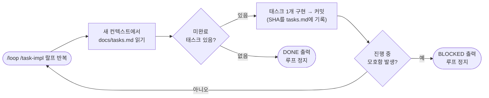
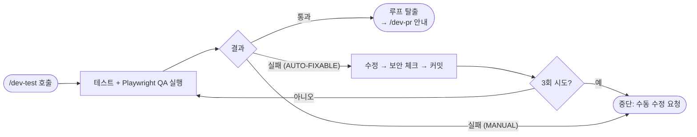
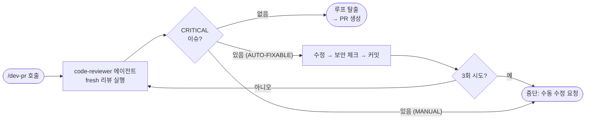
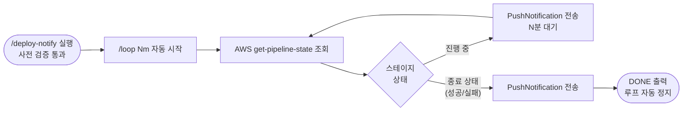

# 시스템 루프 — 핵심 흐름 한눈에 보기

이번 PR(step3)에서 구축한 4개 루프의 공통점: **실패해도 사람이 매번 개입하지 않고, 정해진 정지 조건까지 스스로 반복**한다. 정지 조건은 항상 기계적으로 판정 가능한 값(체크박스 완료, CRITICAL 0건, 파이프라인 종료 상태)이라 루프 안에서는 사람에게 질문하지 않는다.

## 한눈에 보는 비교

| 루프 | 트리거 | 반복 단위 | 정지 조건 |
|---|---|---|---|
| **task-impl 랄프 모드** | `/loop /task-impl 랄프 반복` | 반복마다 새 컨텍스트로 `docs/tasks.md`를 읽고 태스크 1개만 구현·커밋 | 전체 태스크 완료 → `DONE` · 모호함 발생 → `BLOCKED` |
| **dev-test 자동 수정** | `/dev-test` | 실패 항목만 재실행(`RETRY_ITEMS`), 통과 시 전체 1회 최종 검증 | 통과 또는 **3회 초과** |
| **dev-pr 리뷰 루프** | `/dev-pr` | 매회 완전히 새로 리뷰(fresh review) | CRITICAL 0건 또는 **3회 초과** |
| **deploy-notify 관찰** | `/deploy-notify` (내부에서 `/loop Nm` 자동 시작) | N분마다 AWS CodePipeline 상태 재조회 + 알림 | 파이프라인 종료 상태(성공/실패) 도달 → `DONE` |

---

## 1. task-impl 랄프 모드

## 2. dev-test 자동 수정 루프

## 3. dev-pr 리뷰 루프

## 4. deploy-notify 관찰 루프

---

## 왜 4개 다 다르게 생겼나

- **task-impl**: 되돌리기 어려운 "코드 자동 구현+커밋"이라 루프 시작 자체를 사용자가 직접 `/loop`로 타이핑하게 함(진입 체크포인트).
- **dev-test / dev-pr**: 자동 수정이 실패를 반복할 수 있으므로 **3회 상한**을 두고, 초과 시 항상 사람에게 넘긴다.
- **deploy-notify**: 읽기 전용 조회 + 알림만 하고 아무것도 쓰지 않으므로 되돌릴 위험이 없어, 스킬이 `/loop`를 **직접** 호출해 진입 마찰을 없앴다.

정지 조건은 네 루프 모두 AWS/git/리뷰 결과 같은 **관측 가능한 값**으로만 판정한다 — 루프 반복 중에는 `AskUserQuestion`을 쓰지 않는다.
