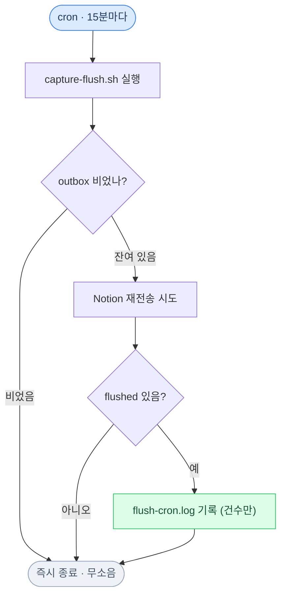
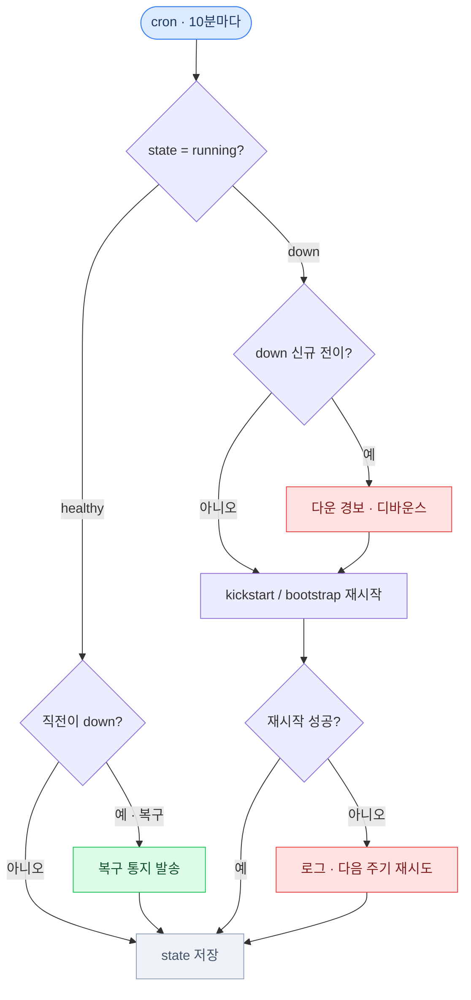
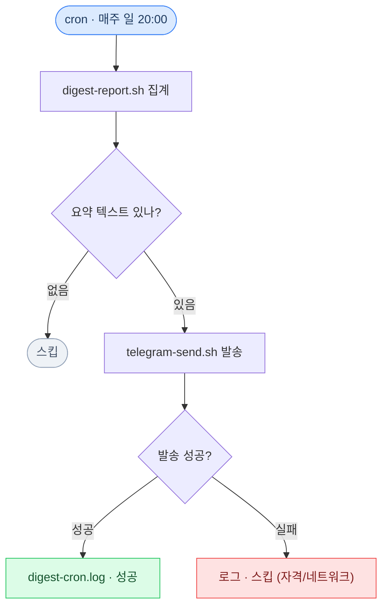
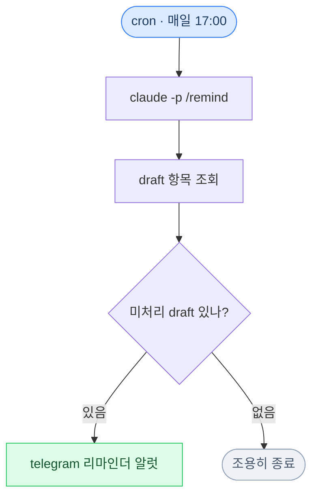
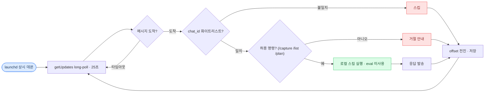
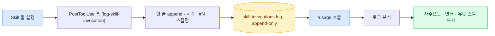

# 시스템 루프 지도 — my-claude-code-os

세션 밖에서 스스로 도는 루프들의 동작 순서. 이 OS의 자동화는 설계 원칙
[`§7`](../.claude/context/design-principles.md)의 축으로 갈린다.

- **탐지형(조정) 루프** — "이상·미처리 있나?"를 주기적으로 감지하고 반응 후 잊는다. 잘 돌수록 조용하다.
- **축적형 루프** — 매 반복이 저장소에 한 겹씩 쌓고 나중에 회수한다. write 절반과 read 절반이 쌍을 이룬다.

**노드 색상 범례** — 🔵 트리거/진입 · 🟢 정상·성공 · ⚪ 무소음·종료 · 🔴 경보·실패 · 🟡 축적 저장소

---

## A · 탐지형(조정) 루프 — crontab 4종

주기 감지 → 반응 → 잊기. 버퍼를 0으로 드레인하거나 데몬을 지킨다. 평상시엔 로그도
알림도 없이 조용하고, 이상이 잡힐 때만 소리를 낸다.

### `flush-cron` — outbox 재동기 · 15분마다

capture가 백그라운드로 던진 Notion 반영이 실패해 outbox에 남으면, 이 루프가 재전송해
"모두 동기" 상태로 수렴시킨다.

### `watchdog-cron` — 데몬 감시 · 10분마다

telegram-listener가 언로드·비정상이면 KeepAlive만으론 조용히 죽는다. 다운을 감지해
폰에 알리고 자동 재시작한다(상태 전이에만 알림 — 디바운스).

### `digest-cron` — 주간 집계 · 매주 일 20:00

할일 현황(상태 분포·카테고리·방치 draft)을 주 1회 요약해 폰으로 보낸다.
집계(결정론)와 발송(부작용)을 분리한다.

### `remind-cron` — draft 재촉 · 매일 17:00

미처리 draft가 남아 있으면 매일 저녁 폰으로 리마인더를 쏜다. 세션 안 스킬(`/remind`)을
세션 밖 cron이 대신 호출한다.

---

## B · 상시 데몬 루프 — launchd

cron처럼 깨었다 자는 게 아니라 launchd가 상시 띄워 둔다. getUpdates를 long-poll로 걸어
폰 명령이 오는 즉시 처리하고, 보안 3종(chat_id 화이트리스트 · 명령 화이트리스트 ·
eval 미사용)을 통과한 것만 실행한다.

### `telegram-listener` — 인바운드 long-poll · 상시(KeepAlive)

---

## C · 축적형 루프 — 자기 관찰

이 레포의 유일한 순수 축적형 루프. 스킬을 부를 때마다 append-only 로그에 한 겹 쌓고(write),
나중에 `/usage`가 그 축적물을 회수해 사용 패턴을 낸다(read). 저장소는 커질수록 가치가 있어
드레인하지 않는다.

### `self-observation` — PostToolUse 훅 → `/usage`

---

**출처** · `.claude/hooks/{flush,watchdog,digest,remind}-cron.sh` · `telegram-listener.sh` ·
`log-skill-invocation.sh` · 스케줄 `launchd/install.sh` · 분류 축 `context/design-principles.md §7`
